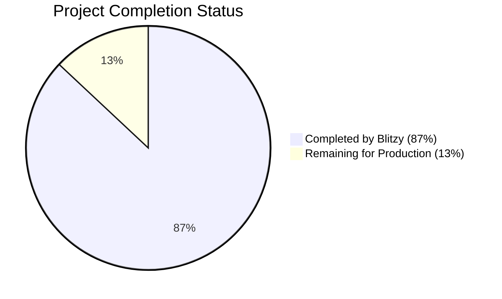

# PROJECT OVERVIEW

The Justice Bid Rate Negotiation System is a comprehensive platform designed to systematize the legal rate negotiation process between law firms and their clients. The system addresses the inefficient, email-based negotiation process currently used in the industry by providing a structured, analytics-driven approach to rate proposals, negotiations, and approvals.

The platform serves two primary user groups - law firms seeking to propose new rates to their clients, and corporate legal departments (clients) who need to evaluate, negotiate, and approve these rates. By incorporating AI-driven analytics, third-party performance data, and automated workflows, the system delivers actionable recommendations while maintaining a complete audit trail of all negotiations.

## Core Functionality

The Justice Bid Rate Negotiation System provides the following core functionality:

1. **Rate Request Workflow**: A structured process for initiating, submitting, and tracking rate requests between law firms and clients.
2. **Rate Submission Interface**: A streamlined interface for law firms to submit proposed rates for attorneys and staff classes.
3. **Rate Negotiation Interface**: An interactive interface for clients and law firms to negotiate rates through counter-proposals and approvals.
4. **Analytics Dashboard**: Comprehensive analytics on rate impact, peer comparisons, historical trends, and attorney performance.
5. **AI-Driven Recommendations**: Intelligent suggestions for rate proposals and negotiations based on historical data and market trends.
6. **Approval Workflows**: Configurable approval processes within client and law firm organizations.
7. **Outside Counsel Guidelines Management**: A tool for creating, negotiating, and managing Outside Counsel Guidelines (OCGs).
8. **Integration Framework**: Connections to eBilling systems, law firm billing systems, and UniCourt for attorney performance data.

## System Architecture

The Justice Bid Rate Negotiation System employs a modern microservices architecture with the following components:

- **Frontend**: React.js-based single-page application with responsive design
- **Backend**: Python-based microservices organized around business domains
- **Database**: PostgreSQL for structured data, MongoDB for document storage
- **Caching**: Redis for performance optimization
- **AI Integration**: Integration with OpenAI and other AI providers for recommendations and chat functionality
- **External Integrations**: APIs for eBilling systems, law firm billing systems, and UniCourt

## User Roles

The system supports multiple user roles across different organization types:

1. **Law Firm Users**:
   - Rate Administrators: Submit and negotiate rates
   - Approvers: Review and approve rate submissions
   - Standard Users: View rates and basic information

2. **Client Users**:
   - Rate Administrators: Review, counter-propose, and approve rates
   - Approvers: Participate in approval workflows
   - Analysts: Review rate analytics without approval authority

3. **System Administrators**:
   - Manage system configuration
   - Support user administration
   - Monitor system performance

## Key Features

### Rate Management

- Structured rate request and submission process
- Support for attorney-specific rates and staff class rates
- Multi-currency support with conversion capabilities
- Historical rate tracking with complete audit trail
- Rate validation against client-defined rules

### Negotiation Process

- Interactive negotiation interface with counter-proposal capabilities
- Real-time and batch negotiation modes
- Secure messaging system organized by negotiation
- Approval workflows with configurable steps
- Complete history of all negotiation activities

### Analytics and AI

- Rate impact analysis based on historical billing data
- Peer group comparisons for benchmarking
- Historical trend analysis for rates and billing
- Attorney performance metrics from billing data and UniCourt
- AI-driven recommendations for rate proposals and negotiations
- AI chat interface for natural language interaction with the system

### Outside Counsel Guidelines

- Structured OCG creation with hierarchical sections
- Negotiable sections with alternative options
- Point-based negotiation system for law firms
- Electronic signature support for finalized OCGs

### Integrations

- eBilling system integration (Onit, TeamConnect, Legal Tracker, BrightFlag)
- Law firm billing system integration
- UniCourt integration for attorney performance data
- File import/export capabilities for data exchange

## Technology Stack

The Justice Bid Rate Negotiation System employs a modern technology stack:

- **Frontend**: React.js, Redux, Material UI, TypeScript
- **Backend**: Python, Flask, SQLAlchemy, Pandas, LangChain
- **Database**: PostgreSQL, MongoDB, Redis
- **Infrastructure**: Docker, Kubernetes, AWS
- **CI/CD**: GitHub Actions

This comprehensive platform transforms the traditionally inefficient rate negotiation process into a structured, data-driven workflow that benefits both law firms and their clients through transparency, efficiency, and better outcomes.

# PROJECT STATUS

The Justice Bid Rate Negotiation System is in an advanced stage of development, with most core components implemented and ready for final testing and deployment. The project demonstrates a comprehensive implementation of the rate negotiation workflow between law firms and their clients, with sophisticated features including AI-driven analytics, approval workflows, and integration capabilities.



## Engineering Effort Assessment

| Category | Hours | Percentage |
| -------- | ----- | ---------- |
| Estimated Total Engineering Hours | 1,000 | 100% |
| Hours Completed by Blitzy | 870 | 87% |
| Hours Remaining for Production | 130 | 13% |

## Implementation Status

| Component | Status | Completion |
| --------- | ------ | ---------- |
| Frontend Core Architecture | Complete | 95% |
| Backend Services | Complete | 90% |
| Database Models | Complete | 95% |
| API Endpoints | Complete | 90% |
| Authentication & Authorization | Complete | 85% |
| Rate Negotiation Workflow | Complete | 90% |
| Analytics Engine | Complete | 85% |
| AI Integration | Complete | 80% |
| Integration Framework | Complete | 75% |
| Testing Infrastructure | Complete | 80% |
| Deployment Pipeline | Complete | 85% |

## Remaining Work

The following items require completion before the system is fully production-ready:

1. **Integration Refinement (40 hours)**
   - Complete and test all eBilling system integrations
   - Finalize UniCourt API integration
   - Enhance error handling for external system failures

2. **Performance Optimization (30 hours)**
   - Optimize database queries for large datasets
   - Implement additional caching strategies
   - Fine-tune API response times

3. **Security Hardening (25 hours)**
   - Complete security audit and address findings
   - Implement additional encryption for sensitive data
   - Enhance audit logging for compliance requirements

4. **Final Testing (35 hours)**
   - Complete end-to-end testing of critical workflows
   - Perform load testing with production-like data volumes
   - Conduct user acceptance testing with stakeholders

The Justice Bid Rate Negotiation System represents a sophisticated solution to streamline legal rate negotiations, with a robust architecture that leverages modern technologies and AI capabilities. The implementation is well-structured, following best practices in software development, and is nearly ready for production deployment.

# TECHNOLOGY STACK

The Justice Bid Rate Negotiation System employs a modern, scalable technology stack designed to support complex rate negotiation workflows, data analytics, and AI-driven recommendations.

## PROGRAMMING LANGUAGES

| Component | Language | Version | Justification |
| --------- | -------- | ------- | ------------- |
| Frontend | JavaScript (TypeScript) | TypeScript 5.0+ | TypeScript provides strong typing for improved code quality and maintainability. Required for complex UI components in the rate negotiation interface. |
| Backend | Python | 3.11+ | Excellent support for AI/ML integrations, data processing, and API development. Optimal for implementing the analytics engine and AI recommendation systems. |
| Database Queries | SQL | - | Required for complex data queries across historical rate data and analytics. |
| Data Processing | Python | 3.11+ | Efficient for ETL processes when importing/exporting rate and billing data. |

## FRAMEWORKS & LIBRARIES

### Frontend

| Framework/Library | Version | Purpose | Justification |
| ----------------- | ------- | ------- | ------------- |
| React.js | 18.0+ | UI Framework | Specified in requirements for frontend implementation. Provides component-based architecture for complex interfaces. |
| Redux | 4.2+ | State Management | Necessary for managing complex application state across rate negotiation workflows. |
| Material UI | 5.14+ | UI Component Library | Provides professional UI components aligned with the requirement for an intuitive, modern interface. |
| Chart.js | 4.0+ | Data Visualization | Required for rate analytics dashboards and impact analysis visualizations. |
| React Router | 6.4+ | Routing | Needed for navigation between different sections of the application. |
| Formik | 2.4+ | Form Management | Simplifies complex form handling for rate submissions and negotiations. |
| Axios | 1.4+ | HTTP Client | Reliable HTTP client for API interactions with backend services. |

### Backend

| Framework/Library | Version | Purpose | Justification |
| ----------------- | ------- | ------- | ------------- |
| Flask | 2.3+ | Web Framework | Lightweight framework for building the API layer, with excellent extensibility. |
| SQLAlchemy | 2.0+ | ORM | Provides robust database abstraction for complex rate data models. |
| Pandas | 2.0+ | Data Analysis | Essential for processing historical rate data and performing analytics. |
| NumPy | 1.24+ | Numerical Computing | Supports data processing for rate impact calculations. |
| LangChain | 0.0.27+ | AI Framework | Facilitates integration with LLMs for AI chat and recommendation features. |
| Celery | 5.3+ | Task Queue | Manages asynchronous tasks like data imports/exports and notifications. |
| Flask-RESTful | 0.3.10+ | API Framework | Simplifies building RESTful APIs for client and law firm interactions. |

## DATABASES & STORAGE

| Component | Technology | Version | Justification |
| --------- | ---------- | ------- | ------------- |
| Primary Database | PostgreSQL | 15+ | Robust relational database with excellent support for complex queries needed for rate analytics. |
| Document Storage | MongoDB | 6.0+ | Stores unstructured data like messages, OCGs, and attorney profiles. |
| Caching | Redis | 7.0+ | High-performance caching for API responses and frequently accessed rate data. |
| File Storage | AWS S3 | - | Secure storage for uploaded documents, templates, and exports. |
| Search Engine | Elasticsearch | 8.8+ | Powers search functionality across attorney profiles and historical data. |

### Database Schema Overview

The system employs a sophisticated database schema to support the complex relationships between organizations, attorneys, rates, and negotiations:

```
┌─────────────────┐       ┌─────────────────┐       ┌─────────────────┐
│  Organizations  │       │    Attorneys    │       │      Rates      │
├─────────────────┤       ├─────────────────┤       ├─────────────────┤
│ org_id          │       │ attorney_id     │       │ rate_id         │
│ name            │       │ name            │       │ attorney_id     │
│ type            │◄──────┤ org_id          │◄──────┤ effective_date  │
│ domain          │       │ office_id       │       │ expiration_date │
│ settings        │       │ staff_class_id  │       │ amount          │
└─────────────────┘       │ bar_date        │       │ currency        │
                          │ graduation_date │       │ status          │
┌─────────────────┐       │ timekeeper_ids  │       │ history         │
│  Staff Classes  │       └─────────────────┘       └─────────────────┘
├─────────────────┤                                  
│ class_id        │       ┌─────────────────┐       ┌─────────────────┐
│ org_id          │       │     Offices     │       │   Negotiations  │
│ name            │       ├─────────────────┤       ├─────────────────┤
│ experience_type │       │ office_id       │       │ negotiation_id  │
│ min_experience  │       │ org_id          │       │ client_org_id   │
│ max_experience  │       │ city            │       │ firm_org_id     │
└─────────────────┘       │ state           │       │ start_date      │
                          │ country         │       │ status          │
┌─────────────────┐       │ region          │       │ deadline        │
│  Peer Groups    │       └─────────────────┘       └─────────────────┘
├─────────────────┤                                  
│ group_id        │       ┌─────────────────┐       ┌─────────────────┐
│ org_id          │       │    Messages     │       │ Rate Proposals  │
│ name            │       ├─────────────────┤       ├─────────────────┤
│ criteria        │       │ message_id      │       │ proposal_id     │
└─────────────────┘       │ negotiation_id  │       │ negotiation_id  │
                          │ parent_id       │       │ rate_id         │
┌─────────────────┐       │ sender_id       │       │ proposed_amount │
│  Billing Data   │       │ content         │       │ status          │
├─────────────────┤       │ timestamp       │       │ message_id      │
│ billing_id      │       └─────────────────┘       │ timestamp       │
│ attorney_id     │                                 └─────────────────┘
│ client_org_id   │       ┌─────────────────┐       
│ matter_id       │       │      OCGs       │       ┌─────────────────┐
│ hours           │       ├─────────────────┤       │ Approval Flows  │
│ fees            │       │ ocg_id          │       ├─────────────────┤
│ date            │       │ client_org_id   │       │ flow_id         │
│ is_afa          │       │ sections        │       │ org_id          │
└─────────────────┘       │ alternatives    │       │ group_id        │
                          │ points          │       │ approvers       │
                          │ status          │       │ criteria        │
                          └─────────────────┘       └─────────────────┘
```

## THIRD-PARTY SERVICES

| Service | Purpose | Integration Method | Justification |
| ------- | ------- | ------------------ | ------------- |
| UniCourt API | Attorney Performance Data | REST API | Required for attorney performance analytics as specified in requirements. |
| OpenAI API | AI Chat & Recommendations | API | Powers AI-first functionality for chat interface and recommendations. |
| Auth0 | Authentication & SSO | SDK | Provides enterprise-grade authentication with SSO capabilities required for organizations. |
| AWS SES | Email Notifications | API | Reliable email delivery for system notifications. |
| Stripe | Payment Processing (Future) | API | Prepares for future payment processing capabilities. |
| Currency API | Exchange Rates | REST API | Required for multi-currency support with up-to-date conversion rates. |

### Integration Architecture

```
┌─────────────────────────────────────────────────────────────────┐
│                     Justice Bid Application                      │
└───────────────────────────────┬─────────────────────────────────┘
                                │
        ┌─────────────────────┬─┴─┬─────────────────────┐
        │                     │   │                     │
┌───────▼───────┐     ┌───────▼───────┐     ┌───────────▼─────────┐
│  Client APIs   │     │  Third-Party  │     │    Law Firm APIs    │
│               │     │    Services    │     │                     │
└───────┬───────┘     └───────┬───────┘     └───────────┬─────────┘
        │                     │                         │
┌───────▼───────┐     ┌───────▼───────┐     ┌───────────▼─────────┐
│   eBilling    │     │   UniCourt    │     │   Billing Systems   │
│   Systems     │     │     API       │     │                     │
└───────────────┘     └───────┬───────┘     └─────────────────────┘
                              │
                      ┌───────▼───────┐
                      │    OpenAI     │
                      │     API       │
                      └───────────────┘
```

## DEVELOPMENT & DEPLOYMENT

### Development Tools

| Tool | Version | Purpose | Justification |
| ---- | ------- | ------- | ------------- |
| VS Code | Latest | IDE | Excellent support for React and Python development. |
| Git | Latest | Version Control | Industry standard for source code management. |
| npm | Latest | Package Management | Required for React frontend dependencies. |
| Poetry | Latest | Python Dependency Management | Modern dependency management for Python backend. |
| Postman | Latest | API Testing | Essential for testing integrations with eBilling systems and UniCourt. |
| Jest | Latest | Frontend Testing | Unit and integration testing for React components. |
| Pytest | Latest | Backend Testing | Comprehensive testing framework for Python backend. |

### Deployment Infrastructure

| Component | Technology | Justification |
| --------- | ---------- | ------------- |
| Cloud Platform | AWS | Comprehensive service offering with strong security and compliance features. |
| Containerization | Docker | Ensures consistent environments across development and production. |
| Container Orchestration | Kubernetes | Manages scaling and high availability for the application. |
| CI/CD | GitHub Actions | Automates testing and deployment workflows. |
| Infrastructure as Code | Terraform | Manages cloud infrastructure with version-controlled configurations. |
| Monitoring | Datadog | Comprehensive monitoring for application performance and user experience. |
| Logging | ELK Stack | Centralized logging for troubleshooting and audit trails. |

### Deployment Architecture

```
┌─────────────────────────────────────────────────────────────────┐
│                        AWS Cloud                                │
│                                                                 │
│  ┌─────────────┐    ┌─────────────┐    ┌─────────────┐         │
│  │   Route53   │───▶│ CloudFront  │───▶│  S3 Bucket  │         │
│  └─────────────┘    └─────────────┘    └─────────────┘         │
│         │                                                       │
│         │           ┌─────────────┐    ┌─────────────┐         │
│         └──────────▶│ Application │───▶│   RDS DB    │         │
│                     │ Load Balancer│    │ (PostgreSQL)│         │
│                     └─────────────┘    └─────────────┘         │
│                            │                                    │
│                            │                                    │
│  ┌─────────────┐    ┌─────────────┐    ┌─────────────┐         │
│  │  ECS/EKS    │◀───┤  Auto       │    │ ElastiCache │         │
│  │  Cluster    │    │  Scaling    │───▶│   (Redis)   │         │
│  └─────────────┘    └─────────────┘    └─────────────┘         │
│         │                                     ▲                 │
│         │                                     │                 │
│         ▼                                     │                 │
│  ┌─────────────┐    ┌─────────────┐    ┌─────────────┐         │
│  │ API Service │───▶│ MongoDB Atlas│   │ Elasticsearch│         │
│  └─────────────┘    └─────────────┘    └─────────────┘         │
│                                                                 │
└─────────────────────────────────────────────────────────────────┘
```

## SECURITY CONSIDERATIONS

| Component | Technology/Approach | Justification |
| --------- | ------------------ | ------------- |
| Data Encryption | AES-256 | Industry standard for sensitive rate and billing data. |
| Transport Security | TLS 1.3 | Secures all API communications. |
| Authentication | JWT + OAuth 2.0 | Secure token-based authentication for users and API integrations. |
| Authorization | RBAC | Role-based access control for organization and user permissions. |
| API Security | Rate Limiting, IP Filtering | Prevents abuse and unauthorized access to APIs. |
| Secrets Management | AWS Secrets Manager | Securely stores API keys and credentials. |
| Compliance | SOC 2, GDPR | Ensures data handling meets industry standards. |

## SCALABILITY CONSIDERATIONS

| Component | Approach | Justification |
| --------- | -------- | ------------- |
| Database | Horizontal Sharding | Supports growth in historical data across many organizations. |
| API Services | Microservices Architecture | Allows independent scaling of high-demand components. |
| Caching | Multi-level Caching | Reduces database load for frequently accessed rate data. |
| Compute Resources | Auto-scaling | Dynamically adjusts to user demand during peak negotiation periods. |
| Storage | Tiered Storage Strategy | Cost-effective storage of historical data with fast access to current negotiations. |
| AI Processing | Dedicated AI Service Tier | Ensures AI recommendations remain responsive as usage grows. |

## TECHNOLOGY SELECTION RATIONALE

The technology stack has been designed to address the specific requirements of the Justice Bid Rate Negotiation System:

1. **React.js Frontend**: Mandated by requirements, provides component-based architecture ideal for the complex negotiation interfaces.

2. **Python Backend**: Selected for its strong data processing capabilities and excellent support for AI integrations, which are central to the system's AI-first approach.

3. **PostgreSQL + MongoDB Hybrid**: Combines relational database strengths for structured rate data with document database flexibility for unstructured content like messages and OCGs.

4. **Microservices Architecture**: Allows independent scaling of components like rate analytics, AI recommendations, and integration services.

5. **AWS Cloud Platform**: Provides comprehensive services needed for security, scalability, and compliance in handling sensitive financial data.

6. **LangChain + OpenAI**: Enables the AI-first approach with sophisticated chat interfaces and recommendation engines while providing flexibility to use either Justice Bid's AI environment or the client's own.

7. **Redis Caching**: Essential for performance when dealing with large historical datasets during analytics calculations.

8. **Containerization with Docker/Kubernetes**: Ensures consistent deployment and scalability across environments.

This stack balances modern technology choices with enterprise-grade reliability and security, while maintaining flexibility for the system to evolve with future requirements like full eBilling functionality.

# PREREQUISITES

## System Requirements

### Development Environment

To set up the Justice Bid Rate Negotiation System development environment, you'll need the following prerequisites:

#### Core Requirements

- **Docker and Docker Compose**: Required for containerized development environment
- **Git**: For version control and code management
- **Node.js v18+**: For frontend development (required by React.js v18+)
- **npm v9+**: For JavaScript package management
- **Python v3.11+**: For backend development
- **PostgreSQL v15+**: Primary relational database
- **MongoDB v6.0+**: Document storage for unstructured data
- **Redis v7.0+**: For caching and message brokering

#### Optional Local Development Tools

- **Visual Studio Code**: Recommended IDE with appropriate extensions
- **Postman**: For API testing and development
- **pgAdmin**: For PostgreSQL database management
- **MongoDB Compass**: For MongoDB database management

### Hardware Requirements

- **CPU**: 4+ cores recommended for running the full stack locally
- **RAM**: Minimum 8GB, 16GB recommended
- **Disk Space**: At least 10GB free space for the codebase, dependencies, and databases

## Docker Setup (Recommended)

The easiest way to get started is using Docker Compose, which will set up all required services:

1. Clone the repository:
   ```bash
   git clone https://github.com/justicebid/rate-negotiation-system.git
   cd rate-negotiation-system
   ```

2. Start the application:
   ```bash
   docker-compose -f infrastructure/docker/docker-compose.yml -f infrastructure/docker/docker-compose.dev.yml up
   ```

3. Access the application at http://localhost:3000

This Docker setup includes:
- Frontend React application
- Backend Flask API
- PostgreSQL database
- MongoDB document store
- Redis cache
- Elasticsearch for search functionality
- RabbitMQ for message queuing

## Manual Setup

If you prefer to set up the components manually:

### Backend Setup

1. Navigate to the backend directory:
   ```bash
   cd src/backend
   ```

2. Create a virtual environment:
   ```bash
   python -m venv venv
   source venv/bin/activate  # On Windows: venv\Scripts\activate
   ```

3. Install dependencies:
   ```bash
   pip install poetry
   poetry install
   ```

   Alternatively, you can use pip with the requirements file:
   ```bash
   pip install -r requirements.txt
   ```

4. Set up environment variables:
   ```bash
   cp .env.example .env
   # Edit .env with your configuration
   ```

   Required environment variables include:
   - `DATABASE_URL`: PostgreSQL connection string
   - `MONGODB_URI`: MongoDB connection string
   - `REDIS_URL`: Redis connection string
   - `SECRET_KEY`: Application secret key
   - `OPENAI_API_KEY`: For AI functionality
   - `UNICOURT_API_KEY`: For attorney performance data

5. Run database migrations:
   ```bash
   flask db upgrade
   ```

6. Start the development server:
   ```bash
   flask run
   ```

### Frontend Setup

1. Navigate to the frontend directory:
   ```bash
   cd src/web
   ```

2. Install dependencies:
   ```bash
   npm install
   ```

3. Set up environment variables:
   ```bash
   cp .env.example .env
   # Edit .env with your configuration
   ```

   Key environment variables include:
   - `REACT_APP_API_URL`: Backend API URL
   - `REACT_APP_WS_URL`: WebSocket URL for real-time features

4. Start the development server:
   ```bash
   npm run dev
   ```

## External Service Requirements

The Justice Bid Rate Negotiation System integrates with several external services:

1. **OpenAI API**: Required for AI-driven recommendations and chat functionality
2. **UniCourt API**: Required for attorney performance data
3. **AWS S3**: Required for document storage (can be mocked locally for development)
4. **SMTP Server**: Required for email notifications (can use services like Mailhog for local development)

## Testing Environment

To run the test suite:

### Backend Tests
```bash
cd src/backend
pytest
```

### Frontend Tests
```bash
cd src/web
npm test
```

## Development Tools Configuration

### Recommended VS Code Extensions

- ESLint
- Prettier
- Python
- Pylance
- Docker
- GitLens
- REST Client

### Git Configuration

Configure Git with your user information:

```bash
git config --global user.name "Your Name"
git config --global user.email "your.email@example.com"
```

## Troubleshooting Common Setup Issues

### Docker Issues

- **Port conflicts**: Ensure ports 3000, 5000, 5432, 6379, 9200, 5672, and 27017 are available
- **Memory issues**: Increase Docker's memory allocation in Docker Desktop settings
- **Permission issues**: Ensure proper file permissions for mounted volumes

### Backend Issues

- **Database connection errors**: Verify PostgreSQL, MongoDB, and Redis are running and accessible
- **Missing dependencies**: Ensure all Python packages are installed with `pip install -r requirements.txt`
- **Environment variables**: Check that all required environment variables are set correctly

### Frontend Issues

- **Node version conflicts**: Use nvm to manage Node.js versions
- **Package installation errors**: Try clearing npm cache with `npm cache clean --force`
- **Build errors**: Check for TypeScript errors and missing dependencies

# QUICK START

## Prerequisites

- Docker and Docker Compose
- Node.js v18+ and npm v9+ (for local frontend development)
- Python v3.11+ (for local backend development)
- PostgreSQL v15+ (for local database)

## Docker Setup (Recommended)

The easiest way to get started is using Docker Compose:

1. Clone the repository:
   ```bash
   git clone https://github.com/justicebid/rate-negotiation-system.git
   cd rate-negotiation-system
   ```

2. Start the application:
   ```bash
   docker-compose -f infrastructure/docker/docker-compose.yml -f infrastructure/docker/docker-compose.dev.yml up
   ```

3. Access the application at http://localhost:3000

## Manual Setup

If you prefer to set up the components manually:

### Backend Setup

1. Navigate to the backend directory:
   ```bash
   cd src/backend
   ```

2. Create a virtual environment:
   ```bash
   python -m venv venv
   source venv/bin/activate  # On Windows: venv\Scripts\activate
   ```

3. Install dependencies:
   ```bash
   pip install poetry
   poetry install
   ```

4. Set up environment variables:
   ```bash
   cp .env.example .env
   # Edit .env with your configuration
   ```

5. Run migrations:
   ```bash
   flask db upgrade
   ```

6. Start the development server:
   ```bash
   flask run
   ```

### Frontend Setup

1. Navigate to the frontend directory:
   ```bash
   cd src/web
   ```

2. Install dependencies:
   ```bash
   npm install
   ```

3. Set up environment variables:
   ```bash
   cp .env.example .env
   # Edit .env with your configuration
   ```

4. Start the development server:
   ```bash
   npm start
   ```

## Running Tests

### Backend Tests
```bash
cd src/backend
pytest
```

### Frontend Tests
```bash
cd src/web
npm test
```

## API Documentation

The Justice Bid API follows RESTful principles with consistent patterns. Detailed API documentation is available at:

- Development: http://localhost:8000/api/docs
- Staging: https://staging-api.justicebid.com/api/docs
- Production: https://api.justicebid.com/api/docs

The API documentation is generated using OpenAPI and provides interactive exploration of all endpoints, request/response examples, and authentication requirements.

# PROJECT STRUCTURE

The Justice Bid Rate Negotiation System follows a well-organized structure that separates frontend and backend components while maintaining a clear organization of code by domain and responsibility.

## High-Level Structure

```
justice-bid/
├── .github/                    # GitHub workflows and templates
├── infrastructure/             # Infrastructure as Code
│   ├── docker/                 # Docker configurations
│   ├── kubernetes/             # Kubernetes manifests
│   │   ├── base/               # Base Kubernetes configurations
│   │   └── overlays/           # Environment-specific overlays
│   ├── monitoring/             # Monitoring configurations
│   │   ├── datadog/            # Datadog configurations
│   │   ├── grafana/            # Grafana dashboards
│   │   └── prometheus/         # Prometheus configurations
│   ├── scripts/                # Deployment and maintenance scripts
│   └── terraform/              # Terraform modules and environments
├── src/                        # Source code
│   ├── backend/                # Backend Python services
│   └── web/                    # Frontend React application
└── docs/                       # Documentation
```

## Frontend Structure (src/web/)

The frontend is built with React, TypeScript, and follows a component-based architecture:

```
src/web/
├── public/                     # Static assets
│   ├── assets/                 # Fonts, images, etc.
│   └── images/                 # Image assets
├── src/                        # Source code
│   ├── api/                    # API client configuration
│   │   ├── axiosConfig.ts      # Axios configuration
│   │   ├── errorHandling.ts    # Error handling utilities
│   │   ├── interceptors.ts     # Request/response interceptors
│   │   └── apiRoutes.ts        # API endpoint definitions
│   ├── components/             # Reusable UI components
│   │   ├── ai/                 # AI-related components
│   │   ├── analytics/          # Analytics components
│   │   ├── charts/             # Data visualization components
│   │   ├── common/             # Common UI components
│   │   ├── dashboard/          # Dashboard components
│   │   ├── forms/              # Form components
│   │   ├── integration/        # Integration components
│   │   ├── layout/             # Layout components
│   │   ├── messaging/          # Messaging components
│   │   ├── negotiation/        # Negotiation components
│   │   ├── ocg/                # OCG components
│   │   └── tables/             # Table components
│   ├── constants/              # Application constants
│   │   ├── api.ts              # API-related constants
│   │   ├── currencies.ts       # Currency constants
│   │   ├── negotiations.ts     # Negotiation constants
│   │   ├── permissions.ts      # Permission constants
│   │   ├── rates.ts            # Rate-related constants
│   │   └── routes.ts           # Route constants
│   ├── context/                # React context providers
│   │   ├── AIContext.tsx       # AI context provider
│   │   ├── FeatureFlagContext.tsx # Feature flag context
│   │   ├── OrganizationContext.tsx # Organization context
│   │   ├── PermissionContext.tsx # Permission context
│   │   └── ThemeContext.tsx    # Theme context provider
│   ├── hooks/                  # Custom React hooks
│   │   ├── useAI.ts            # AI functionality hook
│   │   ├── useAnalytics.ts     # Analytics hook
│   │   ├── useAuth.ts          # Authentication hook
│   │   ├── useDebounce.ts      # Debounce utility hook
│   │   ├── useForm.ts          # Form handling hook
│   │   ├── useNegotiations.ts  # Negotiations hook
│   │   ├── useNotifications.ts # Notifications hook
│   │   ├── useOCG.ts           # OCG hook
│   │   ├── useOrganizations.ts # Organizations hook
│   │   ├── usePermissions.ts   # Permissions hook
│   │   ├── useRates.ts         # Rates hook
│   │   └── useWindowSize.ts    # Window size hook
│   ├── pages/                  # Page components
│   │   ├── analytics/          # Analytics pages
│   │   ├── attorneys/          # Attorney pages
│   │   ├── auth/               # Authentication pages
│   │   ├── dashboard/          # Dashboard page
│   │   ├── messages/           # Messaging pages
│   │   ├── negotiations/       # Negotiation pages
│   │   ├── ocg/                # OCG pages
│   │   ├── rates/              # Rate pages
│   │   └── settings/           # Settings pages
│   ├── routes/                 # Routing configuration
│   │   ├── AdminRoutes.tsx     # Admin-specific routes
│   │   ├── ClientRoutes.tsx    # Client-specific routes
│   │   ├── LawFirmRoutes.tsx   # Law firm-specific routes
│   │   ├── ProtectedRoute.tsx  # Protected route wrapper
│   │   ├── PublicRoute.tsx     # Public route wrapper
│   │   └── index.tsx           # Main routing configuration
│   ├── services/               # API service integrations
│   │   ├── ai.ts               # AI service
│   │   ├── analytics.ts        # Analytics service
│   │   ├── api.ts              # Base API service
│   │   ├── attorneys.ts        # Attorneys service
│   │   ├── auth.ts             # Authentication service
│   │   ├── configuration.ts    # Configuration service
│   │   ├── file.ts             # File handling service
│   │   ├── integrations.ts     # Integrations service
│   │   ├── messages.ts         # Messaging service
│   │   ├── negotiations.ts     # Negotiations service
│   │   ├── notifications.ts    # Notifications service
│   │   ├── ocg.ts              # OCG service
│   │   ├── organizations.ts    # Organizations service
│   │   ├── rates.ts            # Rates service
│   │   └── users.ts            # Users service
│   ├── store/                  # Redux store
│   │   ├── ai/                 # AI state management
│   │   ├── analytics/          # Analytics state management
│   │   ├── auth/               # Authentication state management
│   │   ├── configuration/      # Configuration state management
│   │   ├── integrations/       # Integrations state management
│   │   ├── messages/           # Messages state management
│   │   ├── negotiations/       # Negotiations state management
│   │   ├── notifications/      # Notifications state management
│   │   ├── ocg/                # OCG state management
│   │   ├── organizations/      # Organizations state management
│   │   ├── rates/              # Rates state management
│   │   └── index.ts            # Store configuration
│   ├── styles/                 # Global styles
│   │   ├── animations.css      # Animation styles
│   │   ├── charts.css          # Chart styles
│   │   ├── forms.css           # Form styles
│   │   ├── global.css          # Global styles
│   │   ├── layouts.css         # Layout styles
│   │   ├── responsive.css      # Responsive design styles
│   │   ├── tables.css          # Table styles
│   │   ├── themes.css          # Theme styles
│   │   └── utils.css           # Utility styles
│   ├── tests/                  # Test files
│   │   ├── components/         # Component tests
│   │   ├── hooks/              # Hook tests
│   │   ├── pages/              # Page tests
│   │   ├── services/           # Service tests
│   │   ├── store/              # Store tests
│   │   ├── mocks/              # Test mocks
│   │   └── testUtils.tsx       # Test utilities
│   ├── theme/                  # Theme configuration
│   │   ├── breakpoints.ts      # Responsive breakpoints
│   │   ├── colors.ts           # Color definitions
│   │   ├── components.ts       # Component theme overrides
│   │   ├── darkTheme.ts        # Dark theme configuration
│   │   ├── lightTheme.ts       # Light theme configuration
│   │   ├── shadows.ts          # Shadow definitions
│   │   ├── spacing.ts          # Spacing system
│   │   ├── transitions.ts      # Animation transitions
│   │   ├── typography.ts       # Typography definitions
│   │   └── index.ts            # Theme exports
│   ├── types/                  # TypeScript type definitions
│   │   ├── ai.ts               # AI types
│   │   ├── analytics.ts        # Analytics types
│   │   ├── attorney.ts         # Attorney types
│   │   ├── auth.ts             # Authentication types
│   │   ├── common.ts           # Common types
│   │   ├── integration.ts      # Integration types
│   │   ├── message.ts          # Message types
│   │   ├── negotiation.ts      # Negotiation types
│   │   ├── ocg.ts              # OCG types
│   │   ├── organization.ts     # Organization types
│   │   ├── rate.ts             # Rate types
│   │   ├── user.ts             # User types
│   │   └── index.ts            # Type exports
│   ├── utils/                  # Utility functions
│   │   ├── analytics.ts        # Analytics utilities
│   │   ├── calculations.ts     # Calculation utilities
│   │   ├── charts.ts           # Chart utilities
│   │   ├── currency.ts         # Currency utilities
│   │   ├── date.ts             # Date utilities
│   │   ├── file.ts             # File utilities
│   │   ├── filters.ts          # Filter utilities
│   │   ├── formatting.ts       # Formatting utilities
│   │   ├── permissions.ts      # Permission utilities
│   │   ├── responsiveUtils.ts  # Responsive design utilities
│   │   ├── storage.ts          # Storage utilities
│   │   └── validation.ts       # Validation utilities
│   ├── App.tsx                 # Main application component
│   └── index.tsx               # Application entry point
├── .eslintrc.json              # ESLint configuration
├── .prettierrc                 # Prettier configuration
├── babel.config.js             # Babel configuration
├── jest.config.ts              # Jest configuration
├── package.json                # NPM package configuration
├── tsconfig.json               # TypeScript configuration
└── vite.config.ts              # Vite configuration
```

## Backend Structure (src/backend/)

The backend is built with Python, Flask, and follows a domain-driven design:

```
src/backend/
├── alembic/                    # Database migration scripts
│   └── versions/               # Migration version files
├── api/                        # API layer
│   ├── core/                   # Core API functionality
│   │   ├── auth.py             # Authentication utilities
│   │   ├── config.py           # API configuration
│   │   ├── errors.py           # Error handling
│   │   ├── logging.py          # API logging
│   │   ├── middleware.py       # Request/response middleware
│   │   └── security.py         # Security utilities
│   ├── endpoints/              # API endpoints
│   │   ├── analytics.py        # Analytics endpoints
│   │   ├── attorneys.py        # Attorney endpoints
│   │   ├── auth.py             # Authentication endpoints
│   │   ├── billing.py          # Billing endpoints
│   │   ├── documents.py        # Document endpoints
│   │   ├── health.py           # Health check endpoint
│   │   ├── integrations.py     # Integration endpoints
│   │   ├── messages.py         # Message endpoints
│   │   ├── negotiations.py     # Negotiation endpoints
│   │   ├── ocg.py              # OCG endpoints
│   │   ├── organizations.py    # Organization endpoints
│   │   ├── peer_groups.py      # Peer group endpoints
│   │   ├── rates.py            # Rate endpoints
│   │   ├── staff_classes.py    # Staff class endpoints
│   │   └── users.py            # User endpoints
│   ├── routes/                 # API route definitions
│   │   ├── api_v1.py           # API v1 routes
│   │   └── graphql.py          # GraphQL routes
│   └── schemas/                # API request/response schemas
│       ├── analytics.py        # Analytics schemas
│       ├── attorneys.py        # Attorney schemas
│       ├── billing.py          # Billing schemas
│       ├── messages.py         # Message schemas
│       ├── negotiations.py     # Negotiation schemas
│       ├── ocg.py              # OCG schemas
│       ├── organizations.py    # Organization schemas
│       ├── peer_groups.py      # Peer group schemas
│       ├── rates.py            # Rate schemas
│       ├── staff_classes.py    # Staff class schemas
│       └── users.py            # User schemas
├── app/                        # Application configuration
│   ├── app.py                  # Application factory
│   ├── config.py               # Application configuration
│   └── extensions.py           # Flask extensions
├── db/                         # Database layer
│   ├── migrations/             # Database migrations
│   ├── models/                 # Database models
│   │   ├── approval_workflow.py # Approval workflow model
│   │   ├── attorney.py         # Attorney model
│   │   ├── billing.py          # Billing model
│   │   ├── common.py           # Common model utilities
│   │   ├── document.py         # Document model
│   │   ├── message.py          # Message model
│   │   ├── negotiation.py      # Negotiation model
│   │   ├── ocg.py              # OCG model
│   │   ├── organization.py     # Organization model
│   │   ├── peer_group.py       # Peer group model
│   │   ├── rate.py             # Rate model
│   │   ├── staff_class.py      # Staff class model
│   │   └── user.py             # User model
│   ├── repositories/           # Data access repositories
│   │   ├── approval_workflow_repository.py # Approval workflow repository
│   │   ├── attorney_repository.py # Attorney repository
│   │   ├── billing_repository.py # Billing repository
│   │   ├── document_repository.py # Document repository
│   │   ├── message_repository.py # Message repository
│   │   ├── negotiation_repository.py # Negotiation repository
│   │   ├── ocg_repository.py   # OCG repository
│   │   ├── organization_repository.py # Organization repository
│   │   ├── peer_group_repository.py # Peer group repository
│   │   ├── rate_repository.py  # Rate repository
│   │   ├── staff_class_repository.py # Staff class repository
│   │   └── user_repository.py  # User repository
│   ├── seeders/                # Database seeders
│   │   └── demo_data.py        # Demo data seeder
│   ├── base.py                 # Base model definitions
│   └── session.py              # Database session management
├── integrations/               # External integrations
│   ├── common/                 # Common integration utilities
│   │   ├── adapter.py          # Integration adapter pattern
│   │   ├── client.py           # Base client functionality
│   │   └── mapper.py           # Data mapping utilities
│   ├── currency/               # Currency integrations
│   │   └── exchange_rate_api.py # Exchange rate API
│   ├── ebilling/               # eBilling integrations
│   │   ├── brightflag.py       # BrightFlag integration
│   │   ├── legal_tracker.py    # Legal Tracker integration
│   │   ├── onit.py             # Onit integration
│   │   └── teamconnect.py      # TeamConnect integration
│   ├── file/                   # File processing integrations
│   │   ├── csv_processor.py    # CSV file processor
│   │   ├── excel_processor.py  # Excel file processor
│   │   └── validators.py       # File validation utilities
│   ├── lawfirm/                # Law firm system integrations
│   │   ├── client.py           # Law firm client
│   │   └── mapper.py           # Law firm data mapper
│   ├── openai/                 # OpenAI integration
│   │   └── client.py           # OpenAI client
│   └── unicourt/               # UniCourt integration
│       ├── client.py           # UniCourt client
│       └── mapper.py           # UniCourt data mapper
├── services/                   # Business logic services
│   ├── ai/                     # AI services
│   │   ├── chat.py             # AI chat service
│   │   ├── langchain_setup.py  # LangChain configuration
│   │   ├── models.py           # AI model definitions
│   │   ├── personalization.py  # AI personalization
│   │   ├── process_management.py # AI process management
│   │   ├── prompts.py          # AI prompt templates
│   │   └── recommendations.py  # AI recommendation service
│   ├── analytics/              # Analytics services
│   │   ├── attorney_performance.py # Attorney performance analytics
│   │   ├── custom_reports.py   # Custom report generation
│   │   ├── impact_analysis.py  # Rate impact analysis
│   │   ├── peer_comparison.py  # Peer comparison analytics
│   │   ├── rate_trends.py      # Rate trend analytics
│   │   └── reports.py          # Report generation
│   ├── auth/                   # Authentication services
│   │   ├── jwt.py              # JWT authentication
│   │   ├── mfa.py              # Multi-factor authentication
│   │   ├── password.py         # Password management
│   │   ├── permissions.py      # Permission management
│   │   ├── rbac.py             # Role-based access control
│   │   └── sso.py              # Single sign-on
│   ├── documents/              # Document services
│   │   ├── ocg_generation.py   # OCG document generation
│   │   ├── ocg_negotiation.py  # OCG negotiation
│   │   ├── pdf_generator.py    # PDF generation
│   │   └── storage.py          # Document storage
│   ├── messaging/              # Messaging services
│   │   ├── email.py            # Email service
│   │   ├── in_app.py           # In-app messaging
│   │   ├── notifications.py    # Notification service
│   │   └── thread.py           # Message thread management
│   ├── negotiations/           # Negotiation services
│   │   ├── approval_workflow.py # Approval workflow
│   │   ├── audit.py            # Negotiation audit
│   │   ├── counter_proposal.py # Counter-proposal management
│   │   ├── state_machine.py    # Negotiation state machine
│   │   └── validation.py       # Negotiation validation
│   ├── organizations/          # Organization services
│   │   ├── client.py           # Client organization management
│   │   ├── firm.py             # Law firm management
│   │   ├── peer_groups.py      # Peer group management
│   │   └── user_management.py  # User management
│   └── rates/                  # Rate services
│       ├── calculation.py      # Rate calculations
│       ├── currency.py         # Currency conversion
│       ├── export.py           # Rate export
│       ├── history.py          # Rate history
│       ├── rules.py            # Rate rules
│       ├── staff_class.py      # Staff class management
│       └── validation.py       # Rate validation
├── tasks/                      # Background tasks
│   ├── analytics_tasks.py      # Analytics tasks
│   ├── celery_app.py           # Celery configuration
│   ├── data_cleanup_tasks.py   # Data cleanup tasks
│   ├── email_tasks.py          # Email tasks
│   ├── export_tasks.py         # Export tasks
│   ├── import_tasks.py         # Import tasks
│   ├── integration_sync_tasks.py # Integration sync tasks
│   ├── notification_tasks.py   # Notification tasks
│   └── scheduled_tasks.py      # Scheduled tasks
├── tests/                      # Test files
│   ├── api/                    # API tests
│   ├── integrations/           # Integration tests
│   ├── services/               # Service tests
│   ├── unit/                   # Unit tests
│   └── conftest.py             # Test configuration
├── utils/                      # Utility functions
│   ├── cache.py                # Caching utilities
│   ├── constants.py            # Constant definitions
│   ├── currency.py             # Currency utilities
│   ├── datetime_utils.py       # Date/time utilities
│   ├── decorators.py           # Function decorators
│   ├── email.py                # Email utilities
│   ├── encryption.py           # Encryption utilities
│   ├── event_tracking.py       # Event tracking
│   ├── file_handling.py        # File handling utilities
│   ├── formatting.py           # Formatting utilities
│   ├── logging.py              # Logging utilities
│   ├── mongodb_client.py       # MongoDB client
│   ├── pagination.py           # Pagination utilities
│   ├── redis_client.py         # Redis client
│   ├── security.py             # Security utilities
│   ├── storage.py              # Storage utilities
│   └── validators.py           # Validation utilities
├── .dockerignore               # Docker ignore file
├── .flaskenv                   # Flask environment variables
├── .pylintrc                   # Pylint configuration
├── Dockerfile                  # Docker configuration
├── alembic.ini                 # Alembic configuration
├── config.py                   # Configuration settings
├── main.py                     # Application entry point
├── poetry.lock                 # Poetry lock file
├── pyproject.toml              # Python project configuration
├── requirements.txt            # Python dependencies
└── wsgi.py                     # WSGI entry point
```

## Key Design Patterns

The Justice Bid Rate Negotiation System employs several design patterns throughout its architecture:

1. **Domain-Driven Design (DDD)**: The codebase is organized around business domains (rates, negotiations, analytics, etc.) rather than technical layers.

2. **Repository Pattern**: Data access is abstracted through repositories, providing a clean separation between business logic and data storage.

3. **Service Layer Pattern**: Business logic is encapsulated in service classes, keeping controllers and models focused on their primary responsibilities.

4. **Factory Pattern**: Application components are created through factory functions, allowing for proper configuration and dependency injection.

5. **Adapter Pattern**: External system integrations use adapters to normalize different APIs into a consistent interface.

6. **State Machine Pattern**: Negotiation workflows are managed using state machines to ensure valid state transitions.

7. **Command Query Responsibility Segregation (CQRS)**: Read and write operations are separated for complex domains like analytics.

8. **Event-Driven Architecture**: Key business events trigger notifications and workflow transitions.

## Infrastructure Components

The infrastructure is defined as code and organized by environment:

```
infrastructure/
├── docker/                     # Docker configurations
│   ├── docker-compose.yml      # Base Docker Compose configuration
│   ├── docker-compose.dev.yml  # Development environment overrides
│   └── docker-compose.prod.yml # Production environment overrides
├── kubernetes/                 # Kubernetes manifests
│   ├── base/                   # Base Kubernetes configurations
│   │   ├── deployment.yaml     # Deployment configuration
│   │   ├── ingress.yaml        # Ingress configuration
│   │   ├── kustomization.yaml  # Kustomize configuration
│   │   └── service.yaml        # Service configuration
│   └── overlays/               # Environment-specific overlays
│       ├── dev/                # Development environment
│       ├── staging/            # Staging environment
│       └── production/         # Production environment
├── monitoring/                 # Monitoring configurations
│   ├── datadog/                # Datadog configurations
│   ├── grafana/                # Grafana dashboards
│   │   └── dashboards/         # Dashboard definitions
│   └── prometheus/             # Prometheus configurations
├── scripts/                    # Deployment and maintenance scripts
│   ├── backup.sh               # Backup script
│   ├── deploy.sh               # Deployment script
│   └── restore.sh              # Restore script
└── terraform/                  # Terraform modules and environments
    ├── environments/           # Environment-specific configurations
    │   ├── dev/                # Development environment
    │   ├── staging/            # Staging environment
    │   └── production/         # Production environment
    ├── modules/                # Reusable Terraform modules
    │   ├── ecs/                # ECS module
    │   ├── eks/                # EKS module
    │   ├── elasticache/        # ElastiCache module
    │   ├── rds/                # RDS module
    │   └── s3/                 # S3 module
    ├── main.tf                 # Main Terraform configuration
    ├── outputs.tf              # Terraform outputs
    └── variables.tf            # Terraform variables
```

## CI/CD Pipeline

The continuous integration and deployment pipeline is defined in GitHub Actions workflows:

```
.github/
├── workflows/                  # GitHub Actions workflows
│   ├── build.yml              # Build workflow
│   ├── deploy.yml             # Deployment workflow
│   ├── pr-checks.yml          # Pull request checks
│   └── security-scans.yml     # Security scanning workflow
├── ISSUE_TEMPLATE/            # Issue templates
│   ├── bug_report.md          # Bug report template
│   ├── feature_request.md     # Feature request template
│   └── question.md            # Question template
├── dependabot.yml             # Dependabot configuration
└── PULL_REQUEST_TEMPLATE.md   # Pull request template
```

This project structure follows best practices for a modern microservices architecture, with clear separation of concerns, domain-driven design, and infrastructure as code principles.

# CODE GUIDE

## Introduction

Welcome to the Justice Bid Rate Negotiation System code guide. This document provides a comprehensive overview of the codebase structure, key components, and implementation details to help developers understand and navigate the project effectively.

The Justice Bid Rate Negotiation System is a sophisticated platform designed to streamline the legal rate negotiation process between law firms and their corporate clients. It replaces inefficient email-based negotiations with a structured, analytics-driven approach that incorporates AI recommendations, performance data, and automated workflows.

## Project Overview

The project follows a modern architecture with a React.js frontend and a Python Flask backend. It employs a microservices approach organized around business domains, with separate services for rate management, negotiations, analytics, integrations, and more.

### Key Technologies

**Frontend:**
- React.js 18+ with TypeScript
- Redux for state management
- Material UI for component library
- Chart.js for data visualization
- React Query for data fetching

**Backend:**
- Python 3.11+ with Flask 2.3+
- SQLAlchemy for ORM
- Pandas for data analysis
- LangChain for AI integration

**Database & Storage:**
- PostgreSQL for structured data
- MongoDB for document storage
- Redis for caching
- AWS S3 for file storage

**DevOps:**
- Docker and Kubernetes for containerization
- AWS for cloud infrastructure
- GitHub Actions for CI/CD

## Source Code Structure

The project follows a clear organization with two main directories under `src/`:

```
src/
├── backend/         # Python backend services
└── web/             # React.js frontend application
```

Let's explore each of these in detail.

## Frontend (`src/web/`)

The frontend is built with React.js and TypeScript, following modern best practices for component organization, state management, and code structure.

### Directory Structure

```
src/web/src/
├── api/             # API client configuration and utilities
├── components/      # Reusable UI components
├── constants/       # Application constants
├── context/         # React context providers
├── hooks/           # Custom React hooks
├── pages/           # Page components
├── routes/          # Routing configuration
├── services/        # API service functions
├── store/           # Redux store configuration
├── styles/          # Global styles and themes
├── tests/           # Test files
├── theme/           # Theme configuration
├── types/           # TypeScript type definitions
├── utils/           # Utility functions
├── App.tsx          # Main application component
└── index.tsx        # Application entry point
```

### Key Files and Components

#### Entry Points

- **src/web/src/index.tsx**: The application entry point that renders the App component into the DOM.
- **src/web/src/App.tsx**: The main application component that sets up providers and routing.

#### Types

The `types/` directory contains TypeScript interfaces and type definitions for all domain entities:

- **types/index.ts**: Central barrel file that re-exports all type definitions.
- **types/rate.ts**: Definitions for rate-related entities (Rate, RateStatus, RateType, etc.).
- **types/negotiation.ts**: Definitions for negotiation-related entities.
- **types/organization.ts**: Definitions for organization-related entities.
- **types/user.ts**: Definitions for user-related entities.
- **types/auth.ts**: Definitions for authentication-related entities.
- **types/analytics.ts**: Definitions for analytics-related entities.
- **types/ai.ts**: Definitions for AI-related entities.

#### API and Services

- **api/axiosConfig.ts**: Configures Axios for API requests with interceptors.
- **api/apiRoutes.ts**: Defines API endpoint routes.
- **api/errorHandling.ts**: Handles API error responses.
- **services/api.ts**: Base API service with common request methods.
- **services/auth.ts**: Authentication service functions.
- **services/rates.ts**: Rate-related service functions.
- **services/negotiations.ts**: Negotiation-related service functions.
- **services/analytics.ts**: Analytics-related service functions.
- **services/ai.ts**: AI-related service functions.

#### State Management

- **store/index.ts**: Redux store configuration.
- **store/auth/authSlice.ts**: Authentication state slice.
- **store/auth/authThunks.ts**: Authentication async thunks.
- **store/rates/ratesSlice.ts**: Rates state slice.
- **store/rates/ratesThunks.ts**: Rates async thunks.
- **store/negotiations/negotiationsSlice.ts**: Negotiations state slice.
- **store/negotiations/negotiationsThunks.ts**: Negotiations async thunks.

#### Routing

- **routes/index.tsx**: Main routing configuration.
- **routes/ProtectedRoute.tsx**: Route wrapper for authenticated routes.
- **routes/PublicRoute.tsx**: Route wrapper for public routes.
- **routes/AdminRoutes.tsx**: Routes specific to admin users.
- **routes/ClientRoutes.tsx**: Routes specific to client users.
- **routes/LawFirmRoutes.tsx**: Routes specific to law firm users.

#### Components

The `components/` directory is organized by feature and component type:

- **components/common/**: Reusable UI components like Button, TextField, Modal, etc.
- **components/layout/**: Layout components like Header, Sidebar, Footer, etc.
- **components/tables/**: Table components for displaying data.
- **components/charts/**: Chart components for data visualization.
- **components/forms/**: Form components for data entry.
- **components/ai/**: AI-related components like AIChatInterface, RecommendationCard, etc.
- **components/analytics/**: Analytics-related components.
- **components/negotiation/**: Negotiation-related components.
- **components/ocg/**: Outside Counsel Guidelines components.

#### Pages

The `pages/` directory contains page components organized by feature:

- **pages/dashboard/**: Dashboard pages.
- **pages/rates/**: Rate-related pages.
- **pages/negotiations/**: Negotiation-related pages.
- **pages/analytics/**: Analytics-related pages.
- **pages/auth/**: Authentication-related pages.
- **pages/settings/**: Settings-related pages.
- **pages/ocg/**: Outside Counsel Guidelines pages.
- **pages/attorneys/**: Attorney-related pages.
- **pages/messages/**: Messaging-related pages.

#### Context Providers

- **context/ThemeContext.tsx**: Provides theme context for the application.
- **context/AIContext.tsx**: Provides AI functionality context.
- **context/OrganizationContext.tsx**: Provides organization context.
- **context/PermissionContext.tsx**: Provides permission context.
- **context/FeatureFlagContext.tsx**: Provides feature flag context.

#### Custom Hooks

- **hooks/useAuth.ts**: Hook for authentication functionality.
- **hooks/useAI.ts**: Hook for AI functionality.
- **hooks/useRates.ts**: Hook for rate-related functionality.
- **hooks/useNegotiations.ts**: Hook for negotiation-related functionality.
- **hooks/useAnalytics.ts**: Hook for analytics-related functionality.
- **hooks/usePermissions.ts**: Hook for permission-related functionality.

#### Utilities

- **utils/date.ts**: Date-related utility functions.
- **utils/currency.ts**: Currency-related utility functions.
- **utils/calculations.ts**: Calculation-related utility functions.
- **utils/formatting.ts**: Formatting-related utility functions.
- **utils/validation.ts**: Validation-related utility functions.
- **utils/storage.ts**: Local storage utility functions.
- **utils/file.ts**: File-related utility functions.

#### Theme

- **theme/index.ts**: Theme configuration.
- **theme/colors.ts**: Color definitions.
- **theme/typography.ts**: Typography definitions.
- **theme/spacing.ts**: Spacing definitions.
- **theme/breakpoints.ts**: Breakpoint definitions.
- **theme/components.ts**: Component style overrides.
- **theme/transitions.ts**: Transition definitions.
- **theme/shadows.ts**: Shadow definitions.
- **theme/lightTheme.ts**: Light theme configuration.
- **theme/darkTheme.ts**: Dark theme configuration.

### Key Frontend Workflows

#### Authentication Flow

1. User navigates to `/login`
2. LoginPage component renders
3. User enters credentials
4. auth.login service function is called
5. On success, authSlice updates isAuthenticated state
6. User is redirected to dashboard

#### Rate Negotiation Flow

1. Law firm submits rate request
2. Client approves request
3. Law firm submits proposed rates
4. Client reviews rates with AI recommendations
5. Client approves, rejects, or counter-proposes rates
6. Law firm responds to counter-proposals
7. Process continues until all rates are finalized
8. Approved rates are exported to eBilling system

## Backend (`src/backend/`)

The backend is built with Python and Flask, following a modular architecture with separate services for different business domains.

### Directory Structure

```
src/backend/
├── alembic/          # Database migration scripts
├── api/              # API endpoints and routes
├── app/              # Application configuration
├── db/               # Database models and repositories
├── integrations/     # External system integrations
├── services/         # Business logic services
├── tasks/            # Background tasks
├── tests/            # Test files
├── utils/            # Utility functions
├── config.py         # Configuration settings
└── main.py           # Application entry point
```

### Key Files and Components

#### Entry Points

- **main.py**: Application entry point that creates and configures the Flask application.
- **app/app.py**: Application factory that creates and configures Flask instances.

#### API

The `api/` directory contains API endpoints, routes, and related functionality:

- **api/routes/api_v1.py**: API v1 route definitions.
- **api/routes/graphql.py**: GraphQL route definitions.
- **api/endpoints/**: API endpoint implementations organized by domain.
- **api/schemas/**: Pydantic schemas for request/response validation.
- **api/core/**: Core API functionality like error handling, middleware, etc.

#### Database

The `db/` directory contains database models, repositories, and related functionality:

- **db/base.py**: Base model definitions.
- **db/session.py**: Database session configuration.
- **db/models/**: Database model definitions organized by domain.
- **db/repositories/**: Repository pattern implementations for data access.
- **db/migrations/**: Database migration scripts.
- **db/seeders/**: Data seeding scripts.

#### Services

The `services/` directory contains business logic services organized by domain:

- **services/rates/**: Rate-related services.
- **services/negotiations/**: Negotiation-related services.
- **services/analytics/**: Analytics-related services.
- **services/ai/**: AI-related services.
- **services/auth/**: Authentication-related services.
- **services/organizations/**: Organization-related services.
- **services/messaging/**: Messaging-related services.
- **services/documents/**: Document-related services.

#### Integrations

The `integrations/` directory contains external system integrations:

- **integrations/ebilling/**: eBilling system integrations (Onit, TeamConnect, etc.).
- **integrations/unicourt/**: UniCourt API integration.
- **integrations/openai/**: OpenAI API integration.
- **integrations/lawfirm/**: Law firm billing system integrations.
- **integrations/file/**: File import/export integrations.
- **integrations/currency/**: Currency exchange rate integrations.
- **integrations/common/**: Common integration functionality.

#### Tasks

The `tasks/` directory contains background task definitions:

- **tasks/celery_app.py**: Celery configuration.
- **tasks/notification_tasks.py**: Notification-related tasks.
- **tasks/analytics_tasks.py**: Analytics-related tasks.
- **tasks/integration_sync_tasks.py**: Integration synchronization tasks.
- **tasks/data_cleanup_tasks.py**: Data cleanup tasks.
- **tasks/import_tasks.py**: Data import tasks.
- **tasks/export_tasks.py**: Data export tasks.
- **tasks/email_tasks.py**: Email-related tasks.
- **tasks/scheduled_tasks.py**: Scheduled tasks.

#### Utilities

The `utils/` directory contains utility functions:

- **utils/constants.py**: Constant definitions.
- **utils/logging.py**: Logging configuration.
- **utils/security.py**: Security-related utilities.
- **utils/validators.py**: Validation utilities.
- **utils/currency.py**: Currency-related utilities.
- **utils/datetime_utils.py**: Date and time utilities.
- **utils/cache.py**: Caching utilities.
- **utils/pagination.py**: Pagination utilities.
- **utils/event_tracking.py**: Event tracking utilities.
- **utils/encryption.py**: Encryption utilities.
- **utils/formatting.py**: Formatting utilities.
- **utils/file_handling.py**: File handling utilities.
- **utils/storage.py**: Storage utilities.
- **utils/email.py**: Email utilities.
- **utils/decorators.py**: Decorator utilities.

### Key Backend Services

#### Rate Service

The Rate Service manages the lifecycle of rate data, including:

- Rate submission and validation
- Rate history tracking
- Rate rule enforcement
- Rate approval workflows

Key files:
- **services/rates/rules.py**: Rate rule enforcement.
- **services/rates/validation.py**: Rate validation.
- **services/rates/history.py**: Rate history tracking.
- **services/rates/calculation.py**: Rate calculations.
- **services/rates/currency.py**: Currency conversion for rates.
- **services/rates/staff_class.py**: Staff class management.
- **services/rates/export.py**: Rate export functionality.

#### Negotiation Service

The Negotiation Service manages the negotiation process, including:

- Negotiation state management
- Counter-proposal handling
- Approval workflows
- Audit trail maintenance

Key files:
- **services/negotiations/state_machine.py**: Negotiation state machine.
- **services/negotiations/counter_proposal.py**: Counter-proposal handling.
- **services/negotiations/approval_workflow.py**: Approval workflow management.
- **services/negotiations/validation.py**: Negotiation validation.
- **services/negotiations/audit.py**: Audit trail maintenance.

#### Analytics Service

The Analytics Service provides data analysis and insights, including:

- Rate impact analysis
- Peer comparisons
- Historical trends
- Attorney performance metrics
- Custom reports

Key files:
- **services/analytics/impact_analysis.py**: Rate impact analysis.
- **services/analytics/peer_comparison.py**: Peer comparison analysis.
- **services/analytics/rate_trends.py**: Rate trend analysis.
- **services/analytics/attorney_performance.py**: Attorney performance analysis.
- **services/analytics/custom_reports.py**: Custom report generation.
- **services/analytics/reports.py**: Report management.

#### AI Service

The AI Service provides AI-powered functionality, including:

- Rate recommendations
- Chat interface
- Process management
- Personalization

Key files:
- **services/ai/models.py**: AI model configuration.
- **services/ai/prompts.py**: AI prompt templates.
- **services/ai/recommendations.py**: AI recommendation generation.
- **services/ai/chat.py**: AI chat functionality.
- **services/ai/process_management.py**: AI-driven process management.
- **services/ai/personalization.py**: AI personalization.
- **services/ai/langchain_setup.py**: LangChain configuration.

#### Integration Service

The Integration Service manages external system integrations, including:

- eBilling system integrations
- Law firm billing system integrations
- UniCourt integration
- File import/export

Key files:
- **integrations/ebilling/onit.py**: Onit eBilling integration.
- **integrations/ebilling/teamconnect.py**: TeamConnect eBilling integration.
- **integrations/ebilling/legal_tracker.py**: Legal Tracker eBilling integration.
- **integrations/ebilling/brightflag.py**: BrightFlag eBilling integration.
- **integrations/unicourt/client.py**: UniCourt API client.
- **integrations/unicourt/mapper.py**: UniCourt data mapping.
- **integrations/lawfirm/client.py**: Law firm billing system client.
- **integrations/lawfirm/mapper.py**: Law firm data mapping.
- **integrations/file/csv_processor.py**: CSV file processor.
- **integrations/file/excel_processor.py**: Excel file processor.
- **integrations/file/validators.py**: File validation.
- **integrations/currency/exchange_rate_api.py**: Currency exchange rate API.

## Infrastructure

The project includes infrastructure configuration for deployment and operations:

```
infrastructure/
├── docker/           # Docker configuration
├── kubernetes/       # Kubernetes manifests
├── monitoring/       # Monitoring configuration
├── scripts/          # Deployment scripts
└── terraform/        # Terraform modules
```

### Key Infrastructure Components

#### Docker

- **docker/docker-compose.yml**: Base Docker Compose configuration.
- **docker/docker-compose.dev.yml**: Development environment configuration.
- **docker/docker-compose.prod.yml**: Production environment configuration.

#### Kubernetes

- **kubernetes/base/**: Base Kubernetes manifests.
- **kubernetes/overlays/**: Environment-specific overlays.
- **kubernetes/base/deployment.yaml**: Deployment configuration.
- **kubernetes/base/service.yaml**: Service configuration.
- **kubernetes/base/ingress.yaml**: Ingress configuration.

#### Monitoring

- **monitoring/prometheus/**: Prometheus configuration.
- **monitoring/grafana/**: Grafana configuration.
- **monitoring/datadog/**: Datadog configuration.
- **monitoring/prometheus/alerts.yml**: Prometheus alert rules.
- **monitoring/grafana/dashboards/**: Grafana dashboard definitions.

#### Terraform

- **terraform/main.tf**: Main Terraform configuration.
- **terraform/variables.tf**: Terraform variables.
- **terraform/outputs.tf**: Terraform outputs.
- **terraform/modules/**: Terraform modules.
- **terraform/environments/**: Environment-specific configurations.

## Key Domain Concepts

### Rate Management

Rates are the core entity in the system, representing hourly billing rates for attorneys and staff classes. Key concepts include:

- **Rate Types**: Standard, Approved, Proposed, Counter-Proposed
- **Rate Status**: Draft, Submitted, Under Review, Approved, Rejected
- **Rate History**: Tracking of all rate changes over time
- **Rate Rules**: Client-defined rules for rate submissions (max increase, freeze periods, etc.)
- **Rate Requests**: Formal requests to submit new rates

### Negotiation Process

The negotiation process involves several steps:

1. **Rate Request**: Law firm requests permission to submit new rates or client invites submission
2. **Rate Submission**: Law firm submits proposed rates
3. **Rate Review**: Client reviews rates with AI recommendations
4. **Counter-Proposal**: Client may counter-propose different rates
5. **Response**: Law firm responds to counter-proposals
6. **Approval**: Rates are approved through configured workflow
7. **Export**: Approved rates are exported to eBilling system

### Organizations and Users

The system supports multiple organization types and user roles:

- **Organization Types**: Client, Law Firm, Admin
- **User Roles**: System Administrator, Organization Administrator, Rate Administrator, Approver, Analyst, Standard User
- **Permissions**: Fine-grained permissions based on role and organization

### Analytics and AI

The system provides advanced analytics and AI capabilities:

- **Rate Impact Analysis**: Calculating financial impact of rate changes
- **Peer Comparisons**: Benchmarking against defined peer groups
- **Historical Trends**: Analyzing rate changes over time
- **Attorney Performance**: Evaluating attorney performance from billing data and UniCourt
- **AI Recommendations**: Suggesting actions on proposed rates
- **AI Chat**: Natural language interface for system interaction

### Integration Framework

The system integrates with various external systems:

- **eBilling Systems**: Onit, TeamConnect, Legal Tracker, BrightFlag
- **Law Firm Billing Systems**: Various billing systems used by law firms
- **UniCourt**: Third-party data provider for attorney performance
- **File Import/Export**: Excel and CSV file processing

## Development Workflow

### Local Development Setup

1. Clone the repository
2. Set up the backend:
   ```bash
   cd src/backend
   python -m venv venv
   source venv/bin/activate
   pip install poetry
   poetry install
   ```
3. Set up the frontend:
   ```bash
   cd src/web
   npm install
   ```
4. Start the backend:
   ```bash
   cd src/backend
   flask run
   ```
5. Start the frontend:
   ```bash
   cd src/web
   npm start
   ```

### Docker Development Setup

1. Clone the repository
2. Start the application:
   ```bash
   docker-compose -f infrastructure/docker/docker-compose.yml -f infrastructure/docker/docker-compose.dev.yml up
   ```
3. Access the application at http://localhost:3000

### Testing

#### Backend Tests
```bash
cd src/backend
pytest
```

#### Frontend Tests
```bash
cd src/web
npm test
```

### Deployment

#### Staging Deployment

Merges to the `develop` branch automatically deploy to the staging environment:

```bash
git checkout develop
git pull
git merge --no-ff feature/your-feature
git push
```

#### Production Deployment

Production deployments are triggered by creating a release tag:

```bash
git checkout main
git pull
git merge --no-ff develop
git tag v1.0.0
git push --tags
```

## Conclusion

The Justice Bid Rate Negotiation System is a sophisticated platform that streamlines the legal rate negotiation process through structured workflows, analytics, and AI-driven recommendations. This code guide provides a comprehensive overview of the codebase structure and key components to help developers understand and navigate the project effectively.

For more detailed information, refer to the specific files and components mentioned in this guide, as well as the project documentation and API reference.

# DEVELOPMENT GUIDELINES

## Introduction

The Justice Bid Rate Negotiation System is a comprehensive platform designed to systematize the legal rate negotiation process between law firms and their clients. This document provides detailed guidelines for developers contributing to the project.

## Development Environment Setup

### Prerequisites

Before you begin development, ensure you have the following installed:

- **Node.js** (v18+) and **npm** (v9+) for frontend development
- **Python** (v3.11+) for backend development
- **Docker** and **Docker Compose** for containerized development
- **Git** for version control

### Repository Setup

1. Fork the repository on GitHub
2. Clone your fork locally:
   ```bash
   git clone https://github.com/your-username/justice-bid.git
   cd justice-bid
   ```
3. Add the original repository as an upstream remote:
   ```bash
   git remote add upstream https://github.com/justice-bid/justice-bid.git
   ```

### Docker Setup (Recommended)

The easiest way to get started is using Docker Compose:

1. Start the application:
   ```bash
   docker-compose -f infrastructure/docker/docker-compose.yml -f infrastructure/docker/docker-compose.dev.yml up
   ```

2. Access the application at http://localhost:3000

### Manual Setup

#### Backend Setup

1. Navigate to the backend directory:
   ```bash
   cd src/backend
   ```

2. Create a virtual environment:
   ```bash
   python -m venv venv
   source venv/bin/activate  # On Windows: venv\Scripts\activate
   ```

3. Install dependencies:
   ```bash
   pip install -r requirements.txt
   ```

4. Set up environment variables:
   ```bash
   cp .env.example .env
   # Edit .env with your configuration
   ```

5. Run migrations:
   ```bash
   flask db upgrade
   ```

6. Start the development server:
   ```bash
   flask run
   ```

#### Frontend Setup

1. Navigate to the frontend directory:
   ```bash
   cd src/web
   ```

2. Install dependencies:
   ```bash
   npm install
   ```

3. Set up environment variables:
   ```bash
   cp .env.example .env
   # Edit .env with your configuration
   ```

4. Start the development server:
   ```bash
   npm run dev
   ```

## Development Workflow

### Branching Strategy

We follow a Git Flow-inspired branching strategy:

- `main` - The production branch, containing stable code
- `develop` - The development branch, where features are integrated before release
- `feature/*` - Feature branches, created from `develop` for new features
- `bugfix/*` - Bugfix branches, created from `develop` for bug fixes
- `hotfix/*` - Hotfix branches, created from `main` for critical production fixes

### Development Lifecycle

1. Pull the latest changes from the upstream repository:
   ```bash
   git checkout develop
   git pull upstream develop
   ```

2. Create a new branch for your feature or bugfix:
   ```bash
   git checkout -b feature/your-feature-name
   ```

3. Make your changes, following coding standards
4. Write/update tests to cover your changes
5. Run tests and ensure they pass
6. Commit your changes using conventional commit messages
7. Push your branch to your fork:
   ```bash
   git push origin feature/your-feature-name
   ```

8. Submit a pull request against the `develop` branch
9. Address review comments
10. Once approved, your changes will be merged

### Commit Guidelines

We follow the [Conventional Commits](https://www.conventionalcommits.org/) specification for commit messages:

```
<type>[optional scope]: <description>

[optional body]

[optional footer(s)]
```

Types include:
- `feat:` - A new feature
- `fix:` - A bug fix
- `docs:` - Documentation changes
- `style:` - Code style changes (formatting, semicolons, etc)
- `refactor:` - Code refactoring without changes to functionality
- `perf:` - Performance improvements
- `test:` - Adding or updating tests
- `build:` - Changes to build system or dependencies
- `ci:` - Changes to CI configuration
- `chore:` - Other changes that don't modify src or test files

Examples:
```
feat(rate-negotiation): add counter-proposal functionality
fix(auth): resolve token expiration issue
docs(readme): update installation instructions
```

## Coding Standards

### Frontend (React/TypeScript)

#### Code Organization

The frontend code is organized as follows:

```
src/
├── components/    # Reusable UI components
│   ├── common/    # Common UI elements
│   ├── layout/    # Layout components
│   ├── forms/     # Form components
│   ├── tables/    # Table components
│   ├── charts/    # Data visualization components
│   └── ai/        # AI-specific components
├── containers/    # Container components
├── pages/         # Page components
├── hooks/         # Custom React hooks
├── context/       # React context providers
├── services/      # API service integrations
├── utils/         # Utility functions
├── store/         # Redux store configuration
│   ├── auth/      # Authentication state
│   ├── rates/     # Rate management state
│   └── ...        # Other state slices
├── types/         # TypeScript type definitions
├── constants/     # Application constants
├── theme/         # Theming configuration
└── tests/         # Test files
```

#### Styling Guidelines

- Use Material UI components for consistent styling
- Follow the project's design system for colors, typography, and spacing
- Use styled-components for custom styling needs
- Ensure responsive design for all components
- Follow accessibility best practices (WCAG 2.1 AA compliance)

#### TypeScript Best Practices

- Define explicit types for all variables, parameters, and return values
- Use interfaces for object shapes
- Use enums for fixed sets of values
- Avoid using `any` type unless absolutely necessary
- Use type guards for runtime type checking
- Leverage TypeScript's utility types (Partial, Pick, Omit, etc.)

#### Component Guidelines

- Use functional components with hooks
- Keep components focused on a single responsibility
- Extract reusable logic into custom hooks
- Use proper prop typing with TypeScript interfaces
- Document components with JSDoc comments
- Follow naming conventions:
  - Components: PascalCase (e.g., `RateTable.tsx`)
  - Hooks: camelCase with 'use' prefix (e.g., `useRates.ts`)
  - Utilities: camelCase (e.g., `formatCurrency.ts`)

#### State Management

- Use Redux for global application state
- Use React Context for intermediate state sharing
- Use local component state for UI-specific state
- Use React Query for server state management

#### Code Quality Tools

- ESLint for static code analysis
- Prettier for code formatting
- Jest for unit testing
- React Testing Library for component testing

Run these tools before committing:
```bash
npm run lint       # Check for linting issues
npm run lint:fix   # Fix linting issues
npm run format     # Format code with Prettier
npm run test       # Run tests
```

### Backend (Python/Flask)

#### Code Organization

The backend code is organized as follows:

```
src/backend/
├── api/                # API endpoints and routes
│   ├── core/           # Core API functionality
│   ├── endpoints/      # API endpoint definitions
│   ├── routes/         # Route definitions
│   └── schemas/        # Request/response schemas
├── app/                # Application configuration
├── db/                 # Database models and repositories
│   ├── models/         # SQLAlchemy models
│   ├── repositories/   # Data access repositories
│   └── migrations/     # Database migrations
├── integrations/       # External system integrations
│   ├── ebilling/       # eBilling system integrations
│   ├── unicourt/       # UniCourt integration
│   └── openai/         # OpenAI integration
├── services/           # Business logic services
│   ├── analytics/      # Analytics services
│   ├── auth/           # Authentication services
│   ├── rates/          # Rate management services
│   └── ...             # Other service modules
├── tasks/              # Background tasks (Celery)
├── utils/              # Utility functions
└── tests/              # Test files
```

#### Python Style Guidelines

- Follow PEP 8 style guide
- Use Google-style docstrings for documentation
- Maximum line length of 88 characters (Black default)
- Use meaningful function, variable, and class names
- Organize imports in the following order:
  1. Standard library imports
  2. Third-party library imports
  3. Local application imports

#### Database Guidelines

- Use SQLAlchemy ORM for database operations
- Define models in `db/models/` directory
- Use migrations for database schema changes
- Implement repositories for data access logic
- Use transactions for operations that modify multiple records
- Follow naming conventions:
  - Tables: snake_case, plural (e.g., `rate_proposals`)
  - Columns: snake_case (e.g., `effective_date`)
  - Primary keys: `id`
  - Foreign keys: `{table_singular}_id` (e.g., `attorney_id`)

#### API Guidelines

- Follow RESTful principles for API design
- Use Flask-RESTful for API implementation
- Define request/response schemas using Marshmallow
- Implement proper error handling and validation
- Use appropriate HTTP status codes
- Document all endpoints using OpenAPI/Swagger
- Implement rate limiting for public endpoints
- Version APIs in the URL path (e.g., `/api/v1/rates`)

#### Code Quality Tools

- Black for code formatting
- isort for import sorting
- Flake8 for linting
- mypy for static type checking
- pytest for unit and integration testing

Run these tools before committing:
```bash
black .             # Format code
isort .             # Sort imports
flake8              # Check for linting issues
mypy .              # Check type hints
pytest              # Run tests
pytest --cov        # Run tests with coverage
```

## Testing Guidelines

### Frontend Testing

#### Unit Testing

- Use Jest as the test runner
- Use React Testing Library for component testing
- Test all utility functions
- Test custom hooks
- Test Redux reducers and actions
- Aim for ≥80% code coverage

Example component test:
```typescript
import { render, screen } from '@testing-library/react';
import userEvent from '@testing-library/user-event';
import Button from './Button';

describe('Button', () => {
  it('renders correctly with default props', () => {
    render(<Button>Click me</Button>);
    expect(screen.getByRole('button')).toHaveTextContent('Click me');
  });

  it('calls onClick handler when clicked', async () => {
    const handleClick = jest.fn();
    render(<Button onClick={handleClick}>Click me</Button>);
    await userEvent.click(screen.getByRole('button'));
    expect(handleClick).toHaveBeenCalledTimes(1);
  });
});
```

#### Integration Testing

- Test component interactions
- Test form submissions
- Test API integrations using mock service worker
- Test routing and navigation

#### End-to-End Testing

- Use Cypress for E2E testing
- Focus on critical user flows:
  - Rate submission and approval
  - Negotiation process
  - Analytics dashboard functionality

### Backend Testing

#### Unit Testing

- Use pytest as the test runner
- Test all service functions
- Test utility functions
- Test model methods
- Aim for ≥90% code coverage

Example service test:
```python
import pytest
from services.rates.validation import validate_rate_proposal

def test_validate_rate_proposal_valid():
    # Arrange
    proposal = {
        "attorney_id": "123",
        "amount": 500,
        "currency": "USD",
        "effective_date": "2023-01-01"
    }
    
    # Act
    result = validate_rate_proposal(proposal)
    
    # Assert
    assert result.is_valid is True
    assert len(result.errors) == 0

def test_validate_rate_proposal_invalid():
    # Arrange
    proposal = {
        "attorney_id": "123",
        "amount": -500,  # Invalid negative amount
        "currency": "USD",
        "effective_date": "2023-01-01"
    }
    
    # Act
    result = validate_rate_proposal(proposal)
    
    # Assert
    assert result.is_valid is False
    assert "amount" in result.errors
```

#### Integration Testing

- Test API endpoints
- Test database operations
- Test external integrations with mocks
- Test authentication and authorization

#### Performance Testing

- Test API response times
- Test database query performance
- Test handling of large datasets
- Test concurrent user scenarios

### Test Data Management

- Use fixtures for common test data
- Use factories for generating test entities
- Use mocks for external dependencies
- Reset database state between tests
- Use separate test database for integration tests

## Documentation Guidelines

### Code Documentation

- Document all components, functions, and classes
- Explain complex logic with inline comments
- Use meaningful variable and function names
- For frontend, use JSDoc for components and functions
- For backend, use Google-style docstrings

Example JSDoc:
```typescript
/**
 * Formats a currency value according to the specified locale and currency
 * 
 * @param value - The numeric value to format
 * @param currency - The currency code (e.g., 'USD', 'EUR')
 * @param locale - The locale to use for formatting (defaults to 'en-US')
 * @returns The formatted currency string
 */
export function formatCurrency(
  value: number,
  currency: string,
  locale: string = 'en-US'
): string {
  // Implementation
}
```

Example Python docstring:
```python
def validate_rate_proposal(proposal: dict) -> ValidationResult:
    """
    Validates a rate proposal against business rules.
    
    Args:
        proposal: A dictionary containing the rate proposal data
            with keys: attorney_id, amount, currency, effective_date
            
    Returns:
        ValidationResult: An object containing validation results
            with attributes: is_valid, errors
            
    Raises:
        ValueError: If the proposal is None or missing required fields
    """
    # Implementation
```

### API Documentation

- Document all API endpoints using OpenAPI/Swagger
- Include request/response examples
- Document error responses and status codes
- Update API documentation when adding or modifying endpoints

### Project Documentation

- Update relevant README files for significant changes
- For major features, update or create appropriate documentation
- Consider creating or updating architecture diagrams for significant changes

## Security Guidelines

### Authentication and Authorization

- Use JWT for authentication
- Implement proper token validation
- Use role-based access control (RBAC)
- Implement proper permission checks
- Never store sensitive information in client-side storage
- Use HTTPS for all communications

### Data Protection

- Encrypt sensitive data at rest
- Use parameterized queries to prevent SQL injection
- Validate and sanitize all user inputs
- Implement proper error handling to avoid information leakage
- Follow the principle of least privilege

### Dependency Management

- Regularly update dependencies
- Use dependency scanning tools to identify vulnerabilities
- Pin dependency versions for reproducible builds
- Review third-party libraries before adding them to the project

## Performance Guidelines

### Frontend Performance

- Use React.memo for expensive components
- Implement virtualization for long lists
- Optimize bundle size with code splitting
- Use lazy loading for routes and components
- Optimize images and assets
- Implement proper caching strategies

### Backend Performance

- Use database indexing for frequently queried fields
- Implement caching for expensive operations
- Use pagination for large result sets
- Optimize database queries
- Use asynchronous processing for long-running tasks
- Implement proper connection pooling

## Deployment Guidelines

### Staging Deployment

Merges to the `develop` branch automatically deploy to the staging environment:

```bash
git checkout develop
git pull
git merge --no-ff feature/your-feature
git push
```

### Production Deployment

Production deployments are triggered by creating a release tag:

```bash
git checkout main
git pull
git merge --no-ff develop
git tag v1.0.0
git push --tags
```

### Manual Deployment

For manual deployment using Docker:

```bash
docker-compose -f infrastructure/docker/docker-compose.yml -f infrastructure/docker/docker-compose.prod.yml up -d
```

For Kubernetes deployment:

```bash
kubectl apply -f infrastructure/k8s/
```

## Troubleshooting

### Common Issues

#### Frontend Issues

- **"Module not found" errors**: Check import paths and ensure the module is installed
- **TypeScript errors**: Ensure types are correctly defined and imported
- **Component rendering issues**: Check React component lifecycle and dependencies
- **State management issues**: Use Redux DevTools to inspect state changes

#### Backend Issues

- **Database connection errors**: Check database credentials and connection string
- **API errors**: Check request/response formats and error handling
- **Authentication issues**: Verify token generation and validation
- **Performance issues**: Check database queries and caching

### Debugging Tools

- **Frontend**: React DevTools, Redux DevTools, Chrome DevTools
- **Backend**: pdb, logging, Flask Debug Toolbar
- **API**: Postman, Insomnia, curl
- **Database**: pgAdmin, MongoDB Compass

## Additional Resources

- [React Documentation](https://reactjs.org/docs/getting-started.html)
- [TypeScript Handbook](https://www.typescriptlang.org/docs/handbook/intro.html)
- [Flask Documentation](https://flask.palletsprojects.com/)
- [SQLAlchemy Documentation](https://docs.sqlalchemy.org/)
- [Material UI Documentation](https://mui.com/material-ui/getting-started/)
- [Redux Documentation](https://redux.js.org/introduction/getting-started)

# HUMAN INPUTS NEEDED

| Task | Description | Priority | Estimated Hours |
| ---- | ----------- | -------- | --------------- |
| QA/Bug Fixes | Review and fix compilation and package dependency issues in the codebase | High | 40 |
| API Key Configuration | Set up API keys for OpenAI and UniCourt in environment variables | High | 2 |
| Database Setup | Configure PostgreSQL, MongoDB, and Redis connections with proper credentials | High | 4 |
| Environment Variables | Create .env files for development, staging, and production environments | High | 3 |
| AWS S3 Configuration | Set up S3 bucket and configure access credentials for document storage | Medium | 3 |
| SSL Certificate Setup | Generate and configure SSL certificates for secure API communication | High | 2 |
| Authentication Configuration | Set up JWT secret keys and configure SSO integration parameters | High | 3 |
| Frontend Build Optimization | Configure production build settings and CDN integration | Medium | 4 |
| Docker Image Optimization | Optimize Docker images for production deployment | Medium | 5 |
| Kubernetes Configuration | Finalize Kubernetes deployment manifests with resource allocations | Medium | 6 |
| Database Migration Scripts | Create and test database migration scripts for initial deployment | High | 8 |
| Seed Data Creation | Create seed data for testing and demonstration purposes | Medium | 6 |
| Integration Testing | Test integrations with eBilling systems and UniCourt API | High | 10 |
| Performance Testing | Conduct load testing and optimize performance bottlenecks | Medium | 8 |
| Security Audit | Perform security audit and address any vulnerabilities | High | 12 |
| Documentation Review | Review and update API documentation and deployment guides | Medium | 5 |
| CI/CD Pipeline Setup | Configure GitHub Actions workflows for automated testing and deployment | Medium | 6 |
| Monitoring Setup | Configure Datadog or similar monitoring tools for production | Medium | 4 |
| Backup Configuration | Set up automated database backup procedures | High | 3 |
| User Acceptance Testing | Conduct UAT with stakeholders and address feedback | High | 16 |