# Technical Specifications

## 1. INTRODUCTION

### EXECUTIVE SUMMARY

The Justice Bid Rate Negotiation System is a comprehensive platform designed to systematize the legal rate negotiation process between law firms and their clients. The system addresses the inefficient, email-based negotiation process currently used in the industry by providing a structured, analytics-driven approach to rate proposals, negotiations, and approvals.

The platform serves two primary user groups - law firms seeking to propose new rates to their clients, and corporate legal departments (clients) who need to evaluate, negotiate, and approve these rates. By incorporating AI-driven analytics, third-party performance data, and automated workflows, the system delivers actionable recommendations while maintaining a complete audit trail of all negotiations.

The expected business impact includes significant time savings, improved decision-making through data-driven insights, and better outcomes for both law firms and clients through transparent, structured negotiations.

### SYSTEM OVERVIEW

#### Project Context

| Aspect | Description |
| ------ | ----------- |
| Business Context | The legal industry lacks a systematic approach to rate negotiations, relying on email exchanges and manual analytics. Justice Bid aims to fill this gap with a purpose-built platform. |
| Current Limitations | Existing eBilling systems can only accept or reject rates without supporting negotiation workflows. Analytics are performed outside these systems, and there's no structured way to track negotiation history. |
| Enterprise Integration | The system will integrate with clients' eBilling systems (Onit, TeamConnect, Legal Tracker, BrightFlag) and law firms' billing systems to exchange historical data and approved rates. |

#### High-Level Description

The Justice Bid Rate Negotiation System is an AI-first platform that facilitates the entire rate negotiation lifecycle between law firms and their clients. The system provides:

- Structured workflows for rate requests, submissions, negotiations, and approvals
- Comprehensive analytics comparing proposed rates against historical data and peer groups
- Integration with third-party performance data (UniCourt) for attorney evaluation
- AI-driven recommendations for rate proposals and negotiations
- Configurable approval workflows within both client and law firm organizations
- Secure messaging and notification systems for all communications
- Outside Counsel Guidelines management with negotiable sections
- Flexible data import/export capabilities via API and file uploads

The architecture employs a React.js frontend with a robust backend data structure supporting various data formats, multiple currencies, and complex organizational hierarchies.

#### Success Criteria

| Criteria | Measurement |
| -------- | ----------- |
| Adoption Rate | Number of law firms and clients actively using the platform |
| Negotiation Efficiency | Average time from rate request to approval compared to baseline |
| Data-Driven Decisions | Percentage of rate decisions supported by system analytics |
| Integration Success | Number of successful integrations with eBilling and law firm systems |
| User Satisfaction | Satisfaction scores from both law firm and client users |

### SCOPE

#### In-Scope

- **Core Features and Functionalities**
  - Rate request and submission workflows
  - Negotiation interface with counter-proposal capabilities
  - Analytics dashboards for rate impact analysis
  - AI-driven recommendations for rate proposals
  - Configurable approval workflows
  - Secure messaging system
  - Outside Counsel Guidelines management
  - Peer group configuration and analysis
  - UniCourt integration for attorney performance data
  - Notification system for workflow events

- **Implementation Boundaries**
  - User management with role-based permissions
  - Organization management (law firms and clients)
  - Data import/export via API and file uploads
  - Multi-currency support
  - Historical data analysis (5+ years)
  - Staff class and attorney rate management

#### Out-of-Scope

- Full eBilling functionality (invoice submission, approval, payment)
- Matter management beyond rate-related aspects
- Document management beyond Outside Counsel Guidelines
- Time tracking and timesheet submission
- Financial reporting beyond rate impact analysis
- Mobile applications (initial phase will be web-based)
- Integration with court systems or legal research platforms
- Direct payment processing functionality
- Public API for third-party developers

## 2. PRODUCT REQUIREMENTS

### FEATURE CATALOG

#### Rate Negotiation Core Features

| Feature ID | Feature Name | Category | Priority | Status |
| --- | --- | --- | --- | --- |
| F-001 | Rate Request Workflow | Core Functionality | Critical | Proposed |
| F-002 | Rate Submission Interface | Core Functionality | Critical | Proposed |
| F-003 | Rate Negotiation Interface | Core Functionality | Critical | Proposed |
| F-004 | Rate Analytics Dashboard | Analytics | High | Proposed |
| F-005 | AI-Driven Rate Recommendations | AI Functionality | High | Proposed |
| F-006 | Approval Workflows | Core Functionality | Critical | Proposed |
| F-007 | Secure Messaging System | Communication | High | Proposed |
| F-008 | Outside Counsel Guidelines Management | Core Functionality | High | Proposed |
| F-009 | Peer Group Configuration | Analytics | High | Proposed |
| F-010 | UniCourt Integration | Integration | Medium | Proposed |
| F-011 | Notification System | Communication | Medium | Proposed |

#### Organization Management Features

| Feature ID | Feature Name | Category | Priority | Status |
| --- | --- | --- | --- | --- |
| F-012 | Client Organization Management | Administration | High | Proposed |
| F-013 | Law Firm Organization Management | Administration | High | Proposed |
| F-014 | User Management & Permissions | Administration | High | Proposed |
| F-015 | Multi-Currency Support | Core Functionality | Medium | Proposed |
| F-016 | Historical Data Analysis | Analytics | High | Proposed |
| F-017 | Staff Class Management | Core Functionality | High | Proposed |
| F-018 | Attorney Rate Management | Core Functionality | Critical | Proposed |

#### Integration Features

| Feature ID | Feature Name | Category | Priority | Status |
| --- | --- | --- | --- | --- |
| F-019 | eBilling System API Integration | Integration | High | Proposed |
| F-020 | Law Firm Billing System Integration | Integration | High | Proposed |
| F-021 | Data Import/Export | Data Management | High | Proposed |
| F-022 | API Configuration Interface | Integration | Medium | Proposed |

#### AI and Analytics Features

| Feature ID | Feature Name | Category | Priority | Status |
| --- | --- | --- | --- | --- |
| F-023 | AI Chat Interface | AI Functionality | High | Proposed |
| F-024 | Attorney Performance Analytics | Analytics | Medium | Proposed |
| F-025 | Rate Impact Analysis | Analytics | High | Proposed |
| F-026 | Custom Report Generator | Analytics | Medium | Proposed |
| F-027 | AI-Driven Process Management | AI Functionality | Medium | Proposed |
| F-028 | AI Personalization | AI Functionality | Low | Proposed |

### FUNCTIONAL REQUIREMENTS

#### F-001: Rate Request Workflow

**Description:**
A structured workflow for initiating, submitting, and tracking rate requests between law firms and clients.

**Business Value:**
Systematizes the currently email-based process, providing clear tracking and accountability for rate requests.

**User Benefits:**
- Law firms can formally request permission to submit new rates
- Clients can control when and how rate requests are submitted
- Both parties have visibility into request status and history

**Technical Context:**
Core system functionality that serves as the entry point for the rate negotiation process.

**Dependencies:**
- User Management & Permissions (F-014)
- Notification System (F-011)
- Secure Messaging System (F-007)

| Requirement ID | Description | Acceptance Criteria | Priority |
| --- | --- | --- | --- |
| F-001-RQ-001 | Law firms can request permission to submit new rates to clients | Law firm users can select a client and submit a rate request with a message | Must-Have |
| F-001-RQ-002 | Clients can initiate rate request invitations to law firms | Client users can select a law firm and send a rate submission request | Must-Have |
| F-001-RQ-003 | Clients can approve or reject rate submission requests | Client users can view pending requests and approve/reject with a message | Must-Have |
| F-001-RQ-004 | System enforces client-defined rate rules for request timing | System validates requests against configured rate freeze periods, notice periods, and submission windows | Must-Have |
| F-001-RQ-005 | System tracks all request history with timestamps | Complete audit trail of all requests, approvals, and rejections is maintained | Must-Have |

#### F-002: Rate Submission Interface

**Description:**
Interface for law firms to submit proposed rates for attorneys and staff classes to clients.

**Business Value:**
Provides a structured format for rate submissions, replacing email-based processes.

**User Benefits:**
- Law firms can submit rates in a consistent format
- Clients receive standardized rate proposals
- Both parties can track submission status

**Technical Context:**
Core interface that handles the primary data exchange of the system.

**Dependencies:**
- Rate Request Workflow (F-001)
- Attorney Rate Management (F-018)
- Staff Class Management (F-017)

| Requirement ID | Description | Acceptance Criteria | Priority |
| --- | --- | --- | --- |
| F-002-RQ-001 | Law firms can submit rates for named attorneys | Interface allows entry of proposed rates for individual attorneys with supporting information | Must-Have |
| F-002-RQ-002 | Law firms can submit rates for staff classes | Interface allows entry of proposed rates for defined staff classes | Must-Have |
| F-002-RQ-003 | Law firms can include justification for rate increases | Text field allows firms to explain rationale for proposed increases | Should-Have |
| F-002-RQ-004 | System validates submissions against client rate rules | Submissions are checked against maximum increase percentages and other rules | Must-Have |
| F-002-RQ-005 | Law firms can view historical rates during submission | Previous rates are displayed alongside submission fields | Must-Have |

#### F-003: Rate Negotiation Interface

**Description:**
Interface for clients and law firms to negotiate rates through counter-proposals and approvals.

**Business Value:**
Centralizes the negotiation process, providing transparency and tracking.

**User Benefits:**
- Clients can counter-propose rates with justification
- Law firms can respond to counter-proposals
- Both parties can track negotiation history

**Technical Context:**
Core interface that facilitates the back-and-forth negotiation process.

**Dependencies:**
- Rate Submission Interface (F-002)
- Secure Messaging System (F-007)
- Rate Analytics Dashboard (F-004)

| Requirement ID | Description | Acceptance Criteria | Priority |
| --- | --- | --- | --- |
| F-003-RQ-001 | Clients can approve, reject, or counter-propose rates | Interface allows clients to respond to each proposed rate | Must-Have |
| F-003-RQ-002 | Law firms can accept counter-proposals or propose new rates | Interface allows firms to respond to client counter-proposals | Must-Have |
| F-003-RQ-003 | System maintains complete negotiation history | All proposals, counter-proposals, and messages are tracked with timestamps | Must-Have |
| F-003-RQ-004 | Users can toggle between batch and real-time negotiation | "Real Time" toggle controls whether actions are communicated immediately | Should-Have |
| F-003-RQ-005 | Users can apply bulk actions to multiple rates | Interface allows selection of multiple rates for batch approval/counter-proposal | Should-Have |

#### F-004: Rate Analytics Dashboard

**Description:**
Dashboard providing analytics on historical rates, proposed rates, and their impact.

**Business Value:**
Enables data-driven decision-making during rate negotiations.

**User Benefits:**
- Clients can assess the financial impact of proposed rates
- Law firms can benchmark their proposals against peer groups
- Both parties can analyze historical rate trends

**Technical Context:**
Analytics engine that processes historical and proposed rate data.

**Dependencies:**
- Historical Data Analysis (F-016)
- Peer Group Configuration (F-009)
- Attorney Rate Management (F-018)

| Requirement ID | Description | Acceptance Criteria | Priority |
| --- | --- | --- | --- |
| F-004-RQ-001 | System calculates rate increase impact based on historical hours | Dashboard shows projected cost impact using previous year's hours | Must-Have |
| F-004-RQ-002 | Users can filter analytics by firm, staff class, geography, etc. | Dashboard includes filtering options for all relevant dimensions | Must-Have |
| F-004-RQ-003 | System compares rates against peer groups | Dashboard shows how rates compare to defined peer groups | Should-Have |
| F-004-RQ-004 | System displays historical rate trends | Dashboard includes visualizations of rate changes over time | Should-Have |
| F-004-RQ-005 | System calculates weighted average rates | Dashboard shows rates weighted by hours worked | Should-Have |

#### F-005: AI-Driven Rate Recommendations

**Description:**
AI functionality that provides recommendations for rate proposals and negotiations.

**Business Value:**
Leverages data to suggest optimal rates, improving negotiation outcomes.

**User Benefits:**
- Clients receive guidance on whether to approve, reject, or counter-propose
- Law firms receive guidance on competitive rate proposals
- Both parties benefit from data-driven recommendations

**Technical Context:**
AI engine that analyzes historical data, peer comparisons, and performance metrics.

**Dependencies:**
- Historical Data Analysis (F-016)
- Attorney Performance Analytics (F-024)
- Rate Analytics Dashboard (F-004)

| Requirement ID | Description | Acceptance Criteria | Priority |
| --- | --- | --- | --- |
| F-005-RQ-001 | System recommends actions on proposed rates | AI provides approve/reject/counter recommendations with rationale | Must-Have |
| F-005-RQ-002 | System suggests counter-proposal values | AI calculates suggested counter-proposal rates based on analytics | Must-Have |
| F-005-RQ-003 | System considers multiple factors in recommendations | Recommendations incorporate historical rates, peer comparisons, and performance data | Should-Have |
| F-005-RQ-004 | Users can request explanation of recommendations | Interface allows users to view detailed rationale for recommendations | Should-Have |
| F-005-RQ-005 | System learns from user decisions | AI improves recommendations based on past user actions | Could-Have |

#### F-006: Approval Workflows

**Description:**
Configurable approval workflows for rate decisions within client and law firm organizations.

**Business Value:**
Ensures proper governance of rate decisions within organizations.

**User Benefits:**
- Organizations can enforce internal approval processes
- Approvers receive necessary context for decisions
- Rate decisions follow proper governance

**Technical Context:**
Workflow engine that routes approvals based on configured rules.

**Dependencies:**
- User Management & Permissions (F-014)
- Notification System (F-011)
- Rate Analytics Dashboard (F-004)

| Requirement ID | Description | Acceptance Criteria | Priority |
| --- | --- | --- | --- |
| F-006-RQ-001 | Clients can configure approval workflows by firm or group | Interface allows definition of approvers for specific firms or peer groups | Must-Have |
| F-006-RQ-002 | Law firms can configure approval workflows by client or group | Interface allows definition of approvers for specific clients or peer groups | Must-Have |
| F-006-RQ-003 | Approvers receive notifications with context | Approvers are notified with summary analytics and relevant information | Must-Have |
| F-006-RQ-004 | Approvers can request additional information | Interface allows approvers to ask questions before deciding | Should-Have |
| F-006-RQ-005 | System tracks approval history | Complete audit trail of approval workflows is maintained | Must-Have |

#### F-007: Secure Messaging System

**Description:**
Hierarchical messaging system for communications related to rate negotiations.

**Business Value:**
Centralizes all negotiation communications, replacing email.

**User Benefits:**
- All communications are organized by negotiation
- Messages are linked to specific rates or groups of rates
- Complete history is maintained for reference

**Technical Context:**
Messaging system that organizes communications hierarchically.

**Dependencies:**
- Rate Negotiation Interface (F-003)
- User Management & Permissions (F-014)
- Notification System (F-011)

| Requirement ID | Description | Acceptance Criteria | Priority |
| --- | --- | --- | --- |
| F-007-RQ-001 | System organizes messages hierarchically by negotiation | Messages are grouped by parent negotiation and sub-negotiations | Must-Have |
| F-007-RQ-002 | Users can attach messages to rate proposals/counter-proposals | Interface allows messages to be included with rate actions | Must-Have |
| F-007-RQ-003 | Messages support basic formatting | Interface allows bullets, numbering, bold, and italics | Should-Have |
| F-007-RQ-004 | Users can search and filter messages | Interface includes search and filtering capabilities | Should-Have |
| F-007-RQ-005 | System maintains complete message history | All messages are preserved with timestamps and sender information | Must-Have |

#### F-008: Outside Counsel Guidelines Management

**Description:**
System for managing, negotiating, and tracking Outside Counsel Guidelines (OCGs).

**Business Value:**
Formalizes the OCG process, including negotiable sections.

**User Benefits:**
- Clients can define standard and negotiable OCG sections
- Law firms can negotiate specific sections within point limits
- Both parties have clear documentation of agreed terms

**Technical Context:**
Document management system with negotiation capabilities.

**Dependencies:**
- Secure Messaging System (F-007)
- User Management & Permissions (F-014)
- Notification System (F-011)

| Requirement ID | Description | Acceptance Criteria | Priority |
| --- | --- | --- | --- |
| F-008-RQ-001 | Clients can create OCGs with sections and subsections | Interface allows structured document creation with hierarchical sections | Must-Have |
| F-008-RQ-002 | Clients can mark sections as negotiable with alternatives | Interface allows definition of alternative language with point values | Must-Have |
| F-008-RQ-003 | Law firms can select alternative language within point limits | Interface shows point budget and tracks usage as alternatives are selected | Must-Have |
| F-008-RQ-004 | System incorporates client rate rules into OCGs | Rate rules from client settings are automatically included in OCGs | Should-Have |
| F-008-RQ-005 | System supports electronic signatures for OCGs | Interface allows formal agreement with electronic signatures | Should-Have |

#### F-009: Peer Group Configuration

**Description:**
Functionality for defining and managing peer groups for comparative analysis.

**Business Value:**
Enables benchmarking of rates and performance against relevant peers.

**User Benefits:**
- Clients can compare law firms against similar firms
- Law firms can compare clients against similar clients
- Analytics can be filtered by peer group

**Technical Context:**
Configuration system that defines relationships between organizations.

**Dependencies:**
- Client Organization Management (F-012)
- Law Firm Organization Management (F-013)
- Rate Analytics Dashboard (F-004)

| Requirement ID | Description | Acceptance Criteria | Priority |
| --- | --- | --- | --- |
| F-009-RQ-001 | Clients can define law firm peer groups | Interface allows grouping of firms by various criteria | Must-Have |
| F-009-RQ-002 | Law firms can define client peer groups | Interface allows grouping of clients by various criteria | Must-Have |
| F-009-RQ-003 | Peer groups can be based on geography, practice area, etc. | Interface allows selection of multiple criteria for grouping | Should-Have |
| F-009-RQ-004 | Analytics can be filtered by peer group | Dashboard and reports can be limited to specific peer groups | Must-Have |
| F-009-RQ-005 | System suggests peer groups based on similarities | AI recommends potential peer groupings based on data analysis | Could-Have |

#### F-010: UniCourt Integration

**Description:**
Integration with UniCourt for attorney performance data.

**Business Value:**
Provides objective third-party data on attorney performance.

**User Benefits:**
- Clients can evaluate attorney performance beyond billing data
- Performance data can inform rate negotiations
- Attorney profiles are enriched with court performance data

**Technical Context:**
API integration with external data provider.

**Dependencies:**
- Attorney Rate Management (F-018)
- Attorney Performance Analytics (F-024)
- Data Import/Export (F-021)

| Requirement ID | Description | Acceptance Criteria | Priority |
| --- | --- | --- | --- |
| F-010-RQ-001 | System maps Justice Bid attorneys to UniCourt attorneys | Interface allows confirmation of attorney matches with confidence levels | Must-Have |
| F-010-RQ-002 | System retrieves attorney performance data from UniCourt | API integration pulls relevant performance metrics | Must-Have |
| F-010-RQ-003 | Performance data is incorporated into attorney profiles | Attorney profiles display UniCourt performance metrics | Should-Have |
| F-010-RQ-004 | Performance data is used in rate analytics | Analytics incorporate performance metrics in rate comparisons | Should-Have |
| F-010-RQ-005 | System regularly refreshes UniCourt data | Data is updated on a scheduled basis to maintain currency | Should-Have |

#### F-011: Notification System

**Description:**
System for alerting users to events and required actions.

**Business Value:**
Ensures timely awareness of important events and deadlines.

**User Benefits:**
- Users are informed of actions requiring their attention
- Important deadlines are highlighted
- Communication is timely and targeted

**Technical Context:**
Notification engine with multiple delivery channels.

**Dependencies:**
- User Management & Permissions (F-014)
- Rate Request Workflow (F-001)
- Approval Workflows (F-006)

| Requirement ID | Description | Acceptance Criteria | Priority |
| --- | --- | --- | --- |
| F-011-RQ-001 | System sends notifications for key events | Users receive alerts for rate requests, proposals, approvals, etc. | Must-Have |
| F-011-RQ-002 | Users can configure notification preferences | Interface allows selection of notification events and delivery methods | Must-Have |
| F-011-RQ-003 | Notifications support multiple urgency levels | System distinguishes between routine and urgent notifications | Should-Have |
| F-011-RQ-004 | Notifications are accessible within the application | Interface includes a notification center for viewing all alerts | Must-Have |
| F-011-RQ-005 | System can send notifications via email | External email delivery is supported for key notifications | Should-Have |

#### F-012: Client Organization Management

**Description:**
Functionality for managing client organizations and their structures.

**Business Value:**
Supports the organizational hierarchy and relationships of clients.

**User Benefits:**
- Client organizations can be properly structured
- Departments and practice areas can be defined
- Relationships with law firms are organized

**Technical Context:**
Organization management system that supports complex hierarchies.

**Dependencies:**
- User Management & Permissions (F-014)
- Peer Group Configuration (F-009)
- Approval Workflows (F-006)

| Requirement ID | Description | Acceptance Criteria | Priority |
| --- | --- | --- | --- |
| F-012-RQ-001 | System supports client organization profiles | Interface allows creation and management of client organizations | Must-Have |
| F-012-RQ-002 | Clients can define departments and practice areas | Interface allows structuring of internal organizations | Must-Have |
| F-012-RQ-003 | Clients can manage relationships with law firms | Interface shows all associated law firms with relationship status | Must-Have |
| F-012-RQ-004 | System supports client-specific rate rules | Interface allows configuration of rate rules at organization level | Must-Have |
| F-012-RQ-005 | System tracks client organization changes | History of organizational changes is maintained | Should-Have |

#### F-013: Law Firm Organization Management

**Description:**
Functionality for managing law firm organizations and their structures.

**Business Value:**
Supports the organizational hierarchy and relationships of law firms.

**User Benefits:**
- Law firm organizations can be properly structured
- Offices and practice areas can be defined
- Relationships with clients are organized

**Technical Context:**
Organization management system that supports complex hierarchies.

**Dependencies:**
- User Management & Permissions (F-014)
- Peer Group Configuration (F-009)
- Approval Workflows (F-006)

| Requirement ID | Description | Acceptance Criteria | Priority |
| --- | --- | --- | --- |
| F-013-RQ-001 | System supports law firm organization profiles | Interface allows creation and management of law firm organizations | Must-Have |
| F-013-RQ-002 | Law firms can define offices and practice areas | Interface allows structuring of internal organizations | Must-Have |
| F-013-RQ-003 | Law firms can manage relationships with clients | Interface shows all associated clients with relationship status | Must-Have |
| F-013-RQ-004 | System supports multi-office rate structures | Interface allows configuration of rates by office location | Must-Have |
| F-013-RQ-005 | System tracks law firm organization changes | History of organizational changes is maintained | Should-Have |

#### F-014: User Management & Permissions

**Description:**
System for managing users and their permissions within organizations.

**Business Value:**
Ensures proper access control and security.

**User Benefits:**
- Organizations can control user access
- Users have appropriate permissions for their roles
- System security is maintained

**Technical Context:**
User management system with role-based access control.

**Dependencies:**
- Client Organization Management (F-012)
- Law Firm Organization Management (F-013)
- Approval Workflows (F-006)

| Requirement ID | Description | Acceptance Criteria | Priority |
| --- | --- | --- | --- |
| F-014-RQ-001 | Organizations can create and manage users | Interface allows addition, modification, and deactivation of users | Must-Have |
| F-014-RQ-002 | System supports role-based permissions | Predefined roles with appropriate permission sets are available | Must-Have |
| F-014-RQ-003 | Organizations can define custom permission sets | Interface allows creation of custom roles with specific permissions | Should-Have |
| F-014-RQ-004 | System supports SSO configuration | Organizations can configure SSO for their users | Should-Have |
| F-014-RQ-005 | System maintains user activity logs | All user actions are logged with timestamps | Must-Have |

#### F-015: Multi-Currency Support

**Description:**
Support for multiple currencies in rate management and analytics.

**Business Value:**
Accommodates global law firms and clients operating in multiple currencies.

**User Benefits:**
- Rates can be managed in native currencies
- Analytics can be viewed in a consistent currency
- Currency conversion is handled automatically

**Technical Context:**
Currency management system with conversion capabilities.

**Dependencies:**
- Attorney Rate Management (F-018)
- Rate Analytics Dashboard (F-004)
- Client Organization Management (F-012)

| Requirement ID | Description | Acceptance Criteria | Priority |
| --- | --- | --- | --- |
| F-015-RQ-001 | System supports rates in multiple currencies | Rates can be entered and stored in their native currencies | Must-Have |
| F-015-RQ-002 | Users can view rates in a selected currency | Interface allows selection of display currency with automatic conversion | Must-Have |
| F-015-RQ-003 | System maintains currency conversion rates | Current and historical conversion rates are available | Must-Have |
| F-015-RQ-004 | Users can override default conversion rates | Interface allows manual entry of conversion rates when needed | Should-Have |
| F-015-RQ-005 | Analytics support multi-currency calculations | Reports and dashboards handle currency conversion appropriately | Must-Have |

#### F-016: Historical Data Analysis

**Description:**
Functionality for analyzing historical rate and billing data.

**Business Value:**
Provides context for rate negotiations based on past performance.

**User Benefits:**
- Historical trends inform current negotiations
- Performance can be evaluated over time
- Data-driven decisions are supported

**Technical Context:**
Analytics engine that processes historical data.

**Dependencies:**
- Data Import/Export (F-021)
- Rate Analytics Dashboard (F-004)
- Attorney Performance Analytics (F-024)

| Requirement ID | Description | Acceptance Criteria | Priority |
| --- | --- | --- | --- |
| F-016-RQ-001 | System stores and analyzes 5+ years of historical data | Database supports long-term historical data storage and retrieval | Must-Have |
| F-016-RQ-002 | System calculates rate trends over time | Analytics show rate changes across multiple years | Must-Have |
| F-016-RQ-003 | System analyzes billing patterns by attorney and staff class | Analytics show hours and fees by timekeeper over time | Should-Have |
| F-016-RQ-004 | System identifies rate freeze periods in historical data | Analytics recognize and display historical rate freeze periods | Should-Have |
| F-016-RQ-005 | System analyzes AFA vs. hourly billing mix | Analytics show percentage of fees from AFAs vs. hourly billing | Should-Have |

#### F-017: Staff Class Management

**Description:**
Functionality for defining and managing attorney staff classes.

**Business Value:**
Supports structured rate management based on experience levels.

**User Benefits:**
- Clients can define consistent staff class structures
- Law firms can map attorneys to client-defined classes
- Rates can be managed at the staff class level

**Technical Context:**
Configuration system for defining staff class structures.

**Dependencies:**
- Attorney Rate Management (F-018)
- Client Organization Management (F-012)
- Law Firm Organization Management (F-013)

| Requirement ID | Description | Acceptance Criteria | Priority |
| --- | --- | --- | --- |
| F-017-RQ-001 | Clients can define staff class structures | Interface allows creation of staff classes based on experience criteria | Must-Have |
| F-017-RQ-002 | Staff classes can be based on different experience metrics | System supports graduation year, bar year, or years in role as criteria | Must-Have |
| F-017-RQ-003 | Attorneys are automatically mapped to staff classes | System places attorneys in appropriate classes based on their data | Should-Have |
| F-017-RQ-004 | Staff classes can vary by practice area and geography | System supports different class structures for different segments | Should-Have |
| F-017-RQ-005 | Rate rules can be defined at the staff class level | Interface allows configuration of rate rules by staff class | Must-Have |

#### F-018: Attorney Rate Management

**Description:**
Core functionality for managing attorney rates.

**Business Value:**
Provides the central data structure for the rate negotiation process.

**User Benefits:**
- Attorney rates are consistently structured
- Historical rates are maintained
- Rate changes are tracked over time

**Technical Context:**
Data management system for attorney rate information.

**Dependencies:**
- Staff Class Management (F-017)
- Multi-Currency Support (F-015)
- Historical Data Analysis (F-016)

| Requirement ID | Description | Acceptance Criteria | Priority |
| --- | --- | --- | --- |
| F-018-RQ-001 | System maintains standard and approved rates by attorney | Database stores current and historical rates for each attorney | Must-Have |
| F-018-RQ-002 | System supports multiple rates per attorney based on office | Attorneys can have different rates for different billing offices | Must-Have |
| F-018-RQ-003 | System tracks rate history with effective dates | Complete history of rate changes is maintained with timestamps | Must-Have |
| F-018-RQ-004 | System supports attorney profile information | Database stores biographical and professional information for attorneys | Should-Have |
| F-018-RQ-005 | System maintains unique timekeeper IDs | Each attorney has one or more unique identifiers across systems | Must-Have |

#### F-019: eBilling System API Integration

**Description:**
Integration with client eBilling systems for data exchange.

**Business Value:**
Leverages existing client data and systems.

**User Benefits:**
- Historical billing data is automatically imported
- Approved rates are exported to client systems
- Manual data entry is minimized

**Technical Context:**
API integration with multiple eBilling platforms.

**Dependencies:**
- Data Import/Export (F-021)
- API Configuration Interface (F-022)
- Historical Data Analysis (F-016)

| Requirement ID | Description | Acceptance Criteria | Priority |
| --- | --- | --- | --- |
| F-019-RQ-001 | System integrates with major eBilling platforms | APIs connect to Onit, TeamConnect, Legal Tracker, and BrightFlag | Must-Have |
| F-019-RQ-002 | System imports historical billing data from eBilling systems | API pulls billing history by firm, attorney, and staff class | Must-Have |
| F-019-RQ-003 | System exports approved rates to eBilling systems | API pushes negotiated rates back to client systems | Must-Have |
| F-019-RQ-004 | System validates exported rates against approved rates | Confirmation process verifies rates were correctly transferred | Should-Have |
| F-019-RQ-005 | System handles error conditions in API exchanges | Robust error handling and reporting for API operations | Should-Have |

#### F-020: Law Firm Billing System Integration

**Description:**
Integration with law firm billing systems for data exchange.

**Business Value:**
Leverages existing law firm data and systems.

**User Benefits:**
- Attorney and rate data is automatically imported
- Approved rates are exported to firm systems
- Manual data entry is minimized

**Technical Context:**
API integration with multiple law firm billing platforms.

**Dependencies:**
- Data Import/Export (F-021)
- API Configuration Interface (F-022)
- Attorney Rate Management (F-018)

| Requirement ID | Description | Acceptance Criteria | Priority |
| --- | --- | --- | --- |
| F-020-RQ-001 | System integrates with law firm billing systems | APIs connect to common law firm billing platforms | Must-Have |
| F-020-RQ-002 | System imports attorney and rate data from firm systems | API pulls attorney profiles and standard rates | Must-Have |
| F-020-RQ-003 | System exports approved rates to firm systems | API pushes negotiated rates back to firm systems | Must-Have |
| F-020-RQ-004 | System supports multiple integration methods based on firm size | Different integration options for firms of varying sophistication | Should-Have |
| F-020-RQ-005 | System handles error conditions in API exchanges | Robust error handling and reporting for API operations | Should-Have |

#### F-021: Data Import/Export

**Description:**
Functionality for importing and exporting data via files.

**Business Value:**
Provides alternative to API integration for data exchange.

**User Benefits:**
- Organizations without API capabilities can exchange data
- Data can be manually reviewed before import/export
- Flexible formats support various systems

**Technical Context:**
File processing system with mapping capabilities.

**Dependencies:**
- API Configuration Interface (F-022)
- Historical Data Analysis (F-016)
- Attorney Rate Management (F-018)

| Requirement ID | Description | Acceptance Criteria | Priority |
| --- | --- | --- | --- |
| F-021-RQ-001 | System supports Excel file import/export | Users can upload and download data in Excel format | Must-Have |
| F-021-RQ-002 | System provides templates for data import | Standardized templates guide proper data formatting | Must-Have |
| F-021-RQ-003 | Users can map imported data fields | Interface allows mapping of source fields to system fields | Must-Have |
| F-021-RQ-004 | System validates imported data | Validation checks ensure data integrity before import | Must-Have |
| F-021-RQ-005 | System supports selective data export | Users can filter data for export by various criteria | Should-Have |

#### F-022: API Configuration Interface

**Description:**
Interface for configuring API integrations with external systems.

**Business Value:**
Enables non-technical users to set up system integrations.

**User Benefits:**
- Organizations can configure their own integrations
- Field mapping is visual and intuitive
- Integration testing is simplified

**Technical Context:**
Configuration system for API endpoints and field mapping.

**Dependencies:**
- eBilling System API Integration (F-019)
- Law Firm Billing System Integration (F-020)
- Data Import/Export (F-021)

| Requirement ID | Description | Acceptance Criteria | Priority |
| --- | --- | --- | --- |
| F-022-RQ-001 | Users can configure API endpoints | Interface allows entry of API URLs and authentication details | Must-Have |
| F-022-RQ-002 | Users can map fields between systems | Visual interface for dragging and dropping field mappings | Must-Have |
| F-022-RQ-003 | Users can test API connections | Interface provides testing functionality with sample data | Must-Have |
| F-022-RQ-004 | System supports separate import and export configurations | Distinct configurations for data import and export | Should-Have |
| F-022-RQ-005 | System maintains configuration history | Changes to API configurations are tracked | Should-Have |

#### F-023: AI Chat Interface

**Description:**
AI-powered chat interface for interacting with system data and functionality.

**Business Value:**
Provides intuitive access to system capabilities and insights.

**User Benefits:**
- Users can ask questions about their data
- System functionality is accessible via natural language
- Complex analytics are simplified

**Technical Context:**
Natural language processing system with access to permissioned data.

**Dependencies:**
- User Management & Permissions (F-014)
- Historical Data Analysis (F-016)
- Rate Analytics Dashboard (F-004)

| Requirement ID | Description | Acceptance Criteria | Priority |
| --- | --- | --- | --- |
| F-023-RQ-001 | Users can chat with AI about permissioned data | Chat interface responds to questions about rates, firms, etc. | Must-Have |
| F-023-RQ-002 | AI respects user permissions in responses | Chat only provides information the user is authorized to access | Must-Have |
| F-023-RQ-003 | AI can execute system actions via chat | Users can request actions like approvals or counter-proposals | Should-Have |
| F-023-RQ-004 | AI provides explanations for recommendations | Chat explains the rationale behind suggestions | Should-Have |
| F-023-RQ-005 | AI learns from user interactions | Chat improves responses based on user feedback and patterns | Could-Have |

#### F-024: Attorney Performance Analytics

**Description:**
Analytics on attorney performance based on billing data and third-party sources.

**Business Value:**
Provides objective metrics for evaluating attorney value.

**User Benefits:**
- Clients can assess attorney performance relative to rates
- Performance data informs rate negotiations
- Value assessment goes beyond hourly rates

**Technical Context:**
Analytics engine that processes performance data from multiple sources.

**Dependencies:**
- UniCourt Integration (F-010)
- Historical Data Analysis (F-016)
- Attorney Rate Management (F-018)

| Requirement ID | Description | Acceptance Criteria | Priority |
| --- | --- | --- | --- |
| F-024-RQ-001 | System analyzes attorney performance from billing data | Analytics show utilization, efficiency, and other metrics | Must-Have |
| F-024-RQ-002 | System incorporates UniCourt performance data | Analytics include court performance metrics | Must-Have |
| F-024-RQ-003 | System supports attorney ratings from client users | Interface allows in-house attorneys to rate outside counsel | Should-Have |
| F-024-RQ-004 | System compares performance against rates | Analytics show value metrics relative to billing rates | Should-Have |
| F-024-RQ-005 | System recommends attorneys based on performance | AI suggests attorneys with strong performance metrics | Could-Have |

#### F-025: Rate Impact Analysis

**Description:**
Analytics on the financial impact of rate changes.

**Business Value:**
Quantifies the business impact of rate decisions.

**User Benefits:**
- Clients can assess budget impact of rate proposals
- Law firms can evaluate revenue impact of rate changes
- Both parties can make informed financial decisions

**Technical Context:**
Financial analysis engine that projects impact based on historical data.

**Dependencies:**
- Historical Data Analysis (F-016)
- Rate Analytics Dashboard (F-004)
- Attorney Rate Management (F-018)

| Requirement ID | Description | Acceptance Criteria | Priority |
| --- | --- | --- | --- |
| F-025-RQ-001 | System calculates impact using previous year's hours | Analytics project costs based on historical utilization | Must-Have |
| F-025-RQ-002 | Users can view impact in total or net change | Toggle between total projected costs and incremental change | Must-Have |
| F-025-RQ-003 | Users can filter impact by various dimensions | Analytics can be limited by firm, staff class, geography, etc. | Must-Have |
| F-025-RQ-004 | System compares impact against budgets or targets | Analytics show variance from financial targets | Should-Have |
| F-025-RQ-005 | System projects multi-year impact for rate timelines | Analytics show impact across multiple years for phased increases | Should-Have |

#### F-026: Custom Report Generator

**Description:**
Functionality for creating and saving custom reports.

**Business Value:**
Enables tailored analysis for specific business needs.

**User Benefits:**
- Users can create reports for their specific requirements
- Reports can be saved for future use
- Data can be exported in various formats

**Technical Context:**
Reporting engine with customization capabilities.

**Dependencies:**
- Historical Data Analysis (F-016)
- Rate Analytics Dashboard (F-004)
- Data Import/Export (F-021)

| Requirement ID | Description | Acceptance Criteria | Priority |
| --- | --- | --- | --- |
| F-026-RQ-001 | Users can create custom reports with selected fields | Interface allows selection of data fields and filtering criteria | Must-Have |
| F-026-RQ-002 | Users can save and share reports | Reports can be named, saved, and shared with other users | Must-Have |
| F-026-RQ-003 | Reports can be exported in multiple formats | Export options include PDF and Excel | Should-Have |
| F-026-RQ-004 | Reports can include visualizations | Charts and graphs can be included in custom reports | Should-Have |
| F-026-RQ-005 | System suggests relevant reports | AI recommends reports based on user role and activities | Could-Have |

#### F-027: AI-Driven Process Management

**Description:**
AI functionality that helps users manage their workflow and priorities.

**Business Value:**
Improves efficiency by focusing users on high-priority actions.

**User Benefits:**
- Users receive prioritized action recommendations
- AI suggests next steps based on context
- Routine tasks are automated or streamlined

**Technical Context:**
AI engine that analyzes system state and user patterns.

**Dependencies:**
- Notification System (F-011)
- Rate Negotiation Interface (F-003)
- Approval Workflows (F-006)

| Requirement ID | Description | Acceptance Criteria | Priority |
| --- | --- | --- | --- |
| F-027-RQ-001 | System recommends prioritized actions | Dashboard shows recommended actions in priority order | Must-Have |
| F-027-RQ-002 | Recommendations include supporting rationale | Each recommendation includes explanation of importance | Must-Have |
| F-027-RQ-003 | Users can execute recommended actions directly | Interface allows immediate action on recommendations | Should-Have |
| F-027-RQ-004 | System suggests follow-up messages | AI drafts response messages based on context | Should-Have |
| F-027-RQ-005 | System learns from user behavior | Recommendations improve based on user actions and preferences | Could-Have |

#### F-028: AI Personalization

**Description:**
AI functionality that personalizes the user experience based on preferences and behavior.

**Business Value:**
Improves user efficiency and satisfaction through customization.

**User Benefits:**
- System adapts to user preferences
- Repetitive tasks are streamlined
- Interface highlights relevant information

**Technical Context:**
AI engine that learns from user interactions.

**Dependencies:**
- User Management & Permissions (F-014)
- AI Chat Interface (F-023)
- AI-Driven Process Management (F-027)

| Requirement ID | Description | Acceptance Criteria | Priority |
| --- | --- | --- | --- |
| F-028-RQ-001 | System learns user preferences for content highlighting | Interface highlights content based on past user reactions | Should-Have |
| F-028-RQ-002 | System adapts message drafting to user style | AI-suggested messages match user's communication style | Could-Have |
| F-028-RQ-003 | System personalizes dashboard views | Dashboard emphasizes information relevant to user's patterns | Could-Have |
| F-028-RQ-004 | Users can provide explicit feedback on personalization | Interface allows thumbs up/down on AI suggestions | Should-Have |
| F-028-RQ-005 | System maintains personalization across sessions | User preferences persist between logins | Should-Have |

### FEATURE RELATIONSHIPS

#### Core Feature Dependencies

| Primary Feature | Dependent Features |
| --- | --- |
| Rate Request Workflow (F-001) | Notification System (F-011), Secure Messaging System (F-007), User Management & Permissions (F-014) |
| Rate Submission Interface (F-002) | Rate Request Workflow (F-001), Attorney Rate Management (F-018), Staff Class Management (F-017) |
| Rate Negotiation Interface (F-003) | Rate Submission Interface (F-002), Secure Messaging System (F-007), Rate Analytics Dashboard (F-004) |
| Approval Workflows (F-006) | User Management & Permissions (F-014), Notification System (F-011), Rate Analytics Dashboard (F-004) |

#### Integration Points

| System | Integration Features |
| --- | --- |
| Client eBilling Systems | eBilling System API Integration (F-019), API Configuration Interface (F-022), Data Import/Export (F-021) |
| Law Firm Billing Systems | Law Firm Billing System Integration (F-020), API Configuration Interface (F-022), Data Import/Export (F-021) |
| UniCourt | UniCourt Integration (F-010), Attorney Performance Analytics (F-024), Attorney Rate Management (F-018) |

#### Shared Components

| Component | Related Features |
| --- | --- |
| Rate Data Structure | Attorney Rate Management (F-018), Staff Class Management (F-017), Historical Data Analysis (F-016), Multi-Currency Support (F-015) |
| Organization Structure | Client Organization Management (F-012), Law Firm Organization Management (F-013), User Management & Permissions (F-014), Peer Group Configuration (F-009) |
| Analytics Engine | Rate Analytics Dashboard (F-004), Attorney Performance Analytics (F-024), Rate Impact Analysis (F-025), Custom Report Generator (F-026) |
| AI Framework | AI Chat Interface (F-023), AI-Driven Rate Recommendations (F-005), AI-Driven Process Management (F-027), AI Personalization (F-028) |

### IMPLEMENTATION CONSIDERATIONS

#### Technical Constraints

- The frontend must be implemented in React.js
- The system must support integration with multiple eBilling platforms
- The AI functionality must be configurable to use either Justice Bid's AI environment or the client's own AI environment
- The system must support multiple currencies and conversion between them
- The data structure must accommodate complex organizational hierarchies

#### Performance Requirements

- The system must handle 5+ years of historical data for multiple law firms and clients
- Analytics calculations must complete within acceptable response times
- API integrations must handle large data transfers efficiently
- The system must support concurrent negotiations between multiple firms and clients

#### Scalability Considerations

- The data structure must scale to support hundreds of law firms and clients
- The system must handle thousands of attorneys and their associated rates
- Storage requirements will grow significantly with historical data retention
- AI processing capacity must scale with increasing user adoption

#### Security Implications

- User permissions must strictly control access to sensitive rate information
- Organizations must only have access to their own data
- AI functionality must respect data privacy boundaries
- API integrations must use secure authentication methods
- All user actions must be logged for audit purposes

#### Maintenance Requirements

- Currency conversion rates must be regularly updated
- UniCourt data should be refreshed on a scheduled basis
- Contact verification should be performed periodically
- System logs should be monitored for unusual activity
- AI models should be periodically retrained with new data

### TRACEABILITY MATRIX

| Requirement ID | Feature ID | Business Need | Technical Implementation |
| --- | --- | --- | --- |
| F-001-RQ-001 | F-001 | Systematize rate request process | Rate request workflow engine |
| F-002-RQ-001 | F-002 | Structured rate submission | Attorney rate data structure |
| F-003-RQ-001 | F-003 | Transparent negotiation process | Rate negotiation interface |
| F-004-RQ-001 | F-004 | Data-driven decision making | Rate impact calculation engine |
| F-005-RQ-001 | F-005 | AI-guided negotiations | AI recommendation engine |
| F-006-RQ-001 | F-006 | Internal governance | Approval workflow engine |
| F-007-RQ-001 | F-007 | Centralized communications | Hierarchical messaging system |
| F-008-RQ-001 | F-008 | Formalized guidelines | OCG document management |
| F-009-RQ-001 | F-009 | Comparative analysis | Peer group configuration system |
| F-010-RQ-001 | F-010 | Third-party performance data | UniCourt API integration |

## 3. TECHNOLOGY STACK

### PROGRAMMING LANGUAGES

| Component | Language | Version | Justification |
| --------- | -------- | ------- | ------------- |
| Frontend | JavaScript (TypeScript) | TypeScript 5.0+ | TypeScript provides strong typing for improved code quality and maintainability. Required for complex UI components in the rate negotiation interface. |
| Backend | Python | 3.11+ | Excellent support for AI/ML integrations, data processing, and API development. Optimal for implementing the analytics engine and AI recommendation systems. |
| Database Queries | SQL | - | Required for complex data queries across historical rate data and analytics. |
| Data Processing | Python | 3.11+ | Efficient for ETL processes when importing/exporting rate and billing data. |

### FRAMEWORKS & LIBRARIES

#### Frontend

| Framework/Library | Version | Purpose | Justification |
| ----------------- | ------- | ------- | ------------- |
| React.js | 18.0+ | UI Framework | Specified in requirements for frontend implementation. Provides component-based architecture for complex interfaces. |
| Redux | 4.2+ | State Management | Necessary for managing complex application state across rate negotiation workflows. |
| Material UI | 5.14+ | UI Component Library | Provides professional UI components aligned with the requirement for an intuitive, modern interface. |
| Chart.js | 4.0+ | Data Visualization | Required for rate analytics dashboards and impact analysis visualizations. |
| React Router | 6.4+ | Routing | Needed for navigation between different sections of the application. |
| Formik | 2.4+ | Form Management | Simplifies complex form handling for rate submissions and negotiations. |
| Axios | 1.4+ | HTTP Client | Reliable HTTP client for API interactions with backend services. |

#### Backend

| Framework/Library | Version | Purpose | Justification |
| ----------------- | ------- | ------- | ------------- |
| Flask | 2.3+ | Web Framework | Lightweight framework for building the API layer, with excellent extensibility. |
| SQLAlchemy | 2.0+ | ORM | Provides robust database abstraction for complex rate data models. |
| Pandas | 2.0+ | Data Analysis | Essential for processing historical rate data and performing analytics. |
| NumPy | 1.24+ | Numerical Computing | Supports data processing for rate impact calculations. |
| LangChain | 0.0.27+ | AI Framework | Facilitates integration with LLMs for AI chat and recommendation features. |
| Celery | 5.3+ | Task Queue | Manages asynchronous tasks like data imports/exports and notifications. |
| Flask-RESTful | 0.3.10+ | API Framework | Simplifies building RESTful APIs for client and law firm interactions. |

### DATABASES & STORAGE

| Component | Technology | Version | Justification |
| --------- | ---------- | ------- | ------------- |
| Primary Database | PostgreSQL | 15+ | Robust relational database with excellent support for complex queries needed for rate analytics. |
| Document Storage | MongoDB | 6.0+ | Stores unstructured data like messages, OCGs, and attorney profiles. |
| Caching | Redis | 7.0+ | High-performance caching for API responses and frequently accessed rate data. |
| File Storage | AWS S3 | - | Secure storage for uploaded documents, templates, and exports. |
| Search Engine | Elasticsearch | 8.8+ | Powers search functionality across attorney profiles and historical data. |

#### Database Schema Overview

```
┌─────────────────┐       ┌─────────────────┐       ┌─────────────────┐
│  Organizations  │       │    Attorneys    │       │      Rates      │
├─────────────────┤       ├─────────────────┤       ├─────────────────┤
│ org_id          │       │ attorney_id     │       │ rate_id         │
│ name            │       │ name            │       │ attorney_id     │
│ type            │◄──────┤ org_id          │◄──────┤ effective_date  │
│ domain          │       │ office_id       │       │ expiration_date │
│ settings        │       │ staff_class_id  │       │ amount          │
└─────────────────┘       │ bar_date        │       │ currency        │
                          │ graduation_date │       │ status          │
┌─────────────────┐       │ timekeeper_ids  │       │ history         │
│  Staff Classes  │       └─────────────────┘       └─────────────────┘
├─────────────────┤                                  
│ class_id        │       ┌─────────────────┐       ┌─────────────────┐
│ org_id          │       │     Offices     │       │   Negotiations  │
│ name            │       ├─────────────────┤       ├─────────────────┤
│ experience_type │       │ office_id       │       │ negotiation_id  │
│ min_experience  │       │ org_id          │       │ client_org_id   │
│ max_experience  │       │ city            │       │ firm_org_id     │
└─────────────────┘       │ state           │       │ start_date      │
                          │ country         │       │ status          │
┌─────────────────┐       │ region          │       │ deadline        │
│  Peer Groups    │       └─────────────────┘       └─────────────────┘
├─────────────────┤                                  
│ group_id        │       ┌─────────────────┐       ┌─────────────────┐
│ org_id          │       │    Messages     │       │ Rate Proposals  │
│ name            │       ├─────────────────┤       ├─────────────────┤
│ criteria        │       │ message_id      │       │ proposal_id     │
└─────────────────┘       │ negotiation_id  │       │ negotiation_id  │
                          │ parent_id       │       │ rate_id         │
┌─────────────────┐       │ sender_id       │       │ proposed_amount │
│  Billing Data   │       │ content         │       │ status          │
├─────────────────┤       │ timestamp       │       │ message_id      │
│ billing_id      │       └─────────────────┘       │ timestamp       │
│ attorney_id     │                                 └─────────────────┘
│ client_org_id   │       ┌─────────────────┐       
│ matter_id       │       │      OCGs       │       ┌─────────────────┐
│ hours           │       ├─────────────────┤       │ Approval Flows  │
│ fees            │       │ ocg_id          │       ├─────────────────┤
│ date            │       │ client_org_id   │       │ flow_id         │
│ is_afa          │       │ sections        │       │ org_id          │
└─────────────────┘       │ alternatives    │       │ group_id        │
                          │ points          │       │ approvers       │
                          │ status          │       │ criteria        │
                          └─────────────────┘       └─────────────────┘
```

### THIRD-PARTY SERVICES

| Service | Purpose | Integration Method | Justification |
| ------- | ------- | ------------------ | ------------- |
| UniCourt API | Attorney Performance Data | REST API | Required for attorney performance analytics as specified in requirements. |
| OpenAI API | AI Chat & Recommendations | API | Powers AI-first functionality for chat interface and recommendations. |
| Auth0 | Authentication & SSO | SDK | Provides enterprise-grade authentication with SSO capabilities required for organizations. |
| AWS SES | Email Notifications | API | Reliable email delivery for system notifications. |
| Stripe | Payment Processing (Future) | API | Prepares for future payment processing capabilities. |
| Currency API | Exchange Rates | REST API | Required for multi-currency support with up-to-date conversion rates. |

#### Integration Architecture

```
┌─────────────────────────────────────────────────────────────────┐
│                     Justice Bid Application                      │
└───────────────────────────────┬─────────────────────────────────┘
                                │
        ┌─────────────────────┬─┴─┬─────────────────────┐
        │                     │   │                     │
┌───────▼───────┐     ┌───────▼───────┐     ┌───────────▼─────────┐
│  Client APIs   │     │  Third-Party  │     │    Law Firm APIs    │
│               │     │    Services    │     │                     │
└───────┬───────┘     └───────┬───────┘     └───────────┬─────────┘
        │                     │                         │
┌───────▼───────┐     ┌───────▼───────┐     ┌───────────▼─────────┐
│   eBilling    │     │   UniCourt    │     │   Billing Systems   │
│   Systems     │     │     API       │     │                     │
└───────────────┘     └───────┬───────┘     └─────────────────────┘
                              │
                      ┌───────▼───────┐
                      │    OpenAI     │
                      │     API       │
                      └───────────────┘
```

### DEVELOPMENT & DEPLOYMENT

#### Development Tools

| Tool | Version | Purpose | Justification |
| ---- | ------- | ------- | ------------- |
| VS Code | Latest | IDE | Excellent support for React and Python development. |
| Git | Latest | Version Control | Industry standard for source code management. |
| npm | Latest | Package Management | Required for React frontend dependencies. |
| Poetry | Latest | Python Dependency Management | Modern dependency management for Python backend. |
| Postman | Latest | API Testing | Essential for testing integrations with eBilling systems and UniCourt. |
| Jest | Latest | Frontend Testing | Unit and integration testing for React components. |
| Pytest | Latest | Backend Testing | Comprehensive testing framework for Python backend. |

#### Deployment Infrastructure

| Component | Technology | Justification |
| --------- | ---------- | ------------- |
| Cloud Platform | AWS | Comprehensive service offering with strong security and compliance features. |
| Containerization | Docker | Ensures consistent environments across development and production. |
| Container Orchestration | Kubernetes | Manages scaling and high availability for the application. |
| CI/CD | GitHub Actions | Automates testing and deployment workflows. |
| Infrastructure as Code | Terraform | Manages cloud infrastructure with version-controlled configurations. |
| Monitoring | Datadog | Comprehensive monitoring for application performance and user experience. |
| Logging | ELK Stack | Centralized logging for troubleshooting and audit trails. |

#### Deployment Architecture

```
┌─────────────────────────────────────────────────────────────────┐
│                        AWS Cloud                                │
│                                                                 │
│  ┌─────────────┐    ┌─────────────┐    ┌─────────────┐         │
│  │   Route53   │───▶│ CloudFront  │───▶│  S3 Bucket  │         │
│  └─────────────┘    └─────────────┘    └─────────────┘         │
│         │                                                       │
│         │           ┌─────────────┐    ┌─────────────┐         │
│         └──────────▶│ Application │───▶│   RDS DB    │         │
│                     │ Load Balancer│    │ (PostgreSQL)│         │
│                     └─────────────┘    └─────────────┘         │
│                            │                                    │
│                            │                                    │
│  ┌─────────────┐    ┌─────────────┐    ┌─────────────┐         │
│  │  ECS/EKS    │◀───┤  Auto       │    │ ElastiCache │         │
│  │  Cluster    │    │  Scaling    │───▶│   (Redis)   │         │
│  └─────────────┘    └─────────────┘    └─────────────┘         │
│         │                                     ▲                 │
│         │                                     │                 │
│         ▼                                     │                 │
│  ┌─────────────┐    ┌─────────────┐    ┌─────────────┐         │
│  │ API Service │───▶│ MongoDB Atlas│   │ Elasticsearch│         │
│  └─────────────┘    └─────────────┘    └─────────────┘         │
│                                                                 │
└─────────────────────────────────────────────────────────────────┘
```

### SECURITY CONSIDERATIONS

| Component | Technology/Approach | Justification |
| --------- | ------------------ | ------------- |
| Data Encryption | AES-256 | Industry standard for sensitive rate and billing data. |
| Transport Security | TLS 1.3 | Secures all API communications. |
| Authentication | JWT + OAuth 2.0 | Secure token-based authentication for users and API integrations. |
| Authorization | RBAC | Role-based access control for organization and user permissions. |
| API Security | Rate Limiting, IP Filtering | Prevents abuse and unauthorized access to APIs. |
| Secrets Management | AWS Secrets Manager | Securely stores API keys and credentials. |
| Compliance | SOC 2, GDPR | Ensures data handling meets industry standards. |

### SCALABILITY CONSIDERATIONS

| Component | Approach | Justification |
| --------- | -------- | ------------- |
| Database | Horizontal Sharding | Supports growth in historical data across many organizations. |
| API Services | Microservices Architecture | Allows independent scaling of high-demand components. |
| Caching | Multi-level Caching | Reduces database load for frequently accessed rate data. |
| Compute Resources | Auto-scaling | Dynamically adjusts to user demand during peak negotiation periods. |
| Storage | Tiered Storage Strategy | Cost-effective storage of historical data with fast access to current negotiations. |
| AI Processing | Dedicated AI Service Tier | Ensures AI recommendations remain responsive as usage grows. |

### TECHNOLOGY SELECTION RATIONALE

The technology stack has been designed to address the specific requirements of the Justice Bid Rate Negotiation System:

1. **React.js Frontend**: Mandated by requirements, provides component-based architecture ideal for the complex negotiation interfaces.

2. **Python Backend**: Selected for its strong data processing capabilities and excellent support for AI integrations, which are central to the system's AI-first approach.

3. **PostgreSQL + MongoDB Hybrid**: Combines relational database strengths for structured rate data with document database flexibility for unstructured content like messages and OCGs.

4. **Microservices Architecture**: Allows independent scaling of components like rate analytics, AI recommendations, and integration services.

5. **AWS Cloud Platform**: Provides comprehensive services needed for security, scalability, and compliance in handling sensitive financial data.

6. **LangChain + OpenAI**: Enables the AI-first approach with sophisticated chat interfaces and recommendation engines while providing flexibility to use either Justice Bid's AI environment or the client's own.

7. **Redis Caching**: Essential for performance when dealing with large historical datasets during analytics calculations.

8. **Containerization with Docker/Kubernetes**: Ensures consistent deployment and scalability across environments.

This stack balances modern technology choices with enterprise-grade reliability and security, while maintaining flexibility for the system to evolve with future requirements like full eBilling functionality.

## 4. PROCESS FLOWCHART

### SYSTEM WORKFLOWS

#### Core Business Processes

The Justice Bid Rate Negotiation System encompasses several interconnected workflows that facilitate the rate negotiation process between law firms and clients.

##### Rate Request and Submission Workflow

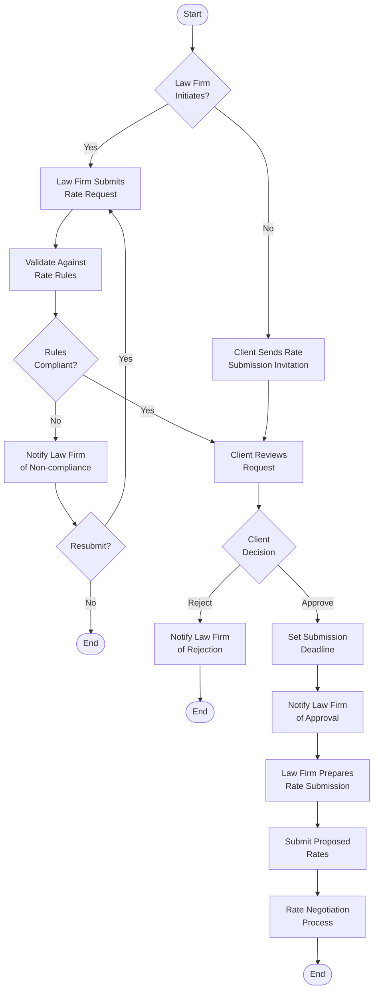

##### Rate Negotiation Workflow

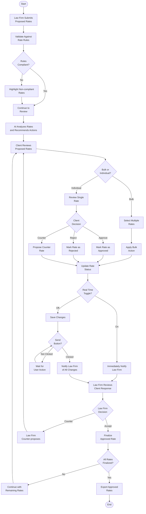

##### Approval Workflow

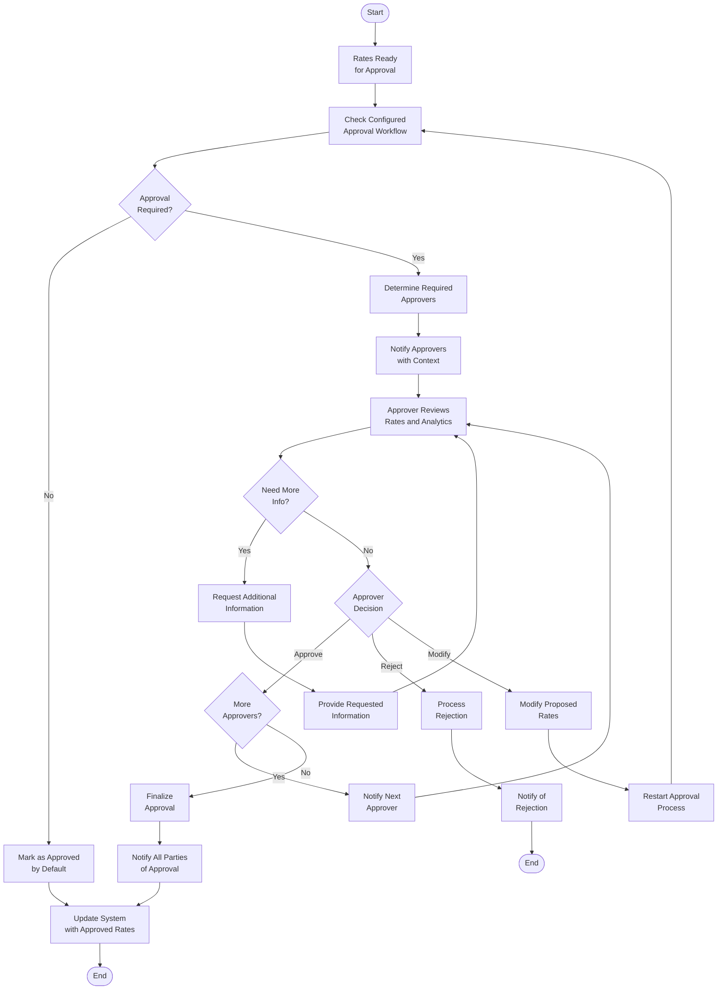

##### Outside Counsel Guidelines Workflow

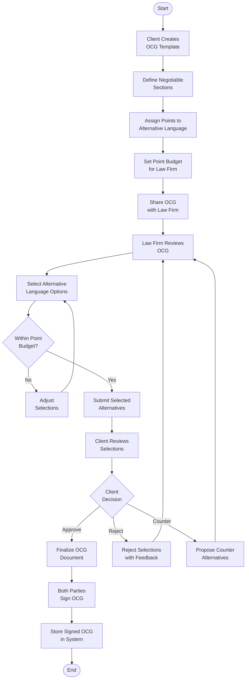

#### Integration Workflows

##### eBilling System Integration Workflow

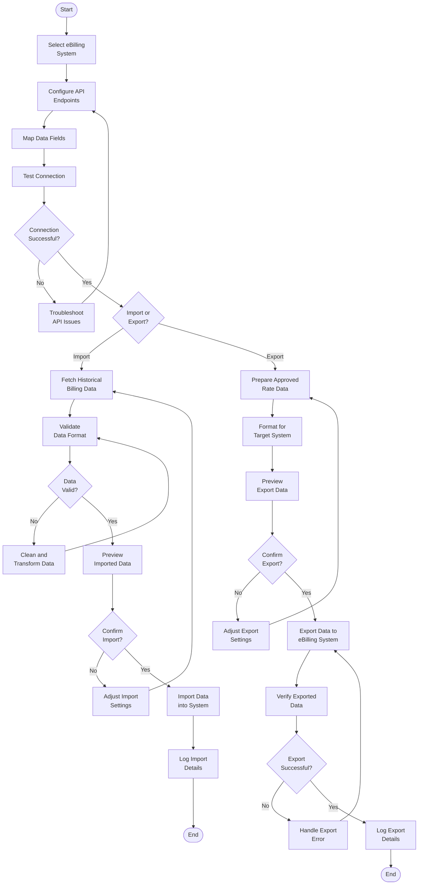

##### UniCourt Integration Workflow

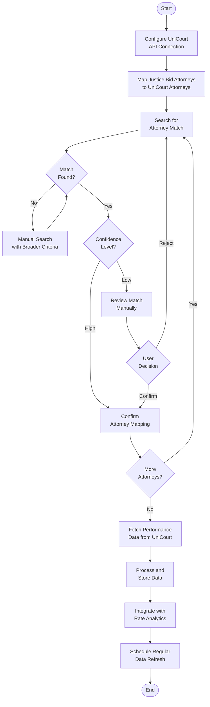

##### Data Import/Export Workflow

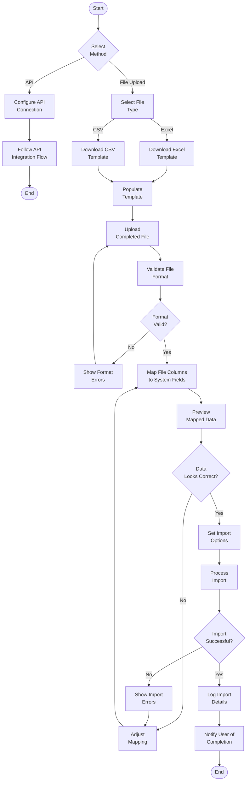

### FLOWCHART REQUIREMENTS

#### Validation Rules

##### Rate Submission Validation Flow

```mermaid
flowchart TD
    Start([Start]) --> ReceiveRates[Receive Proposed\nRates]
    ReceiveRates --> ValidateRateFreeze[Check Rate\nFreeze Period]
    
    ValidateRateFreeze --> FreezeCheck{Within Freeze\nPeriod?}
    FreezeCheck -->|Yes| RejectSubmission[Reject Submission\nwith Explanation]
    FreezeCheck -->|No| ValidateNotice[Check Notice\nPeriod]
    
    ValidateNotice --> NoticeCheck{Notice Period\nSatisfied?}
    NoticeCheck -->|No| AdjustEffectiveDate[Adjust Effective\nDate]
    NoticeCheck -->|Yes| ValidateWindow[Check Submission\nWindow]
    
    AdjustEffectiveDate --> ValidateWindow
    
    ValidateWindow --> WindowCheck{Within\nWindow?}
    WindowCheck -->|No| RejectSubmission
    WindowCheck -->|Yes| ValidateFrequency[Check Request\nFrequency]
    
    ValidateFrequency --> FrequencyCheck{Frequency\nAllowed?}
    FrequencyCheck -->|No| RejectSubmission
    FrequencyCheck -->|Yes| ValidateIncrease[Check Rate\nIncrease Limits]
    
    ValidateIncrease --> IncreaseCheck{Within\nLimits?}
    IncreaseCheck -->|No| FlagExcessive[Flag Excessive\nIncreases]
    IncreaseCheck -->|Yes| ValidateCurrency[Check Currency\nValidity]
    
    FlagExcessive --> ValidateCurrency
    
    ValidateCurrency --> CurrencyCheck{Currency\nValid?}
    CurrencyCheck -->|No| FixCurrency[Fix Currency\nIssues]
    CurrencyCheck -->|Yes| ValidateAttorneys[Validate Attorney\nInformation]
    
    FixCurrency --> ValidateAttorneys
    
    ValidateAttorneys --> AttorneyCheck{Information\nComplete?}
    AttorneyCheck -->|No| FlagIncomplete[Flag Incomplete\nAttorney Data]
    AttorneyCheck -->|Yes| ValidationComplete[Validation\nComplete]
    
    FlagIncomplete --> ValidationComplete
    ValidationComplete --> End([End])
    RejectSubmission --> End
```

##### Authorization Checkpoint Flow

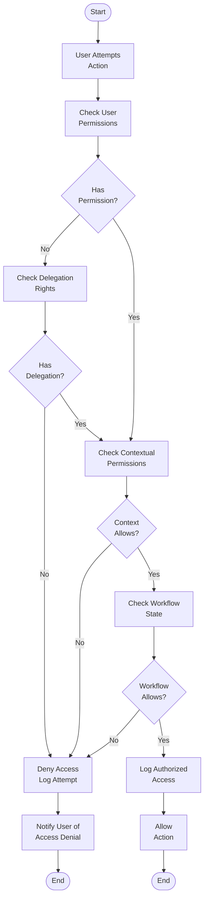

### TECHNICAL IMPLEMENTATION

#### State Management

##### Rate Negotiation State Transition Diagram

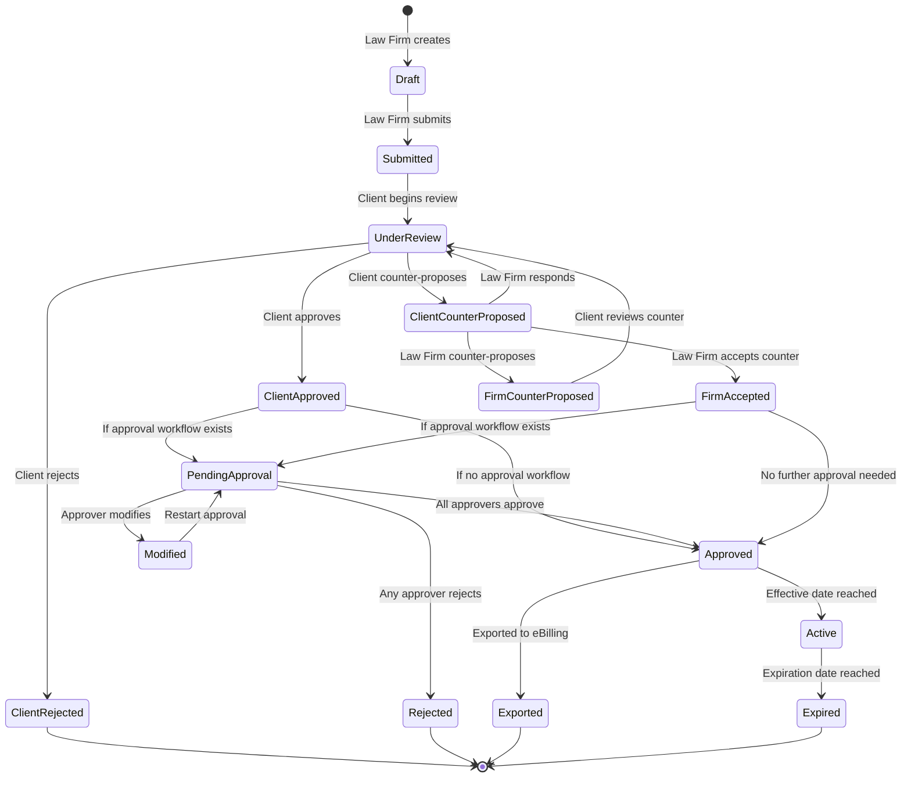

#### Error Handling

##### Rate Submission Error Handling Flow

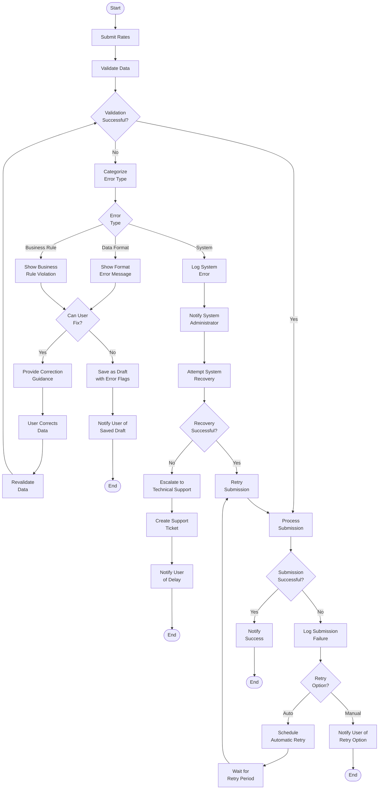

### INTEGRATION SEQUENCE DIAGRAMS

#### eBilling System Integration Sequence

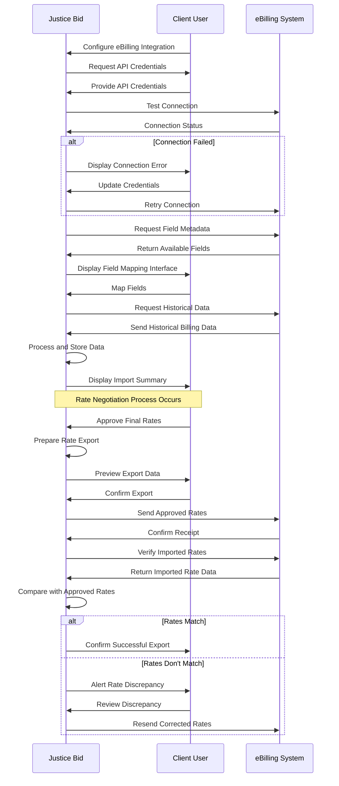

#### UniCourt Integration Sequence

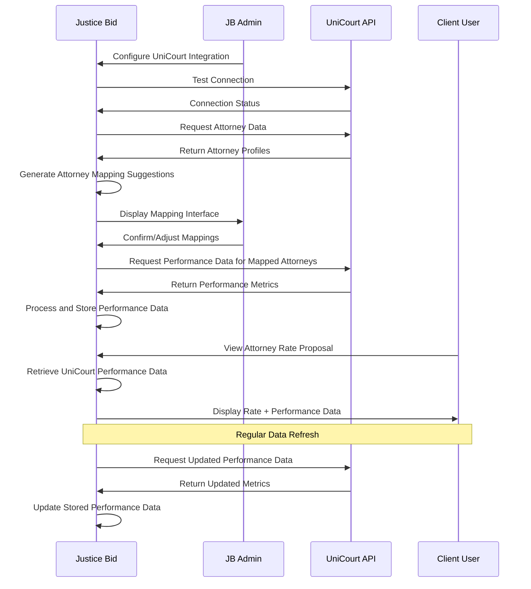

#### AI Recommendation Sequence

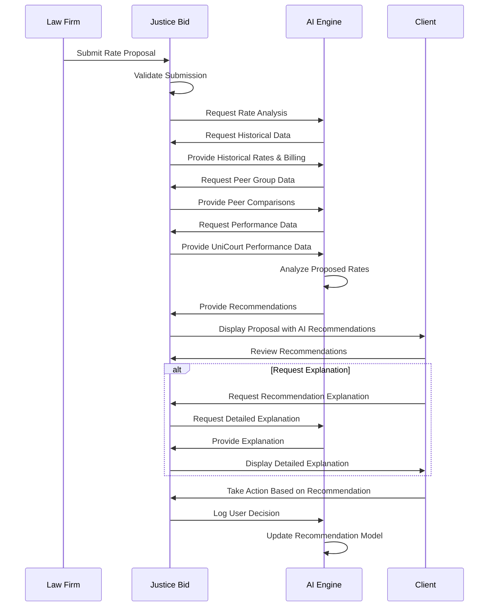

#### High-Level System Workflow

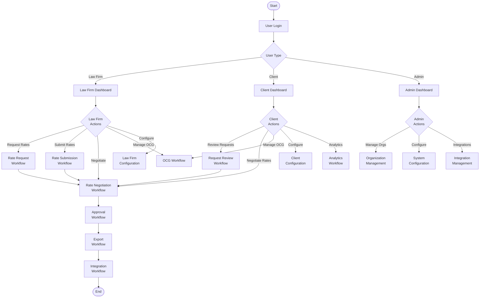

## 5. SYSTEM ARCHITECTURE

### HIGH-LEVEL ARCHITECTURE

#### System Overview

The Justice Bid Rate Negotiation System employs a modern microservices architecture with a React.js frontend and a Python-based backend. This architecture was selected to provide the flexibility needed for the complex rate negotiation workflows while ensuring scalability as the system grows.

The system follows several key architectural principles:

- **API-First Design**: All functionality is exposed through well-defined APIs, enabling seamless integration with external systems like eBilling platforms and UniCourt.
- **Domain-Driven Design**: The system is organized around business domains (rate management, negotiations, analytics, etc.) rather than technical layers.
- **Event-Driven Communication**: Key business events (rate submissions, approvals, etc.) trigger notifications and workflow transitions.
- **Polyglot Persistence**: Different data storage technologies are used based on the nature of the data (relational for structured rate data, document-based for messages and OCGs).
- **AI-First Approach**: AI capabilities are integrated throughout the system with configurable AI environments to support client preferences.

System boundaries are clearly defined with dedicated integration services managing connections to external systems like eBilling platforms, law firm billing systems, and UniCourt. The system exposes RESTful APIs for data exchange and webhook endpoints for event notifications.

#### Core Components Table

| Component | Primary Responsibility | Key Dependencies | Critical Considerations |
| --------- | ---------------------- | ---------------- | ----------------------- |
| Rate Management Service | Handles rate data lifecycle including submissions, approvals, and history | Organization Service, Analytics Service | Must maintain complete audit trail of all rate changes |
| Negotiation Service | Manages the negotiation workflow between law firms and clients | Rate Management Service, Messaging Service | Must support complex approval workflows and real-time updates |
| Analytics Engine | Processes historical and current rate data to provide insights and recommendations | Rate Management Service, Data Import Service | Must handle large volumes of historical data efficiently |
| AI Service | Provides AI-powered recommendations, chat functionality, and process management | All services (consumes data from across the system) | Must support both Justice Bid and client AI environments |
| Organization Service | Manages organization hierarchies, users, and permissions | Authentication Service | Must support complex organizational structures and relationships |
| Integration Hub | Coordinates data exchange with external systems | All services (provides data to/from external systems) | Must handle various integration patterns and data formats |
| Messaging Service | Manages secure communications between parties | Notification Service, Organization Service | Must maintain hierarchical message structure with complete history |

#### Data Flow Description

The primary data flow begins with the import of historical rate and billing data from client eBilling systems or law firm billing systems through the Integration Hub. This data is processed, transformed, and stored in the system's databases to establish the baseline for rate negotiations.

When a rate negotiation begins, the Negotiation Service orchestrates the workflow, starting with a rate request from either a law firm or client. The Rate Management Service handles the submission of proposed rates, which are then analyzed by the Analytics Engine to provide insights on the impact and competitiveness of the rates.

During negotiation, the Messaging Service facilitates secure communications between parties, with all messages and rate proposals flowing through the Negotiation Service to maintain a complete audit trail. The AI Service provides recommendations at key decision points, analyzing the proposed rates against historical data, peer comparisons, and performance metrics.

As rates are approved, the Rate Management Service updates the rate status and notifies relevant parties through the Notification Service. Finally, approved rates can be exported back to client eBilling systems or law firm billing systems through the Integration Hub.

Throughout this process, the Organization Service enforces access controls based on user roles and permissions, ensuring that users only see data they are authorized to access.

#### External Integration Points

| System Name | Integration Type | Data Exchange Pattern | Protocol/Format | SLA Requirements |
| ----------- | ---------------- | --------------------- | --------------- | ---------------- |
| Client eBilling Systems (Onit, TeamConnect, etc.) | Bidirectional | Batch import of historical data, export of approved rates | REST API, File Import/Export | 99.5% availability during business hours, <2s response time |
| Law Firm Billing Systems | Bidirectional | Import of attorney profiles and standard rates, export of approved rates | REST API, File Import/Export | 99% availability during business hours, <3s response time |
| UniCourt | Unidirectional (inbound) | Periodic import of attorney performance data | REST API | 98% availability, <5s response time |
| OpenAI/Client AI Environment | Bidirectional | Real-time queries for AI recommendations and chat | REST API | 99.9% availability, <1s response time |
| SSO Providers | Unidirectional (outbound) | Authentication requests | SAML, OAuth 2.0 | 99.99% availability, <500ms response time |

### COMPONENT DETAILS

#### Rate Management Service

**Purpose and Responsibilities:**
- Manages the lifecycle of rate data including standard rates, proposed rates, counter-proposals, and approved rates
- Maintains complete history of rate changes with effective dates
- Enforces rate rules and validation logic
- Provides APIs for rate submission, retrieval, and updates

**Technologies and Frameworks:**
- Python with Flask for API layer
- SQLAlchemy ORM for database interactions
- Redis for caching frequently accessed rate data

**Key Interfaces:**
- Rate Submission API: Accepts proposed rates from law firms
- Rate Approval API: Processes rate approvals and rejections
- Rate History API: Provides historical rate data for analytics
- Rate Validation API: Validates rates against client-defined rules

**Data Persistence:**
- Primary storage in PostgreSQL for structured rate data
- Redis cache for active negotiation data
- Complete audit log of all rate changes

**Scaling Considerations:**
- Horizontal scaling for API layer
- Database sharding by organization for large clients
- Read replicas for analytics queries

#### Rate Submission Sequence

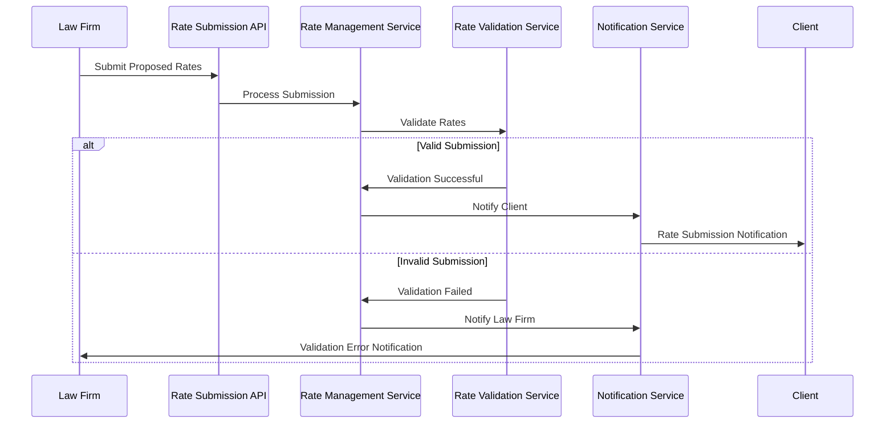

#### Negotiation Service

**Purpose and Responsibilities:**
- Orchestrates the rate negotiation workflow
- Manages the state transitions of negotiations
- Coordinates approval workflows
- Tracks negotiation history and audit trail

**Technologies and Frameworks:**
- Python with Flask for API layer
- State machine pattern for workflow management
- Event-driven architecture for workflow transitions

**Key Interfaces:**
- Negotiation API: Manages negotiation lifecycle
- Approval API: Handles approval workflows
- Counter-proposal API: Processes counter-proposals
- Negotiation History API: Provides audit trail

**Data Persistence:**
- PostgreSQL for negotiation state and history
- MongoDB for complex negotiation metadata
- Complete audit log of all negotiation activities

**Scaling Considerations:**
- Stateless design for horizontal scaling
- Caching of active negotiations
- Asynchronous processing of workflow transitions

#### Negotiation State Transitions

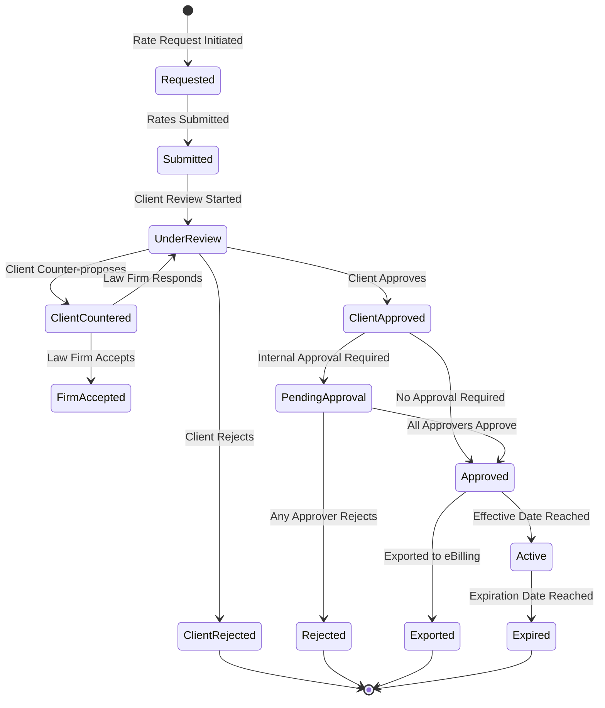

#### Analytics Engine

**Purpose and Responsibilities:**
- Processes historical rate and billing data
- Calculates rate impact based on historical hours
- Provides peer group comparisons
- Generates insights for AI recommendations

**Technologies and Frameworks:**
- Python with NumPy and Pandas for data processing
- Flask for API layer
- Celery for background processing of analytics tasks

**Key Interfaces:**
- Impact Analysis API: Calculates financial impact of rate changes
- Peer Comparison API: Provides benchmarking against peer groups
- Historical Trend API: Analyzes rate trends over time
- Custom Report API: Generates custom analytics reports

**Data Persistence:**
- PostgreSQL for structured analytics data
- Redis for caching frequently accessed analytics
- S3 for storage of generated reports

**Scaling Considerations:**
- Distributed processing for large analytics jobs
- Pre-computation of common analytics queries
- Time-series optimized storage for historical data

#### AI Service

**Purpose and Responsibilities:**
- Provides AI-powered recommendations for rate negotiations
- Supports natural language chat interface
- Manages AI personalization and learning
- Coordinates with external AI environments

**Technologies and Frameworks:**
- Python with LangChain for AI orchestration
- Flask for API layer
- Vector database for semantic search

**Key Interfaces:**
- Recommendation API: Provides AI-driven recommendations
- Chat API: Handles natural language interactions
- Personalization API: Manages user-specific AI preferences
- AI Configuration API: Manages AI environment settings

**Data Persistence:**
- Vector database for semantic search capabilities
- Redis for caching AI responses
- MongoDB for storing conversation history

**Scaling Considerations:**
- Configurable AI environments (Justice Bid or client)
- Batching of AI requests for efficiency
- Caching of common AI responses

#### AI Recommendation Flow

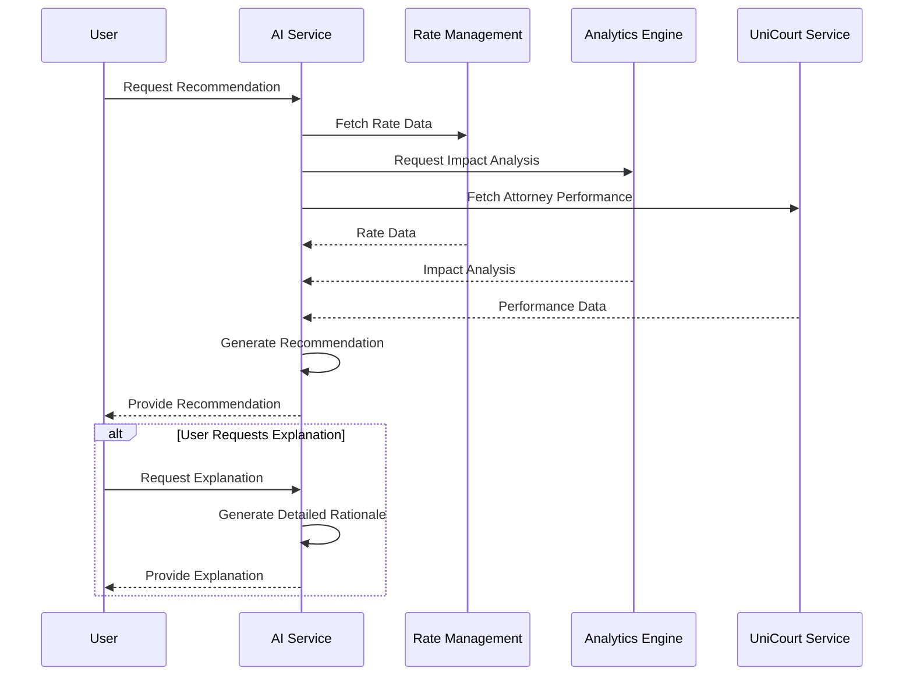

#### Organization Service

**Purpose and Responsibilities:**
- Manages organization hierarchies and relationships
- Handles user management and permissions
- Enforces access controls
- Manages peer group configurations

**Technologies and Frameworks:**
- Python with Flask for API layer
- RBAC (Role-Based Access Control) for permissions
- Graph database for complex organizational relationships

**Key Interfaces:**
- Organization API: Manages organization data
- User API: Handles user management
- Permission API: Controls access rights
- Peer Group API: Manages peer group configurations

**Data Persistence:**
- PostgreSQL for organization and user data
- Neo4j for complex organizational relationships
- Redis for caching permission checks

**Scaling Considerations:**
- Caching of permission checks for performance
- Hierarchical data structures for efficient queries
- Denormalization of frequently accessed data

#### Integration Hub

**Purpose and Responsibilities:**
- Manages integrations with external systems
- Handles data import and export
- Provides field mapping and transformation
- Validates data integrity during exchange

**Technologies and Frameworks:**
- Python with Flask for API layer
- Apache Airflow for orchestration of data pipelines
- Protocol adapters for different integration patterns

**Key Interfaces:**
- Import API: Handles data import from external systems
- Export API: Manages data export to external systems
- Mapping API: Configures field mappings
- Validation API: Ensures data integrity

**Data Persistence:**
- PostgreSQL for integration configurations
- MongoDB for complex mapping rules
- S3 for storage of import/export files

**Scaling Considerations:**
- Asynchronous processing of large data transfers
- Retry mechanisms for failed integrations
- Rate limiting for external API calls

#### Integration Data Flow

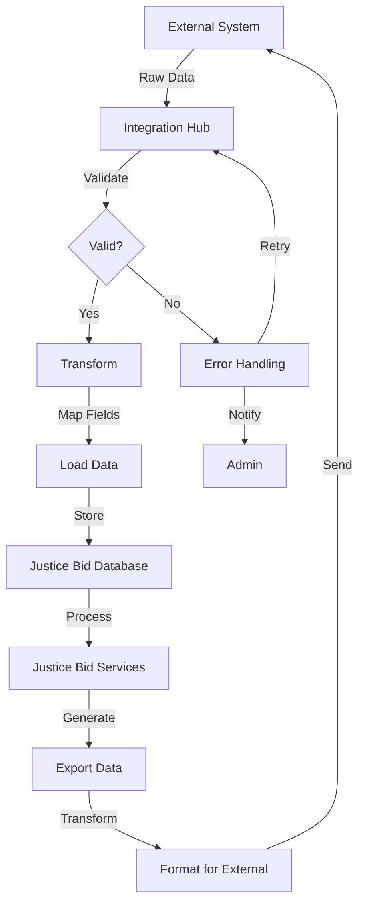

#### Messaging Service

**Purpose and Responsibilities:**
- Manages secure communications between parties
- Maintains hierarchical message structure
- Provides message search and filtering
- Ensures message delivery and tracking

**Technologies and Frameworks:**
- Python with Flask for API layer
- WebSockets for real-time messaging
- Full-text search for message content

**Key Interfaces:**
- Message API: Handles message creation and retrieval
- Thread API: Manages message threads and hierarchy
- Search API: Provides message search capabilities
- Notification API: Integrates with notification system

**Data Persistence:**
- MongoDB for message storage
- Elasticsearch for message search
- Complete audit log of all message activities

**Scaling Considerations:**
- Sharding by organization for large message volumes
- Caching of active message threads
- Archiving of old messages

### TECHNICAL DECISIONS

#### Architecture Style Decisions

| Decision | Options Considered | Selected Approach | Rationale |
| -------- | ------------------ | ----------------- | --------- |
| Overall Architecture | Monolithic, Microservices, Serverless | Microservices | Enables independent scaling of components, supports complex domain model, allows for technology diversity |
| Frontend Framework | Angular, React, Vue | React.js | Required by specifications, excellent component model for complex UIs |
| Backend Language | Java, Python, Node.js | Python | Strong support for data processing and AI integration, excellent libraries for analytics |
| API Design | REST, GraphQL, gRPC | REST with some GraphQL | REST for broad compatibility, GraphQL for complex data queries in analytics |

The microservices architecture was selected to align with the complex domain model of the rate negotiation system. Each business capability (rate management, negotiations, analytics, etc.) is implemented as a separate service with well-defined boundaries. This approach enables independent scaling of components based on demand - for example, the Analytics Engine can scale during peak reporting periods without affecting other services.

#### Communication Pattern Choices

| Pattern | Use Cases | Implementation | Considerations |
| ------- | --------- | -------------- | -------------- |
| Synchronous REST | User-initiated actions, CRUD operations | HTTP/JSON with standardized error responses | Simple, widely supported, but can create tight coupling |
| Asynchronous Events | Workflow transitions, notifications | Message queue (RabbitMQ) with event schema | Loose coupling, resilience, but more complex to implement |
| WebSockets | Real-time negotiations, chat | Socket.io with fallback mechanisms | Enables real-time updates, but requires connection management |
| Batch Processing | Data imports/exports, analytics | Scheduled jobs with idempotent operations | Efficient for large data volumes, but introduces latency |

The system employs a hybrid communication approach, using synchronous REST for direct user interactions and asynchronous events for workflow transitions. This combination provides responsive user experiences while maintaining system resilience. WebSockets are used selectively for real-time features like the negotiation interface when in "Real Time" mode.

#### Data Storage Solution Rationale

| Data Type | Storage Solution | Justification |
| --------- | ---------------- | ------------- |
| Rate and Billing Data | PostgreSQL | Strong consistency, complex query support, transaction support for critical financial data |
| Messages and OCGs | MongoDB | Flexible schema for varied document structures, good performance for hierarchical data |
| Search Indexes | Elasticsearch | Optimized for full-text search across messages and attorney profiles |
| Caching | Redis | High performance, support for complex data structures, pub/sub capabilities |
| File Storage | AWS S3 | Scalable, durable storage for documents, templates, and exports |

A polyglot persistence approach was selected to match storage technologies to data characteristics. PostgreSQL provides the transactional integrity needed for financial data, while MongoDB offers the flexibility required for varied document structures like messages and OCGs. This approach optimizes both performance and data integrity.

#### Error Handling Flow

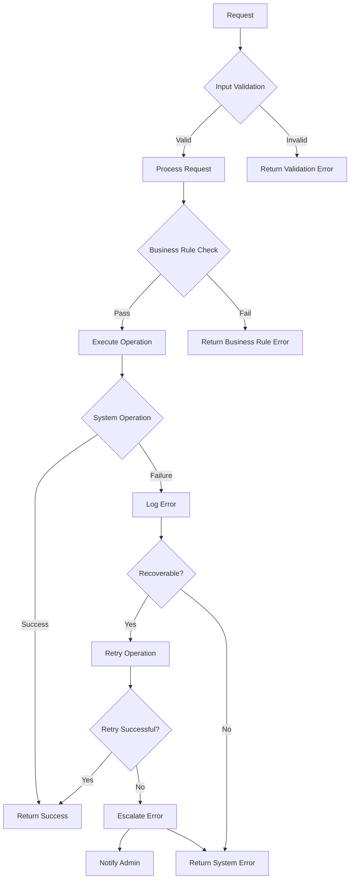

### CROSS-CUTTING CONCERNS

#### Monitoring and Observability Approach

The system implements a comprehensive monitoring strategy with multiple layers:

- **Infrastructure Monitoring**: AWS CloudWatch monitors system resources (CPU, memory, disk) with automated alerts for threshold violations.
- **Application Performance Monitoring**: Datadog APM tracks service performance, latency, and error rates across all microservices.
- **Business Metrics**: Custom dashboards track key business metrics like active negotiations, approval times, and integration success rates.
- **User Experience Monitoring**: Real User Monitoring (RUM) captures frontend performance and user interactions to identify UX issues.

Distributed tracing with OpenTelemetry provides end-to-end visibility across service boundaries, enabling rapid troubleshooting of complex issues. All monitoring data is centralized in Datadog for unified alerting and visualization.

#### Logging and Tracing Strategy

| Log Type | Purpose | Implementation | Retention |
| -------- | ------- | -------------- | --------- |
| Application Logs | Debugging, audit trail | Structured JSON logs with correlation IDs | 90 days |
| Security Logs | Access control, authentication | Immutable logs with tamper detection | 1 year |
| Integration Logs | API calls, data transfers | Detailed request/response logging | 30 days |
| User Activity Logs | Audit trail, compliance | Business event logging with user context | 7 years |

Logs are collected using Fluent Bit agents and centralized in Elasticsearch for searching and analysis. Critical security and audit logs are additionally archived to immutable storage for compliance purposes. All logs include correlation IDs to link related events across services.

#### Authentication and Authorization Framework

The system implements a multi-layered security approach:

- **Authentication**: OAuth 2.0 and SAML for SSO integration with client identity providers, with JWT tokens for session management.
- **Authorization**: RBAC (Role-Based Access Control) with fine-grained permissions at the organization, peer group, and individual entity levels.
- **API Security**: API keys with scope limitations for system integrations, rate limiting to prevent abuse.
- **Data Isolation**: Multi-tenancy with strict data partitioning to ensure organizations can only access their own data.

The Organization Service acts as the central authority for permission checks, with a permission cache to optimize performance. All permission changes are logged for audit purposes.

#### Performance Requirements and SLAs

| Component | Response Time | Throughput | Availability |
| --------- | ------------- | ---------- | ------------ |
| User Interface | <1s for 95% of requests | 100 concurrent users per tenant | 99.9% during business hours |
| API Services | <500ms for 95% of requests | 1000 requests per second | 99.95% |
| Analytics Engine | <5s for standard reports | 100 concurrent report generations | 99.5% |
| AI Services | <2s for recommendations | 50 concurrent AI requests | 99.5% |
| Integration Services | <30s for data imports/exports | 10 concurrent integrations | 99.5% |

The system is designed to handle peak loads during annual rate negotiation periods, with auto-scaling capabilities to maintain performance. Database read replicas and caching strategies ensure analytics queries don't impact transactional performance.

#### Disaster Recovery Procedures

The system implements a comprehensive disaster recovery strategy:

- **Data Backup**: Automated daily backups of all databases with point-in-time recovery capabilities.
- **Multi-Region Deployment**: Critical components deployed across multiple AWS regions for high availability.
- **Recovery Time Objective (RTO)**: 4 hours for full system recovery.
- **Recovery Point Objective (RPO)**: 15 minutes maximum data loss in disaster scenarios.

Regular disaster recovery drills ensure the procedures are effective and team members are familiar with recovery processes. Documentation is maintained for all recovery procedures, including manual steps if automated recovery fails.

## 6. SYSTEM COMPONENTS DESIGN

### FRONTEND COMPONENTS

#### User Interface Architecture

The Justice Bid Rate Negotiation System frontend is built using React.js with a component-based architecture that emphasizes reusability, maintainability, and a consistent user experience. The UI architecture follows these key principles:

1. **Component Hierarchy**: Components are organized in a hierarchical structure with clear parent-child relationships
2. **Atomic Design**: UI elements follow the atomic design methodology (atoms, molecules, organisms, templates, pages)
3. **Separation of Concerns**: Presentation components are separated from container components that manage state
4. **Responsive Design**: All components adapt to different screen sizes using responsive design principles

The high-level component structure is organized as follows:

```
src/
├── components/
│   ├── common/              # Shared UI components
│   ├── layout/              # Layout components
│   ├── forms/               # Form components
│   ├── tables/              # Table components
│   ├── charts/              # Data visualization components
│   ├── modals/              # Modal dialog components
│   └── ai/                  # AI-specific components
├── containers/              # Container components for business logic
├── pages/                   # Page components
├── hooks/                   # Custom React hooks
├── context/                 # React context providers
├── services/                # API service integrations
├── utils/                   # Utility functions
└── assets/                  # Static assets
```

#### Key UI Components

| Component Category | Description | Key Components |
| ------------------ | ----------- | -------------- |
| Navigation | Components for user navigation | Header, Sidebar, Breadcrumbs, TabNavigation |
| Dashboard | Dashboard visualization components | DashboardCard, MetricDisplay, ActionCenter |
| Rate Management | Components for rate submission and negotiation | RateTable, RateComparisonChart, RateHistoryTimeline |
| Negotiation | Components for the negotiation process | NegotiationInterface, CounterProposalForm, ApprovalActions |
| Analytics | Data visualization components | ImpactAnalysisChart, PeerComparisonChart, RateTrendGraph |
| Messaging | Communication components | MessageThread, MessageComposer, NotificationCenter |
| AI Interface | AI interaction components | AIChatInterface, RecommendationCard, AIExplanationPanel |
| Configuration | System configuration components | APIConfigurationForm, FieldMappingInterface, WorkflowEditor |

#### Component Interaction Diagram

```mermaid
graph TD
    A[App] --> B[AuthProvider]
    B --> C[Layout]
    C --> D[Header]
    C --> E[Sidebar]
    C --> F[MainContent]
    F --> G[Router]
    G --> H[Dashboard]
    G --> I[RateNegotiation]
    G --> J[Analytics]
    G --> K[Configuration]
    
    H --> L[DashboardCards]
    H --> M[NotificationCenter]
    H --> N[ActionItems]
    
    I --> O[RateTable]
    I --> P[NegotiationInterface]
    I --> Q[MessageThread]
    
    P --> R[CounterProposalForm]
    P --> S[ApprovalActions]
    P --> T[RateHistory]
    
    J --> U[ImpactAnalysisChart]
    J --> V[PeerComparisonChart]
    J --> W[CustomReportBuilder]
    
    K --> X[APIConfiguration]
    K --> Y[UserManagement]
    K --> Z[WorkflowEditor]
```

#### State Management

The application uses a combination of state management approaches:

1. **Redux**: For global application state including:
   - User authentication and permissions
   - Active negotiations and their status
   - System configuration settings
   - Notification state

2. **React Context**: For intermediate state sharing across component trees:
   - Theme and UI preferences
   - Current organization context
   - Feature flags and permissions

3. **Local Component State**: For UI-specific state:
   - Form inputs and validation
   - UI element visibility (expanded/collapsed)
   - Temporary user interactions

4. **React Query**: For server state management:
   - Data fetching and caching
   - Optimistic updates
   - Background refetching

#### Redux Store Structure

```
store/
├── auth/                # Authentication state
├── organizations/       # Organization data
├── rates/               # Rate data and negotiations
├── analytics/           # Analytics data
├── messages/            # Messaging state
├── notifications/       # Notification state
├── configuration/       # System configuration
└── ai/                  # AI state and interactions
```

#### Key User Interfaces

##### Dashboard Interface

The dashboard serves as the central hub for both law firms and clients, providing:

- **Action Center**: Prioritized list of actions requiring attention
- **Notification Panel**: Recent notifications and messages
- **Active Negotiations**: Overview of ongoing rate negotiations
- **Analytics Summary**: Key metrics and trends
- **AI Recommendations**: AI-suggested actions and insights


##### Rate Negotiation Interface

The rate negotiation interface is the core of the application, featuring:

- **Rate Table**: Interactive table of rates with filtering and sorting
- **Negotiation Controls**: Approve, reject, counter-propose actions
- **Rate History**: Timeline view of rate changes
- **Impact Analysis**: Real-time calculation of financial impact
- **Messaging Panel**: Contextual messaging tied to specific rates
- **AI Recommendations**: Suggested actions based on analytics


##### Analytics Dashboard

The analytics dashboard provides comprehensive data visualization:

- **Impact Analysis**: Financial impact of rate changes
- **Peer Comparisons**: Benchmarking against defined peer groups
- **Historical Trends**: Rate and billing trends over time
- **Attorney Performance**: Performance metrics from billing and UniCourt
- **Custom Reports**: User-defined analytics views
- **AI Insights**: AI-generated observations and recommendations


##### Configuration Interface

The configuration interface allows system setup:

- **API Configuration**: Connection to eBilling and law firm systems
- **Field Mapping**: Visual mapping of data fields between systems
- **Workflow Editor**: Definition of approval workflows
- **Rate Rules**: Configuration of rate rules and constraints
- **OCG Editor**: Creation and management of Outside Counsel Guidelines
- **Peer Group Configuration**: Definition of peer groups for comparison


### BACKEND COMPONENTS

#### Service Architecture

The Justice Bid backend follows a microservices architecture organized around business domains. Each service is responsible for a specific business capability and exposes well-defined APIs for interaction with other services and the frontend.

The key services include:

| Service | Responsibility | Key APIs |
| ------- | -------------- | -------- |
| Rate Service | Manages rate data and lifecycle | Rate submission, approval, history |
| Negotiation Service | Handles negotiation workflows | Negotiation state, counter-proposals, approvals |
| Analytics Service | Processes data for insights | Impact analysis, peer comparison, trends |
| Organization Service | Manages org data and relationships | Org profiles, user management, permissions |
| Messaging Service | Handles communication | Message threads, notifications |
| Integration Service | Manages external system connections | Data import/export, field mapping |
| AI Service | Provides AI capabilities | Recommendations, chat, personalization |
| Document Service | Manages OCGs and documents | OCG creation, negotiation, versioning |

#### Service Interaction Diagram

```mermaid
graph TD
    A[API Gateway] --> B[Rate Service]
    A --> C[Negotiation Service]
    A --> D[Analytics Service]
    A --> E[Organization Service]
    A --> F[Messaging Service]
    A --> G[Integration Service]
    A --> H[AI Service]
    A --> I[Document Service]
    
    B <--> C
    B <--> D
    C <--> D
    C <--> F
    D <--> G
    E <--> B
    E <--> C
    E <--> F
    G <--> B
    H <--> B
    H <--> C
    H <--> D
    H <--> F
    I <--> E
    I <--> F
```

#### Data Models

The core data models in the system include:

##### Organization Model

```json
{
  "id": "uuid",
  "name": "String",
  "type": "Enum(Client, LawFirm, Admin)",
  "domain": "String",
  "settings": {
    "rateRules": {
      "freezePeriod": "Number",
      "noticeRequired": "Number",
      "maxIncreasePercent": "Number",
      "submissionWindow": {
        "startMonth": "Number",
        "startDay": "Number",
        "endMonth": "Number",
        "endDay": "Number"
      }
    },
    "approvalWorkflow": "Object",
    "afaTarget": "Number",
    "defaultCurrency": "String"
  },
  "offices": ["Office"],
  "departments": ["Department"],
  "contacts": ["Contact"],
  "createdAt": "DateTime",
  "updatedAt": "DateTime"
}
```

##### Attorney Model

```json
{
  "id": "uuid",
  "organizationId": "uuid",
  "name": "String",
  "email": "String",
  "barDate": "Date",
  "graduationDate": "Date",
  "promotionDate": "Date",
  "officeIds": ["uuid"],
  "practiceAreas": ["String"],
  "timekeeperIds": {
    "clientId": "String"
  },
  "unicourtId": "String",
  "performanceData": {
    "unicourt": "Object",
    "ratings": ["Rating"]
  },
  "createdAt": "DateTime",
  "updatedAt": "DateTime"
}
```

##### Rate Model

```json
{
  "id": "uuid",
  "attorneyId": "uuid",
  "clientId": "uuid",
  "firmId": "uuid",
  "officeId": "uuid",
  "staffClassId": "uuid",
  "amount": "Number",
  "currency": "String",
  "type": "Enum(Standard, Approved, Proposed, CounterProposed)",
  "effectiveDate": "Date",
  "expirationDate": "Date",
  "status": "Enum(Draft, Submitted, UnderReview, Approved, Rejected)",
  "history": [{
    "amount": "Number",
    "type": "Enum",
    "status": "Enum",
    "timestamp": "DateTime",
    "userId": "uuid",
    "message": "String"
  }],
  "createdAt": "DateTime",
  "updatedAt": "DateTime"
}
```

##### Negotiation Model

```json
{
  "id": "uuid",
  "clientId": "uuid",
  "firmId": "uuid",
  "status": "Enum(Requested, InProgress, Completed, Rejected)",
  "requestDate": "DateTime",
  "submissionDeadline": "DateTime",
  "completionDate": "DateTime",
  "rateIds": ["uuid"],
  "messageThreadId": "uuid",
  "approvalWorkflowId": "uuid",
  "approvalStatus": "Enum(Pending, InProgress, Approved, Rejected)",
  "createdAt": "DateTime",
  "updatedAt": "DateTime"
}
```

##### Message Model

```json
{
  "id": "uuid",
  "threadId": "uuid",
  "parentId": "uuid",
  "senderId": "uuid",
  "recipientIds": ["uuid"],
  "content": "String",
  "attachments": ["Attachment"],
  "relatedEntityType": "Enum(Negotiation, Rate, OCG)",
  "relatedEntityId": "uuid",
  "isRead": "Boolean",
  "createdAt": "DateTime",
  "updatedAt": "DateTime"
}
```

##### OCG Model

```json
{
  "id": "uuid",
  "clientId": "uuid",
  "name": "String",
  "version": "Number",
  "status": "Enum(Draft, Published, Negotiating, Signed)",
  "sections": [{
    "id": "uuid",
    "title": "String",
    "content": "String",
    "isNegotiable": "Boolean",
    "alternatives": [{
      "id": "uuid",
      "title": "String",
      "content": "String",
      "points": "Number"
    }]
  }],
  "firmSelections": {
    "firmId": {
      "sectionId": "uuid",
      "alternativeId": "uuid",
      "pointsUsed": "Number"
    }
  },
  "totalPoints": "Number",
  "createdAt": "DateTime",
  "updatedAt": "DateTime"
}
```

#### API Design

The Justice Bid API follows RESTful principles with consistent patterns:

1. **Resource-Based URLs**: APIs are organized around resources
2. **HTTP Methods**: Standard HTTP methods (GET, POST, PUT, DELETE) for CRUD operations
3. **JSON Format**: All requests and responses use JSON
4. **Versioning**: API versioning via URL path (/api/v1/...)
5. **Authentication**: JWT-based authentication with role-based access control
6. **Pagination**: Consistent pagination for list endpoints
7. **Filtering**: Query parameter-based filtering
8. **Error Handling**: Standardized error responses

##### Sample API Endpoints

**Rate Service API:**

```
GET    /api/v1/rates                   # List rates with filtering
POST   /api/v1/rates                   # Create new rate
GET    /api/v1/rates/:id               # Get rate details
PUT    /api/v1/rates/:id               # Update rate
GET    /api/v1/rates/:id/history       # Get rate history
POST   /api/v1/rates/:id/approve       # Approve rate
POST   /api/v1/rates/:id/reject        # Reject rate
POST   /api/v1/rates/:id/counter       # Counter-propose rate
```

**Negotiation Service API:**

```
GET    /api/v1/negotiations                    # List negotiations
POST   /api/v1/negotiations                    # Create negotiation
GET    /api/v1/negotiations/:id                # Get negotiation details
PUT    /api/v1/negotiations/:id/status         # Update negotiation status
GET    /api/v1/negotiations/:id/rates          # Get rates in negotiation
POST   /api/v1/negotiations/:id/submit         # Submit rates for negotiation
POST   /api/v1/negotiations/:id/approve        # Approve negotiation
POST   /api/v1/negotiations/:id/reject         # Reject negotiation
```

**Analytics Service API:**

```
GET    /api/v1/analytics/impact                # Get rate impact analysis
GET    /api/v1/analytics/comparison            # Get peer comparison
GET    /api/v1/analytics/trends                # Get historical trends
GET    /api/v1/analytics/performance           # Get attorney performance
POST   /api/v1/analytics/reports               # Create custom report
GET    /api/v1/analytics/reports/:id           # Get report results
```

**AI Service API:**

```
POST   /api/v1/ai/chat                         # Chat with AI
POST   /api/v1/ai/recommendations/rates        # Get rate recommendations
POST   /api/v1/ai/recommendations/actions      # Get action recommendations
POST   /api/v1/ai/analyze                      # Analyze specific data
GET    /api/v1/ai/configuration                # Get AI configuration
PUT    /api/v1/ai/configuration                # Update AI configuration
```

#### Integration Interfaces

The Integration Service provides interfaces for connecting with external systems:

##### eBilling System Integration

- **Configuration Interface**: API endpoint configuration and field mapping
- **Data Import Interface**: Historical rate and billing data import
- **Data Export Interface**: Approved rate export
- **Validation Interface**: Data validation and error handling

##### Law Firm Billing System Integration

- **Configuration Interface**: API endpoint configuration and field mapping
- **Attorney Import Interface**: Attorney profile and standard rate import
- **Rate Export Interface**: Approved rate export
- **Validation Interface**: Data validation and error handling

##### UniCourt Integration

- **Configuration Interface**: API endpoint configuration
- **Attorney Mapping Interface**: Justice Bid to UniCourt attorney mapping
- **Performance Data Interface**: Attorney performance data import
- **Refresh Interface**: Scheduled data refresh

##### File Import/Export

- **Template Interface**: Template generation and download
- **Upload Interface**: File upload and validation
- **Mapping Interface**: Field mapping for imported data
- **Export Interface**: Data export to various formats

### AI COMPONENTS

#### AI Architecture

The Justice Bid AI architecture is designed to be flexible, allowing clients to use either Justice Bid's AI environment or their own. The architecture consists of several layers:

1. **AI Orchestration Layer**: Coordinates AI services and manages routing to appropriate AI environments
2. **Model Integration Layer**: Connects to various LLM providers (OpenAI, Azure OpenAI, etc.)
3. **Context Management Layer**: Manages conversation context and user history
4. **Data Access Layer**: Controls secure access to permissioned data
5. **Personalization Layer**: Adapts AI behavior based on user preferences and patterns

```mermaid
graph TD
    A[AI Service API] --> B[AI Orchestration Layer]
    B --> C[Model Integration Layer]
    B --> D[Context Management Layer]
    B --> E[Data Access Layer]
    B --> F[Personalization Layer]
    
    C --> G[Justice Bid AI Environment]
    C --> H[Client AI Environment]
    
    E --> I[Rate Data]
    E --> J[Organization Data]
    E --> K[Negotiation Data]
    E --> L[Analytics Data]
    
    F --> M[User Preferences]
    F --> N[Interaction History]
    F --> O[Learning Models]
```

#### AI Capabilities

The AI components provide several key capabilities:

##### AI Chat Interface

The AI Chat Interface allows users to interact with the system using natural language:

- **Query Processing**: Parses natural language queries into structured requests
- **Context Management**: Maintains conversation context for follow-up questions
- **Data Access Control**: Enforces permissions on data access
- **Response Generation**: Generates natural language responses with appropriate formatting
- **Action Execution**: Performs system actions based on user requests

##### Rate Recommendations

The Rate Recommendation engine provides AI-driven guidance for rate decisions:

- **Rate Analysis**: Analyzes proposed rates against historical data and peer groups
- **Impact Calculation**: Calculates financial impact of rate changes
- **Performance Correlation**: Correlates rates with attorney performance data
- **Recommendation Generation**: Suggests approve/reject/counter actions with rationale
- **Counter-Proposal Calculation**: Calculates optimal counter-proposal values

##### Process Management

The Process Management AI helps users prioritize and manage their workflow:

- **Action Prioritization**: Ranks pending actions by importance and urgency
- **Next Step Prediction**: Suggests logical next steps in workflows
- **Message Generation**: Drafts follow-up messages based on context
- **Deadline Management**: Highlights approaching deadlines and time-sensitive items
- **Pattern Recognition**: Identifies patterns in negotiation behavior

##### Personalization

The Personalization AI adapts the system to individual user preferences:

- **Preference Learning**: Learns from user interactions and explicit feedback
- **Content Highlighting**: Highlights content based on user interests
- **Style Adaptation**: Adapts communication style to match user preferences
- **Recommendation Tuning**: Adjusts recommendations based on past user decisions
- **Interface Customization**: Personalizes dashboard views and information presentation

#### AI Integration Points

The AI components integrate with other system components at several key points:

| Integration Point | AI Capability | Implementation |
| ----------------- | ------------- | -------------- |
| Rate Negotiation Interface | Rate Recommendations | AI-suggested actions displayed alongside rates |
| Dashboard | Process Management | Prioritized action recommendations |
| Messaging | Message Generation | AI-suggested response drafts |
| Analytics | Insight Generation | AI-generated observations on data patterns |
| OCG Negotiation | Language Analysis | AI-assisted evaluation of clause alternatives |
| Approval Workflow | Context Summarization | AI-generated summaries for approvers |
| Attorney Selection | Performance Analysis | AI-recommended attorneys based on performance |

#### AI Configuration

The AI Configuration interface allows organizations to customize their AI experience:

- **Environment Selection**: Choose between Justice Bid or client AI environment
- **Model Selection**: Configure specific models for different AI functions
- **Data Access Control**: Define what data can be accessed by AI functions
- **Personalization Settings**: Configure user-level personalization options
- **Feedback Collection**: Gather feedback to improve AI performance

### INTEGRATION COMPONENTS

#### External System Integrations

The Justice Bid system integrates with several external systems:

##### eBilling System Integration

Integration with client eBilling systems (Onit, TeamConnect, Legal Tracker, BrightFlag) includes:

- **Historical Data Import**: Import of historical billing and rate data
- **Rate Export**: Export of approved rates back to eBilling systems
- **Field Mapping**: Configurable mapping between Justice Bid and eBilling fields
- **Validation**: Data validation and error handling
- **Synchronization**: Periodic data synchronization

##### Law Firm Billing System Integration

Integration with law firm billing systems includes:

- **Attorney Data Import**: Import of attorney profiles and standard rates
- **Rate Export**: Export of approved rates back to firm systems
- **Field Mapping**: Configurable mapping between Justice Bid and firm system fields
- **Validation**: Data validation and error handling
- **Synchronization**: Periodic data synchronization

##### UniCourt Integration

Integration with UniCourt for attorney performance data includes:

- **Attorney Mapping**: Mapping between Justice Bid attorneys and UniCourt attorneys
- **Performance Data Import**: Import of attorney court performance metrics
- **Data Refresh**: Scheduled refreshing of performance data
- **Data Correlation**: Correlation of performance data with rate information

#### File Import/Export

The system supports file-based data exchange:

- **Template Generation**: Creation of standardized Excel templates for data import
- **File Upload**: Secure upload of data files
- **Field Mapping**: Visual mapping of file columns to system fields
- **Validation**: Data validation with error reporting
- **Transformation**: Data transformation to system format
- **Export**: Data export to various file formats (Excel, CSV, PDF)

#### Integration Configuration

The Integration Configuration interface allows users to set up and manage integrations:

- **Connection Setup**: Configuration of API endpoints and authentication
- **Field Mapping**: Visual mapping of fields between systems
- **Testing**: Connection and data transfer testing
- **Scheduling**: Configuration of import/export schedules
- **Monitoring**: Monitoring of integration status and errors
- **Logging**: Comprehensive logging of all integration activities

#### Integration Architecture Diagram

```mermaid
graph TD
    A[Justice Bid System] --> B[Integration Service]
    B --> C[API Integration Module]
    B --> D[File Integration Module]
    B --> E[Transformation Module]
    B --> F[Validation Module]
    B --> G[Scheduling Module]
    
    C --> H[eBilling Systems]
    C --> I[Law Firm Systems]
    C --> J[UniCourt API]
    
    D --> K[Excel Import/Export]
    D --> L[CSV Import/Export]
    D --> M[PDF Export]
    
    E --> N[Field Mapping Engine]
    E --> O[Data Transformation Rules]
    
    F --> P[Validation Rules]
    F --> Q[Error Handling]
    
    G --> R[Scheduled Jobs]
    G --> S[Event Triggers]
```

### SECURITY COMPONENTS

#### Authentication and Authorization

The Justice Bid system implements a comprehensive security model:

##### Authentication

- **JWT-Based Authentication**: Secure token-based authentication
- **SSO Integration**: Support for SAML and OAuth 2.0 for enterprise SSO
- **Multi-Factor Authentication**: Optional MFA for enhanced security
- **Session Management**: Secure session handling with appropriate timeouts

##### Authorization

- **Role-Based Access Control**: Permissions based on user roles
- **Organization-Level Permissions**: Access control at the organization level
- **Data-Level Permissions**: Fine-grained control over data access
- **Action-Level Permissions**: Control over specific actions (approve, reject, etc.)
- **Delegation**: Ability to delegate permissions temporarily

#### Data Security

The system implements multiple layers of data security:

- **Encryption at Rest**: All sensitive data encrypted in the database
- **Encryption in Transit**: TLS for all data transmission
- **Data Isolation**: Multi-tenant architecture with strict data separation
- **Sensitive Data Handling**: Special handling for personally identifiable information
- **Data Retention**: Configurable data retention policies
- **Audit Logging**: Comprehensive logging of all data access and changes

#### Security Architecture Diagram

```mermaid
graph TD
    A[User] --> B[Authentication Layer]
    B --> C[Authorization Layer]
    C --> D[API Gateway]
    D --> E[Service Layer]
    E --> F[Data Access Layer]
    F --> G[Database]
    
    H[Security Monitoring] --> B
    H --> C
    H --> D
    H --> E
    H --> F
    
    I[Audit Logging] --> B
    I --> C
    I --> D
    I --> E
    I --> F
```

### DEPLOYMENT COMPONENTS

#### Deployment Architecture

The Justice Bid system is deployed using a containerized architecture:

- **Containerization**: Docker containers for all services
- **Orchestration**: Kubernetes for container orchestration
- **Load Balancing**: Distributed load balancing for high availability
- **Auto-Scaling**: Automatic scaling based on demand
- **Service Mesh**: Istio for service-to-service communication
- **Monitoring**: Comprehensive monitoring with Prometheus and Grafana
- **Logging**: Centralized logging with ELK stack

#### Deployment Diagram

```mermaid
graph TD
    A[User] --> B[CDN]
    B --> C[Load Balancer]
    C --> D[API Gateway]
    
    D --> E[Frontend Service]
    D --> F[Backend Services]
    
    F --> G[Rate Service]
    F --> H[Negotiation Service]
    F --> I[Analytics Service]
    F --> J[Organization Service]
    F --> K[Messaging Service]
    F --> L[Integration Service]
    F --> M[AI Service]
    F --> N[Document Service]
    
    G --> O[Database Cluster]
    H --> O
    I --> O
    J --> O
    K --> O
    L --> O
    M --> O
    N --> O
    
    P[Monitoring] --> E
    P --> F
    P --> O
    
    Q[Logging] --> E
    Q --> F
    Q --> O
```

#### CI/CD Pipeline

The system uses a comprehensive CI/CD pipeline:

- **Source Control**: Git with feature branch workflow
- **CI Server**: Jenkins or GitHub Actions for continuous integration
- **Automated Testing**: Unit, integration, and end-to-end testing
- **Static Analysis**: Code quality and security scanning
- **Artifact Repository**: Docker registry for container images
- **Deployment Automation**: Automated deployment to staging and production
- **Infrastructure as Code**: Terraform for infrastructure management
- **Environment Management**: Separate development, staging, and production environments

#### Monitoring and Observability

The system includes comprehensive monitoring:

- **Application Performance Monitoring**: Datadog APM for service performance
- **Infrastructure Monitoring**: Prometheus for system metrics
- **User Experience Monitoring**: Real User Monitoring for frontend performance
- **Distributed Tracing**: Jaeger for request tracing across services
- **Log Aggregation**: ELK stack for centralized logging
- **Alerting**: Automated alerts for system issues
- **Dashboards**: Grafana dashboards for system visibility

### COMPONENT INTERACTIONS

#### Key Interaction Flows

##### Rate Submission Flow

```mermaid
sequenceDiagram
    participant LF as Law Firm UI
    participant API as API Gateway
    participant RS as Rate Service
    participant NS as Negotiation Service
    participant AS as Analytics Service
    participant AIS as AI Service
    participant MS as Messaging Service
    
    LF->>API: Submit Rate Request
    API->>NS: Create Negotiation
    NS->>MS: Create Message Thread
    NS-->>LF: Return Negotiation ID
    
    LF->>API: Submit Proposed Rates
    API->>RS: Store Proposed Rates
    RS->>NS: Update Negotiation Status
    NS->>AS: Calculate Rate Impact
    NS->>AIS: Generate Recommendations
    
    AIS-->>NS: Return Recommendations
    AS-->>NS: Return Impact Analysis
    NS-->>LF: Return Submission Status
    
    NS->>MS: Send Notification to Client
```

##### Rate Negotiation Flow

```mermaid
sequenceDiagram
    participant CL as Client UI
    participant API as API Gateway
    participant NS as Negotiation Service
    participant RS as Rate Service
    participant AS as Analytics Service
    participant AIS as AI Service
    participant MS as Messaging Service
    
    CL->>API: Get Negotiation Details
    API->>NS: Fetch Negotiation
    NS->>RS: Get Proposed Rates
    NS->>AS: Get Impact Analysis
    NS->>AIS: Get Recommendations
    
    RS-->>NS: Return Rate Data
    AS-->>NS: Return Impact Analysis
    AIS-->>NS: Return Recommendations
    NS-->>CL: Return Negotiation Details
    
    CL->>API: Counter-Propose Rates
    API->>RS: Store Counter-Proposals
    RS->>NS: Update Negotiation Status
    NS->>MS: Send Notification to Firm
    NS-->>CL: Return Update Status
```

##### Approval Workflow Flow

```mermaid
sequenceDiagram
    participant UI as User Interface
    participant API as API Gateway
    participant NS as Negotiation Service
    participant OS as Organization Service
    participant AIS as AI Service
    participant MS as Messaging Service
    
    UI->>API: Submit for Approval
    API->>NS: Update Negotiation Status
    NS->>OS: Get Approval Workflow
    OS-->>NS: Return Workflow Definition
    
    NS->>AIS: Generate Approval Summary
    AIS-->>NS: Return Summary
    
    NS->>MS: Notify Approvers
    MS-->>NS: Confirmation
    
    loop For Each Approver
        MS->>UI: Send Notification
        UI->>API: Approver Decision
        API->>NS: Process Decision
        NS->>MS: Notify Next Approver
    end
    
    NS->>MS: Notify Final Status
    MS-->>UI: Final Notification
```

##### AI Recommendation Flow

```mermaid
sequenceDiagram
    participant UI as User Interface
    participant API as API Gateway
    participant AIS as AI Service
    participant RS as Rate Service
    participant AS as Analytics Service
    participant OS as Organization Service
    
    UI->>API: Request Recommendations
    API->>AIS: Process Recommendation Request
    
    AIS->>OS: Get User Permissions
    OS-->>AIS: Return Permissions
    
    AIS->>RS: Get Rate Data
    RS-->>AIS: Return Rate Data
    
    AIS->>AS: Get Analytics Data
    AS-->>AIS: Return Analytics Data
    
    AIS->>AIS: Generate Recommendations
    AIS-->>UI: Return Recommendations
    
    UI->>API: Request Explanation
    API->>AIS: Process Explanation Request
    AIS-->>UI: Return Detailed Explanation
```

#### Component Dependencies

The system components have the following key dependencies:

| Component | Dependencies | Justification |
| --------- | ------------ | ------------- |
| Rate Service | Organization Service, Database | Needs organization context and data storage |
| Negotiation Service | Rate Service, Messaging Service, Organization Service | Coordinates rates, messages, and approvals |
| Analytics Service | Rate Service, Integration Service | Processes rate data and imported billing data |
| AI Service | All Services | Needs access to data across the system |
| Integration Service | Rate Service, Organization Service | Imports/exports data related to rates and organizations |
| Messaging Service | Organization Service | Needs user and permission information |
| Document Service | Organization Service | Manages documents for organizations |

#### Error Handling Strategies

The system implements comprehensive error handling:

1. **Input Validation**: Frontend and API validation to catch errors early
2. **Graceful Degradation**: Components fail independently without affecting the entire system
3. **Retry Mechanisms**: Automatic retries for transient failures
4. **Circuit Breakers**: Prevent cascading failures when services are unavailable
5. **Fallback Mechanisms**: Alternative paths when primary functions fail
6. **Comprehensive Logging**: Detailed error logging for troubleshooting
7. **User Feedback**: Clear error messages for user-facing issues

#### Performance Optimization

The system includes several performance optimizations:

1. **Caching Strategy**: Multi-level caching for frequently accessed data
2. **Asynchronous Processing**: Background processing for non-critical operations
3. **Database Optimization**: Indexes and query optimization for common patterns
4. **Lazy Loading**: On-demand loading of data when needed
5. **Pagination**: Efficient handling of large data sets
6. **Data Denormalization**: Strategic denormalization for read-heavy operations
7. **CDN Integration**: Content delivery network for static assets

### SYSTEM EXTENSIBILITY

#### Extension Points

The Justice Bid system is designed with several extension points:

1. **Plugin Architecture**: Support for custom plugins to extend functionality
2. **Webhook System**: Configurable webhooks for integration with external systems
3. **Custom Field Support**: Ability to add custom fields to core data models
4. **Workflow Customization**: Configurable approval and negotiation workflows
5. **Report Customization**: Custom report definitions and visualizations
6. **AI Prompt Templates**: Customizable templates for AI interactions
7. **Theme Customization**: Organization-specific UI theming

#### Future Expansion Areas

The system architecture supports future expansion in several areas:

1. **Full eBilling Functionality**: Extension to handle invoice submission and payment
2. **Matter Management**: Addition of matter lifecycle management
3. **Document Management**: Expanded document management capabilities
4. **Mobile Applications**: Native mobile applications for key workflows
5. **Advanced Analytics**: Enhanced analytics with predictive capabilities
6. **Public API**: Developer API for third-party integrations
7. **Marketplace**: Ecosystem for third-party extensions and integrations

#### Versioning Strategy

The system implements a comprehensive versioning strategy:

1. **API Versioning**: Explicit versioning of all APIs
2. **Database Migrations**: Structured approach to database schema changes
3. **Feature Flags**: Controlled rollout of new features
4. **Backward Compatibility**: Maintained compatibility for core interfaces
5. **Deprecation Policy**: Clear policy for deprecating old functionality
6. **Documentation Versioning**: Version-specific documentation

## 6.1 CORE SERVICES ARCHITECTURE

### SERVICE COMPONENTS

The Justice Bid Rate Negotiation System employs a microservices architecture to support its complex domain model and ensure independent scalability of components. The system is divided into distinct service boundaries with clear responsibilities and communication patterns.

#### Service Boundaries and Responsibilities

| Service | Primary Responsibility | Key Dependencies | Data Domain |
| ------- | ---------------------- | ---------------- | ----------- |
| Rate Service | Manages rate data lifecycle and validation | Organization Service | Rates, Rate History |
| Negotiation Service | Orchestrates negotiation workflows | Rate Service, Messaging Service | Negotiations, Proposals |
| Analytics Service | Processes historical data for insights | Rate Service, Data Service | Analytics, Reports |
| Organization Service | Manages org hierarchies and permissions | Authentication Service | Organizations, Users |
| Messaging Service | Handles secure communications | Notification Service | Messages, Threads |
| Integration Service | Manages external system connections | Rate Service, Data Service | Integrations, Mappings |
| AI Service | Provides AI capabilities and recommendations | All services | AI Models, Recommendations |
| Document Service | Manages OCGs and document workflows | Organization Service | Documents, Templates |

#### Inter-Service Communication Patterns

The system employs multiple communication patterns based on the nature of the interaction:

| Pattern | Use Case | Implementation | Considerations |
| ------- | -------- | -------------- | ------------- |
| Synchronous REST | User-initiated actions | HTTP/JSON with standardized responses | Used for immediate user feedback |
| Asynchronous Events | Workflow state changes | RabbitMQ with event schema | Ensures loose coupling between services |
| Bulk Data Transfer | Analytics processing | Batch processing with checkpoints | Optimized for large data volumes |
| Real-time Updates | Negotiation interface | WebSockets with fallback | Enables collaborative features |

```mermaid
graph TD
    A[API Gateway] --> B[Rate Service]
    A --> C[Negotiation Service]
    A --> D[Analytics Service]
    A --> E[Organization Service]
    A --> F[Messaging Service]
    A --> G[Integration Service]
    A --> H[AI Service]
    A --> I[Document Service]
    
    B -- REST --> C
    B -- Events --> D
    C -- Events --> F
    C -- Events --> B
    D -- Bulk --> G
    E -- REST --> B
    E -- REST --> C
    H -- REST --> J[All Services]
    I -- Events --> F
```

#### Service Discovery and Load Balancing

| Component | Implementation | Purpose |
| --------- | -------------- | ------- |
| Service Registry | Consul | Maintains service health and location information |
| API Gateway | Kong | Routes requests and enforces policies |
| Load Balancer | AWS ALB | Distributes traffic across service instances |
| Service Mesh | Istio | Manages service-to-service communication |

The service discovery mechanism uses Consul for service registration and health checking. Each service registers with Consul upon startup and provides health check endpoints. The API Gateway (Kong) queries Consul to route requests to appropriate service instances.

Load balancing is implemented at multiple levels:
- AWS Application Load Balancer for external traffic distribution
- Istio service mesh for internal service-to-service load balancing
- Database connection pooling for database load distribution

#### Circuit Breaker and Resilience Patterns

| Pattern | Implementation | Configuration |
| ------- | -------------- | ------------- |
| Circuit Breaker | Hystrix | Threshold: 50% failure rate, Reset: 30s |
| Rate Limiting | Kong plugins | 100 req/sec per client, 1000 req/sec total |
| Bulkhead | Thread pool isolation | Separate pools for critical vs. non-critical operations |
| Timeout | Service configuration | 2s for user-facing, 30s for batch operations |

```mermaid
stateDiagram-v2
    [*] --> Closed
    Closed --> Open: Failure threshold exceeded
    Open --> HalfOpen: After timeout period
    HalfOpen --> Closed: Success threshold met
    HalfOpen --> Open: Failures continue
    Open --> [*]
```

#### Retry and Fallback Mechanisms

| Operation Type | Retry Strategy | Fallback Mechanism |
| -------------- | -------------- | ------------------ |
| Critical User Operations | 3 retries with exponential backoff | Graceful degradation with cached data |
| Integration Operations | 5 retries with jitter | Queue for later processing |
| Batch Processing | No automatic retry | Manual intervention trigger |
| Real-time Updates | Quick retry (100ms) then fallback | Polling fallback mechanism |

### SCALABILITY DESIGN

#### Horizontal/Vertical Scaling Approach

The Justice Bid system employs a hybrid scaling approach tailored to each service's characteristics:

| Service | Scaling Approach | Scaling Trigger | Resource Allocation |
| ------- | ---------------- | --------------- | ------------------- |
| Rate Service | Horizontal | CPU > 70%, Request count > 1000/min | 2-10 instances, 2 vCPU, 4GB RAM |
| Negotiation Service | Horizontal | Active negotiations > 100 | 2-8 instances, 2 vCPU, 4GB RAM |
| Analytics Service | Vertical + Horizontal | Queue depth > 50 | 2-4 instances, 4-8 vCPU, 8-16GB RAM |
| AI Service | Vertical | GPU utilization > 80% | 2 instances, 4 vCPU, 8GB RAM, GPU support |

```mermaid
graph TD
    A[User Load] --> B{API Gateway}
    B --> C[Auto Scaling Group]
    C --> D[Rate Service Instances]
    C --> E[Negotiation Service Instances]
    C --> F[Other Service Instances]
    
    G[Analytics Jobs] --> H{Queue}
    H --> I[Analytics Workers]
    I --> J[Vertical Scaling]
    I --> K[Horizontal Scaling]
    
    L[AI Requests] --> M{AI Service}
    M --> N[GPU Instances]
```

#### Auto-Scaling Triggers and Rules

| Service | Scale Out Trigger | Scale In Trigger | Cooldown Period |
| ------- | ----------------- | ---------------- | --------------- |
| Rate Service | CPU > 70% for 3 min | CPU < 40% for 10 min | 5 minutes |
| Negotiation Service | Memory > 80% for 3 min | Memory < 50% for 10 min | 5 minutes |
| Analytics Service | Queue depth > 50 for 5 min | Queue depth < 10 for 15 min | 10 minutes |
| Integration Service | Concurrent jobs > 20 | Concurrent jobs < 5 for 15 min | 5 minutes |

Auto-scaling is implemented using AWS Auto Scaling Groups with custom CloudWatch metrics for specialized triggers like queue depth and active negotiations.

#### Performance Optimization Techniques

| Technique | Implementation | Target Services |
| --------- | -------------- | --------------- |
| Caching | Redis with tiered strategy | Rate Service, Analytics Service |
| Read Replicas | PostgreSQL read replicas | All database-heavy services |
| Query Optimization | Materialized views, indexes | Analytics Service, Rate Service |
| Asynchronous Processing | Background job queues | Integration Service, Analytics Service |

The system implements a multi-level caching strategy:
- L1: In-memory cache for frequently accessed data (1-minute TTL)
- L2: Redis cache for shared data across instances (10-minute TTL)
- L3: CDN for static assets and reports (1-day TTL)

#### Capacity Planning Guidelines

| Resource | Planning Metric | Growth Factor | Monitoring |
| -------- | --------------- | ------------- | ---------- |
| Database Storage | 100MB per client per year | 1.5x annual growth | Weekly projection review |
| API Capacity | 100 req/sec per 10 active users | 2x during peak periods | Real-time monitoring |
| Analytics Processing | 1 CPU core per 5 concurrent reports | 1.3x annual growth | Daily capacity review |
| AI Processing | 2 req/sec per concurrent user | 2x during negotiation periods | Hourly utilization check |

### RESILIENCE PATTERNS

#### Fault Tolerance Mechanisms

| Component | Fault Tolerance Mechanism | Recovery Time Objective |
| --------- | ------------------------- | ----------------------- |
| API Services | Multi-AZ deployment with auto-healing | < 1 minute |
| Database | Multi-AZ with automated failover | < 2 minutes |
| Message Queue | Clustered deployment with persistent storage | < 30 seconds |
| Cache | Redis cluster with sentinel | < 10 seconds |

The system employs defense-in-depth strategies for fault tolerance:
- Service-level retry mechanisms with exponential backoff
- Circuit breakers to prevent cascading failures
- Bulkhead patterns to isolate failures
- Graceful degradation for non-critical features

#### Disaster Recovery Procedures

| Scenario | Recovery Procedure | RTO | RPO |
| -------- | ------------------ | --- | --- |
| Single AZ Failure | Automatic failover to standby AZ | 5 minutes | 0 minutes |
| Region Failure | Manual promotion of standby region | 1 hour | 15 minutes |
| Database Corruption | Point-in-time recovery from backups | 2 hours | 5 minutes |
| Service Compromise | Isolation and redeployment from clean images | 4 hours | 0 minutes |

```mermaid
graph TD
    A[Disaster Event] --> B{Impact Assessment}
    B --> C[Single AZ Failure]
    B --> D[Region Failure]
    B --> E[Data Corruption]
    
    C --> F[Automatic Failover]
    D --> G[DR Coordinator Notification]
    G --> H[Manual Region Promotion]
    E --> I[Initiate Data Recovery]
    
    F --> J[Verify Service Health]
    H --> J
    I --> J
    
    J --> K{Services Healthy?}
    K -->|Yes| L[Resume Operations]
    K -->|No| M[Escalate to Engineering]
    M --> N[Manual Intervention]
    N --> J
```

#### Data Redundancy Approach

| Data Type | Redundancy Mechanism | Consistency Model |
| --------- | -------------------- | ----------------- |
| Transactional Data | Synchronous replication to standby | Strong consistency |
| Analytical Data | Asynchronous replication with batch reconciliation | Eventual consistency |
| User Files | Multi-region S3 replication | Eventual consistency |
| Configuration | Version-controlled with GitOps | Strong consistency |

The system implements different redundancy strategies based on data criticality:
- Critical rate and negotiation data uses synchronous replication
- Analytics and historical data uses asynchronous replication
- All data is backed up daily with 30-day retention
- Point-in-time recovery capability for the previous 7 days

#### Failover Configurations

| Component | Failover Trigger | Failover Target | Verification Process |
| --------- | ---------------- | --------------- | ------------------- |
| Database | Primary instance failure | Standby replica | Automated health check |
| API Services | Instance health check failure | New instance in ASG | API test suite |
| Cache | Primary node failure | Replica promotion | Cache validation |
| Message Queue | Broker failure | Standby broker | Message flow verification |

Failover processes are fully automated for infrastructure components and semi-automated for application services, requiring verification before completing the failover.

#### Service Degradation Policies

| Degradation Level | Trigger | User Impact | Recovery Action |
| ----------------- | ------- | ----------- | --------------- |
| Level 1 (Minor) | Non-critical service unavailable | Limited feature availability | Automatic retry and recovery |
| Level 2 (Moderate) | Multiple non-critical services down | Reduced functionality | Alert on-call engineer |
| Level 3 (Severe) | Critical service degraded | Core functionality impacted | Incident response team activation |
| Level 4 (Critical) | Multiple critical services down | System unusable | DR plan activation |

The system implements graceful degradation by prioritizing core functionality:
- Rate submission and approval workflows are highest priority
- Analytics and reporting can be degraded during high load
- AI recommendations can fall back to simpler algorithms
- Real-time updates can degrade to polling

```mermaid
graph TD
    A[Service Health Monitoring] --> B{Health Status}
    B -->|Healthy| C[Full Service]
    B -->|Degraded| D{Degradation Level}
    
    D -->|Level 1| E[Disable Non-Critical Features]
    D -->|Level 2| F[Activate Read-Only Mode for Analytics]
    D -->|Level 3| G[Fallback to Core Functions Only]
    D -->|Level 4| H[Maintenance Mode]
    
    E --> I[Auto-Recovery Attempt]
    F --> J[Engineer Intervention]
    G --> K[Incident Response]
    H --> L[DR Activation]
    
    I -->|Success| C
    I -->|Failure| J
    J -->|Success| C
    J -->|Failure| K
    K -->|Success| C
    K -->|Failure| L
```

## 6.2 DATABASE DESIGN

### SCHEMA DESIGN

#### Entity Relationships

The Justice Bid Rate Negotiation System requires a robust database design to support complex rate negotiations between law firms and clients. The core entities and their relationships are outlined below:

| Entity | Description | Key Relationships |
| ------ | ----------- | ----------------- |
| Organizations | Law firms and clients | Has many Users, Offices, Departments |
| Users | System users with roles | Belongs to Organization, has Permissions |
| Attorneys | Legal professionals at law firms | Belongs to Law Firm, has many Rates |
| Rates | Hourly billing rates | Belongs to Attorney, Client, and Negotiation |
| Negotiations | Rate negotiation sessions | Belongs to Client and Law Firm, has many Rates |
| Staff Classes | Attorney classification levels | Belongs to Client, has many Attorneys |
| Billing History | Historical billing data | Belongs to Attorney, Client, and Matter |
| Messages | Communication between parties | Belongs to Negotiation, has hierarchical structure |
| OCGs | Outside Counsel Guidelines | Belongs to Client, has many Sections |
| Peer Groups | Groupings for comparison | Belongs to Organization, has many members |

The primary relationships form a complex network centered around the rate negotiation process:

```mermaid
erDiagram
    ORGANIZATIONS ||--o{ USERS : employs
    ORGANIZATIONS {
        uuid id
        string name
        enum type
        string domain
        jsonb settings
    }
    ORGANIZATIONS ||--o{ OFFICES : has
    ORGANIZATIONS ||--o{ DEPARTMENTS : has
    ORGANIZATIONS ||--o{ PEER_GROUPS : defines
    
    ORGANIZATIONS }|--o{ NEGOTIATIONS : participates
    
    NEGOTIATIONS ||--o{ RATES : contains
    NEGOTIATIONS ||--o{ MESSAGES : contains
    NEGOTIATIONS {
        uuid id
        uuid client_id
        uuid firm_id
        enum status
        date request_date
        date submission_deadline
        date completion_date
    }
    
    ATTORNEYS }|--|| ORGANIZATIONS : employed_by
    ATTORNEYS ||--o{ RATES : has
    ATTORNEYS {
        uuid id
        uuid organization_id
        string name
        date bar_date
        date graduation_date
        date promotion_date
        jsonb timekeeper_ids
        uuid unicourt_id
    }
    
    RATES {
        uuid id
        uuid attorney_id
        uuid client_id
        uuid firm_id
        uuid staff_class_id
        decimal amount
        string currency
        enum type
        date effective_date
        date expiration_date
        enum status
        jsonb history
    }
    
    STAFF_CLASSES }|--|| ORGANIZATIONS : defined_by
    STAFF_CLASSES ||--o{ ATTORNEYS : categorizes
    STAFF_CLASSES {
        uuid id
        uuid organization_id
        string name
        enum experience_type
        integer min_experience
        integer max_experience
    }
    
    BILLING_HISTORY }|--|| ATTORNEYS : performed_by
    BILLING_HISTORY }|--|| ORGANIZATIONS : billed_to
    BILLING_HISTORY }|--|| MATTERS : related_to
    BILLING_HISTORY {
        uuid id
        uuid attorney_id
        uuid client_id
        uuid matter_id
        decimal hours
        decimal fees
        date billing_date
        boolean is_afa
    }
    
    MESSAGES {
        uuid id
        uuid thread_id
        uuid parent_id
        uuid sender_id
        jsonb recipient_ids
        text content
        jsonb attachments
        timestamp created_at
    }
    
    OCG }|--|| ORGANIZATIONS : owned_by
    OCG ||--o{ OCG_SECTIONS : contains
    OCG {
        uuid id
        uuid client_id
        string name
        integer version
        enum status
        jsonb firm_selections
    }
    
    OCG_SECTIONS {
        uuid id
        uuid ocg_id
        string title
        text content
        boolean is_negotiable
        jsonb alternatives
    }
    
    PEER_GROUPS }|--|| ORGANIZATIONS : owned_by
    PEER_GROUPS ||--o{ PEER_GROUP_MEMBERS : contains
    PEER_GROUPS {
        uuid id
        uuid organization_id
        string name
        jsonb criteria
    }
    
    MATTERS }|--|| ORGANIZATIONS : owned_by
    MATTERS {
        uuid id
        uuid client_id
        string name
        uuid department_id
        date start_date
        date end_date
        enum status
    }
```

#### Data Models and Structures

The core data models are implemented with the following structures:

**Organizations Table**

| Column | Type | Description |
| ------ | ---- | ----------- |
| id | UUID | Primary key |
| name | VARCHAR(255) | Organization name |
| type | ENUM | 'LawFirm', 'Client', 'Admin' |
| domain | VARCHAR(255) | Email domain for organization |
| settings | JSONB | Organization-specific settings |
| created_at | TIMESTAMP | Creation timestamp |
| updated_at | TIMESTAMP | Last update timestamp |

**Users Table**

| Column | Type | Description |
| ------ | ---- | ----------- |
| id | UUID | Primary key |
| organization_id | UUID | Foreign key to Organizations |
| email | VARCHAR(255) | User email address |
| name | VARCHAR(255) | User full name |
| role | VARCHAR(100) | User role in organization |
| permissions | JSONB | User-specific permissions |
| is_contact | BOOLEAN | Whether user is a contact |
| last_verified | TIMESTAMP | Last contact verification |
| created_at | TIMESTAMP | Creation timestamp |
| updated_at | TIMESTAMP | Last update timestamp |

**Attorneys Table**

| Column | Type | Description |
| ------ | ---- | ----------- |
| id | UUID | Primary key |
| organization_id | UUID | Foreign key to Organizations (law firm) |
| name | VARCHAR(255) | Attorney name |
| bar_date | DATE | Bar admission date |
| graduation_date | DATE | Law school graduation date |
| promotion_date | DATE | Last promotion date |
| timekeeper_ids | JSONB | Client-specific timekeeper IDs |
| unicourt_id | UUID | UniCourt identifier |
| performance_data | JSONB | Performance metrics |
| created_at | TIMESTAMP | Creation timestamp |
| updated_at | TIMESTAMP | Last update timestamp |

**Rates Table**

| Column | Type | Description |
| ------ | ---- | ----------- |
| id | UUID | Primary key |
| attorney_id | UUID | Foreign key to Attorneys |
| client_id | UUID | Foreign key to Organizations (client) |
| firm_id | UUID | Foreign key to Organizations (law firm) |
| office_id | UUID | Foreign key to Offices |
| staff_class_id | UUID | Foreign key to StaffClasses |
| amount | DECIMAL(10,2) | Rate amount |
| currency | VARCHAR(3) | Currency code |
| type | ENUM | 'Standard', 'Approved', 'Proposed', 'CounterProposed' |
| effective_date | DATE | Rate effective date |
| expiration_date | DATE | Rate expiration date |
| status | ENUM | 'Draft', 'Submitted', 'UnderReview', 'Approved', 'Rejected' |
| history | JSONB | Historical rate changes |
| created_at | TIMESTAMP | Creation timestamp |
| updated_at | TIMESTAMP | Last update timestamp |

**Negotiations Table**

| Column | Type | Description |
| ------ | ---- | ----------- |
| id | UUID | Primary key |
| client_id | UUID | Foreign key to Organizations (client) |
| firm_id | UUID | Foreign key to Organizations (law firm) |
| status | ENUM | 'Requested', 'InProgress', 'Completed', 'Rejected' |
| request_date | DATE | Initial request date |
| submission_deadline | DATE | Deadline for submission |
| completion_date | DATE | Completion date |
| created_at | TIMESTAMP | Creation timestamp |
| updated_at | TIMESTAMP | Last update timestamp |

#### Indexing Strategy

The system employs a comprehensive indexing strategy to optimize query performance:

| Table | Index Type | Columns | Purpose |
| ----- | ---------- | ------- | ------- |
| Organizations | B-tree | domain | Fast lookup by email domain |
| Users | B-tree | organization_id, email | User lookup by org and email |
| Attorneys | B-tree | organization_id, name | Attorney lookup by firm and name |
| Attorneys | GIN | timekeeper_ids | JSON search for timekeeper IDs |
| Rates | B-tree | attorney_id, client_id, status | Rate lookup by attorney and client |
| Rates | B-tree | effective_date, expiration_date | Date range queries |
| Rates | B-tree | staff_class_id | Staff class filtering |
| Negotiations | B-tree | client_id, firm_id, status | Negotiation lookup |
| Negotiations | B-tree | submission_deadline | Deadline queries |
| Messages | B-tree | thread_id, parent_id | Hierarchical message queries |
| Messages | GIN | content | Full-text search in messages |
| BillingHistory | B-tree | attorney_id, client_id, billing_date | Billing history queries |
| BillingHistory | B-tree | matter_id | Matter-specific billing |

#### Partitioning Approach

The database employs table partitioning for large tables with historical data:

| Table | Partition Key | Partition Strategy | Retention |
| ----- | ------------- | ------------------ | --------- |
| Rates | effective_date | Range by month | 7 years |
| BillingHistory | billing_date | Range by month | 7 years |
| Messages | created_at | Range by month | 3 years |
| AuditLogs | timestamp | Range by month | 7 years |

This partitioning strategy allows for efficient queries on recent data while maintaining historical records for compliance and analytics.

#### Replication Configuration

The system uses a multi-tier replication strategy:

```mermaid
graph TD
    A[Primary Database] --> B[Synchronous Standby]
    A --> C[Asynchronous Replica 1]
    A --> D[Asynchronous Replica 2]
    
    B --> E[Disaster Recovery]
    C --> F[Analytics Queries]
    D --> G[Reporting Queries]
```

| Replica Type | Purpose | Sync Method | Failover Priority |
| ------------ | ------- | ----------- | ----------------- |
| Synchronous Standby | High availability | Synchronous | Automatic |
| Asynchronous Replica 1 | Analytics workload | Asynchronous | Manual |
| Asynchronous Replica 2 | Reporting workload | Asynchronous | Manual |
| Disaster Recovery | Business continuity | Asynchronous | Manual |

#### Backup Architecture

The backup strategy includes multiple layers of protection:

| Backup Type | Frequency | Retention | Storage |
| ----------- | --------- | --------- | ------- |
| Full Backup | Daily | 30 days | S3 (encrypted) |
| Incremental Backup | Hourly | 7 days | S3 (encrypted) |
| Transaction Logs | Continuous | 7 days | S3 (encrypted) |
| Point-in-Time Recovery | N/A | 7 days | Database feature |
| Snapshot Backup | Weekly | 1 year | S3 Glacier |

Cross-region backups are maintained for disaster recovery purposes, with automated verification of backup integrity.

### DATA MANAGEMENT

#### Migration Procedures

The system supports several data migration paths:

| Migration Type | Source | Destination | Validation |
| -------------- | ------ | ----------- | ---------- |
| Initial Load | Client eBilling | Justice Bid | Field mapping verification |
| Historical Data | Law Firm Billing | Justice Bid | Completeness check |
| Rate Export | Justice Bid | Client eBilling | Rate matching verification |
| Attorney Data | UniCourt API | Justice Bid | Attorney mapping confirmation |

The migration process follows these steps:

1. Configuration of source/destination mappings
2. Sample data validation
3. Incremental migration with checkpoints
4. Post-migration validation
5. Rollback capability if validation fails

#### Versioning Strategy

The database employs a comprehensive versioning approach:

| Entity | Versioning Method | History Storage | Retrieval |
| ------ | ----------------- | --------------- | --------- |
| Rates | Temporal tables | Rate history JSONB | Point-in-time query |
| OCGs | Explicit versioning | Version number | Version comparison |
| Negotiations | State transitions | Audit log | Timeline reconstruction |
| Messages | Immutable records | No updates allowed | Thread view |

All rate changes are stored with complete history, including:
- Previous values
- Change timestamp
- User who made the change
- Associated message or justification

#### Archival Policies

The system implements tiered data archival:

| Data Type | Active Retention | Archive Retention | Archive Storage |
| --------- | ---------------- | ----------------- | -------------- |
| Rate Data | 2 years | 7+ years | S3 Glacier |
| Billing History | 2 years | 7+ years | S3 Glacier |
| Negotiations | 2 years | 7+ years | S3 Glacier |
| Messages | 2 years | 7+ years | S3 Glacier |
| Audit Logs | 1 year | 7+ years | S3 Glacier |

Archival processes include:
1. Data compression and encryption
2. Metadata indexing for searchability
3. Periodic archive verification
4. Compliance-driven retention enforcement

#### Data Storage and Retrieval Mechanisms

The system employs a polyglot persistence approach:

| Data Type | Storage Technology | Access Pattern | Optimization |
| --------- | ------------------ | -------------- | ------------ |
| Transactional Data | PostgreSQL | ACID transactions | Indexing, partitioning |
| Document Data | PostgreSQL JSONB | Flexible schema | GIN indexing |
| Full-text Search | PostgreSQL + tsvector | Text search | Full-text indexing |
| Analytics Data | PostgreSQL | Analytical queries | Materialized views |
| Cached Data | Redis | High-speed access | Time-based expiration |

Data retrieval mechanisms include:
- Parameterized queries with prepared statements
- Cursor-based pagination for large result sets
- Batch processing for analytics operations
- Materialized views for common analytics queries

#### Caching Policies

The system implements a multi-level caching strategy:

| Cache Level | Technology | Data Types | TTL | Invalidation |
| ----------- | ---------- | ---------- | --- | ------------ |
| Application Cache | In-memory | User permissions, settings | 5 minutes | On update |
| Distributed Cache | Redis | Rate data, negotiation state | 10 minutes | On update |
| Query Cache | PostgreSQL | Common query results | 15 minutes | Scheduled |
| API Response Cache | Redis | External API responses | 60 minutes | On demand |

Cache invalidation strategies include:
- Event-based invalidation for direct updates
- Time-based expiration for relatively static data
- Version-tagged cache keys for bulk invalidation
- Selective invalidation for partial updates

### COMPLIANCE CONSIDERATIONS

#### Data Retention Rules

The system implements data retention policies aligned with legal and regulatory requirements:

| Data Category | Minimum Retention | Maximum Retention | Justification |
| ------------- | ----------------- | ----------------- | ------------- |
| Rate Records | 7 years | 10 years | Financial record requirements |
| Billing Data | 7 years | 10 years | Financial record requirements |
| User Activity | 2 years | 7 years | Audit requirements |
| Communications | 3 years | 7 years | Legal requirements |
| Authentication Logs | 1 year | 3 years | Security requirements |

The system supports:
- Configurable retention periods by organization
- Automated enforcement of retention policies
- Legal hold functionality to override retention
- Secure deletion with verification

#### Backup and Fault Tolerance Policies

The system implements comprehensive backup and fault tolerance:

| Component | Fault Tolerance | Recovery Time | Recovery Point |
| --------- | --------------- | ------------- | -------------- |
| Primary Database | Multi-AZ deployment | < 5 minutes | 0 data loss |
| Application Servers | Auto-scaling groups | < 2 minutes | N/A |
| Caching Layer | Redis cluster | < 1 minute | Acceptable loss |
| File Storage | S3 with versioning | < 1 minute | 0 data loss |

Backup verification includes:
- Automated restore testing
- Integrity validation
- Performance testing of restored systems
- Documentation of recovery procedures

#### Privacy Controls

The system implements privacy controls aligned with GDPR, CCPA, and other regulations:

| Privacy Requirement | Implementation | Verification |
| ------------------- | -------------- | ------------ |
| Data Minimization | Schema design limits PII | Schema review |
| Purpose Limitation | Field-level usage tracking | Audit logs |
| Storage Limitation | Automated retention enforcement | Compliance reports |
| Right to Access | Data export API | User testing |
| Right to Erasure | Secure deletion procedures | Verification process |

Additional privacy features include:
- Data classification tagging
- PII identification and special handling
- Cross-border transfer controls
- Privacy impact assessments

#### Audit Mechanisms

The system implements comprehensive audit logging:

| Audit Category | Events Captured | Retention | Access Control |
| -------------- | --------------- | --------- | ------------- |
| Data Access | Read/write operations | 7 years | Admin only |
| Authentication | Login/logout, failures | 3 years | Admin only |
| Configuration | System setting changes | 7 years | Admin only |
| Rate Changes | All rate modifications | 7 years | Organization admins |
| API Operations | External system interactions | 3 years | Admin only |

Audit log features include:
- Tamper-evident logging
- Cryptographic verification
- Structured log format for analysis
- Separation from operational logs

#### Access Controls

The database implements multi-layered access controls:

| Access Layer | Control Mechanism | Granularity | Enforcement |
| ------------ | ----------------- | ----------- | ----------- |
| Network | VPC, security groups | Network level | Infrastructure |
| Database | Role-based access | Database/schema | Database engine |
| Application | Row-level security | Record level | Application + DB |
| Field | Column permissions | Field level | Application |

Row-level security ensures:
- Organizations can only access their own data
- Users can only access data according to their role
- Approval workflows enforce separation of duties
- Historical data access follows the same permissions

### PERFORMANCE OPTIMIZATION

#### Query Optimization Patterns

The system employs several query optimization patterns:

| Pattern | Implementation | Use Cases | Benefits |
| ------- | -------------- | --------- | -------- |
| Materialized Views | Refresh on schedule | Analytics dashboards | Reduced computation |
| Denormalization | Calculated fields | Rate impact analysis | Faster reads |
| Covering Indexes | Include columns | Common lookups | Reduced I/O |
| Query Rewriting | ORM optimization | Complex filters | Efficient execution |

Example optimized queries include:
- Rate impact calculations using pre-computed values
- Peer group comparisons using materialized aggregates
- Historical trend analysis with time-bucketed data

#### Caching Strategy

The system implements a multi-tier caching strategy:

| Cache Type | Implementation | Data Patterns | Invalidation |
| ---------- | -------------- | ------------- | ------------ |
| Result Cache | Redis | Read-heavy queries | Time-based + explicit |
| Object Cache | Redis | Entity objects | On update |
| Query Cache | PostgreSQL | Repeated queries | Automatic |
| Computed Values | Redis | Analytics results | Scheduled refresh |

Cache key design includes:
- Organization-specific prefixes for isolation
- Version tags for bulk invalidation
- Query parameter hashing for uniqueness
- TTL based on data volatility

#### Connection Pooling

The system implements connection pooling for database efficiency:

| Pool Type | Size | Timeout | Validation |
| --------- | ---- | ------- | ---------- |
| Application Pool | 10-50 connections | 30 seconds | Before use |
| Analytics Pool | 5-20 connections | 60 seconds | Before use |
| Admin Pool | 3-10 connections | 30 seconds | Before use |
| Integration Pool | 5-15 connections | 45 seconds | Before use |

Connection pool management includes:
- Monitoring for leaks and starvation
- Automatic scaling based on load
- Separate pools for read/write operations
- Health checking and reconnection

#### Read/Write Splitting

The system implements read/write splitting for scalability:

```mermaid
graph TD
    A[Application] --> B{Router}
    B -->|Writes| C[Primary DB]
    B -->|Analytical Reads| D[Read Replica 1]
    B -->|Report Reads| E[Read Replica 2]
    B -->|Standard Reads| F[Read Replica 3]
    
    C -->|Replication| D
    C -->|Replication| E
    C -->|Replication| F
```

| Operation Type | Database Target | Consistency | Latency |
| -------------- | --------------- | ----------- | ------- |
| Transactional Writes | Primary | Strong | Standard |
| Transactional Reads | Primary | Strong | Standard |
| Dashboard Reads | Read Replica | Eventually | Low |
| Report Generation | Read Replica | Eventually | Medium |
| Analytics Queries | Read Replica | Eventually | High |

Read/write splitting is implemented at the application level with:
- Transaction-aware routing
- Consistency requirements assessment
- Replica health monitoring
- Fallback to primary when needed

#### Batch Processing Approach

The system implements batch processing for efficiency:

| Process Type | Batch Size | Frequency | Priority |
| ------------ | ---------- | --------- | -------- |
| Data Import | 1000 records | On demand | Normal |
| Analytics Calculation | 5000 records | Scheduled | Low |
| Notification Processing | 100 records | Near real-time | High |
| Audit Log Generation | 500 records | Near real-time | Medium |

Batch processing features include:
- Checkpointing for resumability
- Error handling with partial success
- Progress tracking and reporting
- Resource throttling during peak hours

### DATA FLOW DIAGRAMS

#### Rate Negotiation Data Flow

```mermaid
graph TD
    A[Law Firm] -->|Submit Rate Request| B[Rate Request API]
    B -->|Store Request| C[(Database)]
    B -->|Notify| D[Client]
    
    D -->|Approve Request| E[Rate Approval API]
    E -->|Update Status| C
    E -->|Notify| A
    
    A -->|Submit Proposed Rates| F[Rate Submission API]
    F -->|Validate| G[Rate Rules Engine]
    G -->|Store Proposals| C
    G -->|Notify| D
    
    D -->|Review Rates| H[Rate Analysis Engine]
    H -->|Fetch Historical Data| C
    H -->|Calculate Impact| I[Analytics Engine]
    I -->|Store Results| C
    
    D -->|Counter-Propose| J[Rate Counter API]
    J -->|Store Counter| C
    J -->|Notify| A
    
    A -->|Accept Counter| K[Rate Acceptance API]
    K -->|Update Status| C
    K -->|Notify| D
    
    D -->|Approve Final| L[Rate Finalization API]
    L -->|Update Status| C
    L -->|Export| M[eBilling System]
```

#### Data Integration Flow

```mermaid
graph TD
    A[Client eBilling] -->|Historical Data| B[Integration API]
    C[Law Firm System] -->|Attorney Data| B
    D[UniCourt API] -->|Performance Data| B
    
    B -->|Validate| E[Data Validation]
    E -->|Transform| F[Data Transformation]
    F -->|Map Fields| G[Field Mapping]
    
    G -->|Store| H[(Database)]
    
    H -->|Process| I[Analytics Engine]
    I -->|Generate| J[Insights]
    J -->|Store| H
    
    H -->|Export| K[Rate Export]
    K -->|Send| A
    K -->|Send| C
```

#### Audit and Compliance Data Flow

```mermaid
graph TD
    A[User Actions] -->|Generate| B[Audit Events]
    B -->|Validate| C[Event Validation]
    C -->|Enrich| D[Context Enrichment]
    
    D -->|Store| E[(Audit Database)]
    
    F[System Events] -->|Generate| B
    G[API Operations] -->|Generate| B
    
    E -->|Archive| H[Compliance Archive]
    E -->|Report| I[Compliance Reports]
    
    J[Retention Policy] -->|Apply| K[Data Retention]
    K -->|Process| E
    K -->|Process| L[(Main Database)]
```

This comprehensive database design supports the complex requirements of the Justice Bid Rate Negotiation System, providing robust data management, performance optimization, and compliance capabilities while maintaining the flexibility needed for future expansion.

## 6.3 INTEGRATION ARCHITECTURE

### API DESIGN

The Justice Bid Rate Negotiation System implements a comprehensive API architecture to facilitate integration with external systems, particularly eBilling platforms, law firm billing systems, and third-party data providers like UniCourt.

#### Protocol Specifications

| Protocol | Usage | Justification |
| -------- | ----- | ------------- |
| REST | Primary API protocol | Industry standard, wide compatibility with eBilling systems |
| GraphQL | Analytics queries | Efficient for complex data queries with multiple filters |
| WebSockets | Real-time updates | Enables collaborative negotiation features |

The system exposes RESTful APIs following these principles:
- Resource-based URL structure (e.g., `/api/v1/rates`, `/api/v1/negotiations`)
- Standard HTTP methods (GET, POST, PUT, DELETE) for CRUD operations
- JSON as the primary data exchange format
- Consistent error response structure
- Hypermedia links for resource discovery

#### Authentication Methods

| Method | Use Case | Implementation |
| ------ | -------- | -------------- |
| OAuth 2.0 | User authentication | Authorization code flow for web applications |
| JWT | API authentication | Signed tokens with short expiration for API calls |
| API Keys | System integration | For eBilling and law firm system integration |
| SAML 2.0 | Enterprise SSO | For client and law firm SSO integration |

The system implements a multi-layered authentication approach:
- Interactive users authenticate via OAuth 2.0 or SAML
- System-to-system integration uses API keys with JWT
- All authentication methods support MFA where applicable

#### Authorization Framework

The authorization framework implements a role-based access control (RBAC) model with attribute-based refinements:

```mermaid
graph TD
    A[Authentication] --> B[Identity Verification]
    B --> C[Role Assignment]
    C --> D[Permission Calculation]
    D --> E[Resource Access]
    
    F[Organization Context] --> D
    G[Data Ownership] --> D
    H[Relationship Context] --> D
```

API authorization is enforced at multiple levels:
- Gateway level: Basic authentication and rate limiting
- Service level: Role and permission verification
- Data level: Row-level security based on organization relationships

#### Rate Limiting Strategy

| API Category | Rate Limit | Burst Allowance | Throttling Response |
| ------------ | ---------- | --------------- | ------------------- |
| Standard APIs | 100 req/min | 150 req/min for 1 min | 429 Too Many Requests |
| Bulk Operations | 20 req/min | 30 req/min for 1 min | 429 with Retry-After |
| Analytics APIs | 30 req/min | 45 req/min for 1 min | 429 with Retry-After |
| Critical Operations | 50 req/min | 75 req/min for 1 min | 429 with Retry-After |

Rate limits are implemented using a token bucket algorithm with:
- Per-client rate limiting based on API key or user
- Graduated response to limit violations (warning, throttling, blocking)
- Clear documentation of limits in API responses via headers

#### Versioning Approach

The API versioning strategy follows these principles:

| Version Element | Approach | Example |
| --------------- | -------- | ------- |
| Major Version | URL path | `/api/v1/rates` |
| Minor Version | Accept header | `Accept: application/vnd.justicebid.v1.2+json` |
| Deprecation | HTTP headers | `Deprecation: true, Sunset: Sat, 31 Dec 2023 23:59:59 GMT` |

The versioning lifecycle includes:
- Minimum 12-month support for deprecated versions
- Clear documentation of breaking vs. non-breaking changes
- Version-specific documentation
- Migration guides between major versions

#### Documentation Standards

API documentation follows the OpenAPI 3.0 specification and includes:

- Interactive API documentation using Swagger UI
- Code samples in multiple languages
- Authentication and authorization examples
- Rate limiting information
- Versioning details
- Error code reference
- Integration patterns and best practices

### MESSAGE PROCESSING

#### Event Processing Patterns

The system implements an event-driven architecture for key business processes:

```mermaid
graph TD
    A[Event Source] --> B[Event Bus]
    B --> C[Event Processor]
    C --> D[Event Store]
    C --> E[Event Subscribers]
    
    F[Rate Submission] --> A
    G[Rate Approval] --> A
    H[Negotiation Update] --> A
    
    E --> I[Notification Service]
    E --> J[Analytics Service]
    E --> K[Integration Service]
```

Key event processing patterns include:

| Pattern | Implementation | Use Case |
| ------- | -------------- | -------- |
| Event Sourcing | Immutable event log | Rate negotiation history |
| CQRS | Separate read/write models | Analytics vs. transactional operations |
| Saga | Distributed transactions | Multi-step approval workflows |
| Event Replay | Rebuilding state from events | Audit and compliance |

#### Message Queue Architecture

The message queue architecture uses RabbitMQ with the following topology:

```mermaid
graph TD
    A[Producer Services] --> B[Exchange]
    B --> C[Rate Queue]
    B --> D[Notification Queue]
    B --> E[Integration Queue]
    B --> F[Analytics Queue]
    
    C --> G[Rate Processors]
    D --> H[Notification Processors]
    E --> I[Integration Processors]
    F --> J[Analytics Processors]
    
    K[Dead Letter Exchange] --> L[Dead Letter Queue]
    C -.-> K
    D -.-> K
    E -.-> K
    F -.-> K
```

Message queue configuration includes:

| Queue Type | Delivery Guarantee | Retry Strategy | DLQ Policy |
| ---------- | ------------------ | -------------- | ---------- |
| Critical Operations | At-least-once | Exponential backoff, max 5 retries | Manual intervention |
| Notifications | At-least-once | Fixed interval, max 3 retries | Discard after 24h |
| Bulk Operations | At-least-once | Exponential backoff, max 3 retries | Requeue after analysis |
| Analytics | At-most-once | No retry | Log and discard |

#### Stream Processing Design

For real-time analytics and collaborative features, the system implements stream processing:

```mermaid
graph TD
    A[Event Sources] --> B[Stream Processor]
    B --> C[Real-time Analytics]
    B --> D[Collaboration Updates]
    B --> E[Notification Triggers]
    
    F[Rate Changes] --> A
    G[User Actions] --> A
    H[System Events] --> A
```

Stream processing components include:

| Component | Technology | Purpose |
| --------- | ---------- | ------- |
| Stream Ingestion | Kafka Connect | Capture events from multiple sources |
| Stream Processing | Kafka Streams | Transform and enrich event data |
| Stream Storage | Kafka Topics | Maintain event history |
| Stream Consumers | Custom Services | Act on processed events |

#### Batch Processing Flows

For data-intensive operations, the system implements batch processing:

```mermaid
graph TD
    A[Data Sources] --> B[Extract]
    B --> C[Transform]
    C --> D[Load]
    D --> E[Target Systems]
    
    F[Historical Data Import] --> A
    G[Rate Export] --> A
    H[Analytics Calculation] --> A
```

Batch processing configurations include:

| Process Type | Schedule | Parallelism | Monitoring |
| ------------ | -------- | ----------- | ---------- |
| Data Import | On-demand | Dynamic based on volume | Progress tracking |
| Data Export | On-demand | Fixed (5 workers) | Completion notification |
| Analytics | Daily | Dynamic based on load | SLA monitoring |
| Archiving | Weekly | Fixed (3 workers) | Completion verification |

#### Error Handling Strategy

The message processing error handling strategy follows these principles:

```mermaid
graph TD
    A[Message Processing] --> B{Success?}
    B -->|Yes| C[Complete Processing]
    B -->|No| D{Retriable?}
    
    D -->|Yes| E{Retry Count < Max?}
    D -->|No| F[Dead Letter Queue]
    
    E -->|Yes| G[Backoff]
    E -->|No| F
    
    G --> H[Requeue]
    H --> A
    
    F --> I[Error Analysis]
    I --> J{Recoverable?}
    
    J -->|Yes| K[Fix and Reprocess]
    J -->|No| L[Log and Alert]
```

Error handling includes:

| Error Type | Detection | Response | Recovery |
| ---------- | --------- | -------- | -------- |
| Transient Failures | Status codes, exceptions | Retry with backoff | Automatic |
| Data Validation | Schema validation | Reject with details | Manual correction |
| Integration Failures | Connection errors | Circuit breaking | Automatic reconnection |
| Business Rule Violations | Rule engine | Reject with explanation | Manual intervention |

### EXTERNAL SYSTEMS

#### Third-party Integration Patterns

The system implements multiple integration patterns for third-party systems:

| Pattern | Implementation | Use Case |
| ------- | -------------- | -------- |
| API Gateway | Kong | Unified access point for all external APIs |
| Adapter | Custom connectors | eBilling system integration |
| Message Translator | Mapping service | Field mapping between systems |
| Content Enricher | Data enhancement | Adding UniCourt data to attorney profiles |
| Claim Check | Reference storage | Large file handling |

#### Legacy System Interfaces

For integration with legacy eBilling and law firm systems, the system provides:

```mermaid
graph TD
    A[Justice Bid] --> B[Adapter Layer]
    B --> C[Protocol Adapters]
    C --> D[Legacy eBilling Systems]
    C --> E[Law Firm Systems]
    
    F[File Import/Export] --> G[File Processor]
    G --> H[Data Transformation]
    H --> I[Justice Bid Data Store]
```

Legacy system integration includes:

| System Type | Integration Method | Data Exchange | Transformation |
| ----------- | ------------------ | ------------- | -------------- |
| eBilling Systems | REST API, SFTP | JSON, CSV, XML | Field mapping |
| Law Firm Systems | REST API, SFTP | JSON, CSV, XML | Field mapping |
| Email-based Systems | SMTP, IMAP | Email parsing | AI extraction |
| File-based Systems | File upload/download | Excel, CSV | Template mapping |

#### API Gateway Configuration

The API gateway serves as the central entry point for all external integrations:

```mermaid
graph TD
    A[External Systems] --> B[API Gateway]
    B --> C[Authentication]
    C --> D[Rate Limiting]
    D --> E[Request Routing]
    E --> F[Backend Services]
    
    B --> G[Monitoring]
    B --> H[Analytics]
    B --> I[Caching]
```

API gateway features include:

| Feature | Implementation | Purpose |
| ------- | -------------- | ------- |
| Request Routing | Path-based routing | Direct requests to appropriate services |
| Authentication | OAuth, API keys | Secure access to APIs |
| Rate Limiting | Token bucket algorithm | Prevent API abuse |
| Request Transformation | Request/response mapping | Format adaptation |
| Monitoring | Metrics collection | API usage tracking |
| Caching | Response caching | Improve performance |

#### External Service Contracts

The system defines clear contracts with external services:

| Service | Contract Type | SLA | Fallback |
| ------- | ------------- | --- | -------- |
| eBilling Systems | REST API | 99.5% availability, <2s response | File import/export |
| Law Firm Systems | REST API | 99% availability, <3s response | File import/export |
| UniCourt | REST API | 98% availability, <5s response | Cached data |
| OpenAI/AI Provider | REST API | 99.5% availability, <1s response | Degraded AI features |
| SSO Providers | SAML/OAuth | 99.9% availability, <500ms response | Local authentication |

### INTEGRATION FLOWS

#### eBilling System Integration Flow

```mermaid
sequenceDiagram
    participant JB as Justice Bid
    participant Client as Client User
    participant Gateway as API Gateway
    participant eBilling as eBilling System
    
    Client->>JB: Configure eBilling Integration
    JB->>Client: Request API Credentials
    Client->>JB: Provide API Credentials
    
    JB->>Gateway: Test Connection
    Gateway->>eBilling: Validate Credentials
    eBilling->>Gateway: Connection Status
    Gateway->>JB: Connection Result
    
    alt Connection Failed
        JB->>Client: Display Connection Error
        Client->>JB: Update Credentials
        JB->>Gateway: Retry Connection
    end
    
    JB->>Gateway: Request Field Metadata
    Gateway->>eBilling: Get Field Definitions
    eBilling->>Gateway: Return Field Metadata
    Gateway->>JB: Field Definitions
    JB->>Client: Display Field Mapping Interface
    Client->>JB: Map Fields
    
    JB->>Gateway: Request Historical Data
    Gateway->>eBilling: Query Historical Billing
    eBilling->>Gateway: Return Billing Data
    Gateway->>JB: Process and Transform Data
    JB->>JB: Store Transformed Data
    JB->>Client: Display Import Summary
    
    Note over JB,Client: Rate Negotiation Process Occurs
    
    Client->>JB: Approve Final Rates
    JB->>JB: Prepare Rate Export
    JB->>Client: Preview Export Data
    Client->>JB: Confirm Export
    
    JB->>Gateway: Send Approved Rates
    Gateway->>eBilling: Update Rate Data
    eBilling->>Gateway: Confirm Receipt
    Gateway->>JB: Export Confirmation
    
    JB->>Gateway: Verify Imported Rates
    Gateway->>eBilling: Query Updated Rates
    eBilling->>Gateway: Return Current Rates
    Gateway->>JB: Validation Result
    
    alt Rates Match
        JB->>Client: Confirm Successful Export
    else Rates Don't Match
        JB->>Client: Alert Rate Discrepancy
        Client->>JB: Review Discrepancy
        JB->>Gateway: Resend Corrected Rates
    end
```

#### Law Firm Billing System Integration Flow

```mermaid
sequenceDiagram
    participant JB as Justice Bid
    participant Firm as Law Firm User
    participant Gateway as API Gateway
    participant FirmSystem as Law Firm Billing System
    
    Firm->>JB: Configure Billing System Integration
    JB->>Firm: Request API Credentials
    Firm->>JB: Provide API Credentials
    
    JB->>Gateway: Test Connection
    Gateway->>FirmSystem: Validate Credentials
    FirmSystem->>Gateway: Connection Status
    Gateway->>JB: Connection Result
    
    JB->>Gateway: Request Attorney Data
    Gateway->>FirmSystem: Query Attorney Profiles
    FirmSystem->>Gateway: Return Attorney Data
    Gateway->>JB: Process and Transform Data
    JB->>JB: Store Attorney Profiles
    
    JB->>Gateway: Request Standard Rates
    Gateway->>FirmSystem: Query Standard Rates
    FirmSystem->>Gateway: Return Rate Data
    Gateway->>JB: Process and Transform Rates
    JB->>JB: Store Standard Rates
    JB->>Firm: Display Import Summary
    
    Note over JB,Firm: Rate Negotiation Process Occurs
    
    Firm->>JB: Accept Negotiated Rates
    JB->>JB: Prepare Rate Export
    JB->>Firm: Preview Export Data
    Firm->>JB: Confirm Export
    
    JB->>Gateway: Send Approved Rates
    Gateway->>FirmSystem: Update Rate Data
    FirmSystem->>Gateway: Confirm Receipt
    Gateway->>JB: Export Confirmation
    JB->>Firm: Confirm Successful Export
```

#### UniCourt Integration Flow

```mermaid
sequenceDiagram
    participant JB as Justice Bid
    participant Admin as JB Admin
    participant Gateway as API Gateway
    participant UC as UniCourt API
    
    Admin->>JB: Configure UniCourt Integration
    JB->>Admin: Request API Credentials
    Admin->>JB: Provide API Credentials
    
    JB->>Gateway: Test Connection
    Gateway->>UC: Validate Credentials
    UC->>Gateway: Connection Status
    Gateway->>JB: Connection Result
    
    JB->>Gateway: Request Attorney Data
    Gateway->>UC: Search Attorney Profiles
    UC->>Gateway: Return Attorney Profiles
    Gateway->>JB: Process Attorney Data
    
    JB->>JB: Generate Attorney Mapping Suggestions
    JB->>Admin: Display Mapping Interface
    Admin->>JB: Confirm/Adjust Mappings
    JB->>JB: Store Attorney Mappings
    
    JB->>Gateway: Request Performance Data
    Gateway->>UC: Query Attorney Performance
    UC->>Gateway: Return Performance Metrics
    Gateway->>JB: Process Performance Data
    JB->>JB: Store Performance Metrics
    
    Note over JB: Scheduled Data Refresh
    
    JB->>Gateway: Request Updated Performance Data
    Gateway->>UC: Query Latest Performance
    UC->>Gateway: Return Updated Metrics
    Gateway->>JB: Process Updated Data
    JB->>JB: Update Stored Performance Data
```

#### File Import/Export Flow

```mermaid
sequenceDiagram
    participant User as User
    participant JB as Justice Bid
    participant Processor as File Processor
    participant Storage as Data Storage
    
    User->>JB: Request File Template
    JB->>User: Provide Template
    
    User->>JB: Upload Populated File
    JB->>Processor: Process File
    Processor->>Processor: Validate Format
    
    alt Format Invalid
        Processor->>JB: Return Format Errors
        JB->>User: Display Format Errors
        User->>JB: Upload Corrected File
    end
    
    Processor->>JB: Return Field Mapping Interface
    JB->>User: Display Mapping Interface
    User->>JB: Configure Field Mapping
    
    JB->>Processor: Apply Mapping
    Processor->>Processor: Transform Data
    Processor->>Processor: Validate Data
    
    alt Data Invalid
        Processor->>JB: Return Data Errors
        JB->>User: Display Data Errors
        User->>JB: Upload Corrected Data
    end
    
    Processor->>JB: Preview Transformed Data
    JB->>User: Display Data Preview
    User->>JB: Confirm Import
    
    JB->>Processor: Process Import
    Processor->>Storage: Store Data
    Storage->>JB: Confirm Storage
    JB->>User: Display Import Summary
```

### API ARCHITECTURE DIAGRAM

```mermaid
graph TD
    A[External Systems] --> B[API Gateway]
    B --> C[Authentication Service]
    C --> D[Service Router]
    
    D --> E[Rate Service API]
    D --> F[Negotiation Service API]
    D --> G[Analytics Service API]
    D --> H[Integration Service API]
    D --> I[AI Service API]
    D --> J[Document Service API]
    
    E --> K[Rate Management]
    F --> L[Negotiation Management]
    G --> M[Analytics Engine]
    H --> N[Integration Engine]
    I --> O[AI Engine]
    J --> P[Document Management]
    
    Q[eBilling Systems] <--> H
    R[Law Firm Systems] <--> H
    S[UniCourt API] <--> H
    T[AI Provider API] <--> I
    
    U[File Import/Export] <--> H
```

### MESSAGE FLOW DIAGRAM

```mermaid
graph TD
    A[Event Sources] --> B[Event Bus]
    
    B --> C[Rate Service]
    B --> D[Negotiation Service]
    B --> E[Notification Service]
    B --> F[Analytics Service]
    B --> G[Integration Service]
    
    H[Rate Submission] --> A
    I[Rate Approval] --> A
    J[Counter Proposal] --> A
    K[Message Sent] --> A
    L[Integration Event] --> A
    
    C --> M[Rate Updates]
    D --> N[Negotiation Updates]
    E --> O[User Notifications]
    F --> P[Analytics Updates]
    G --> Q[External System Updates]
    
    M --> B
    N --> B
    O --> R[Email Service]
    O --> S[In-App Notifications]
    P --> T[Dashboard Updates]
    Q --> U[eBilling Systems]
    Q --> V[Law Firm Systems]
```

### EXTERNAL DEPENDENCIES

| System | Purpose | Integration Method | Data Exchange | Criticality |
| ------ | ------- | ------------------ | ------------- | ----------- |
| eBilling Systems (Onit, TeamConnect, etc.) | Historical billing data, rate export | REST API, File Import/Export | JSON, CSV, Excel | Critical |
| Law Firm Billing Systems | Attorney profiles, standard rates | REST API, File Import/Export | JSON, CSV, Excel | Critical |
| UniCourt | Attorney performance data | REST API | JSON | High |
| OpenAI/AI Provider | AI recommendations, chat | REST API | JSON | Medium |
| SSO Providers | Authentication | SAML, OAuth | XML, JWT | High |
| Email Service | Notifications | SMTP | Email | Medium |
| Currency API | Exchange rates | REST API | JSON | Low |

The integration architecture is designed to be flexible and adaptable, supporting various integration patterns and protocols to accommodate the diverse systems landscape of law firms and clients. The system prioritizes data integrity, security, and performance while providing robust error handling and monitoring capabilities.

## 6.4 SECURITY ARCHITECTURE

### AUTHENTICATION FRAMEWORK

The Justice Bid Rate Negotiation System implements a comprehensive authentication framework to ensure secure access while providing a seamless user experience for both law firms and clients.

#### Identity Management

| Component | Implementation | Purpose |
| --------- | -------------- | ------- |
| User Registry | Centralized identity store | Maintains user profiles, credentials, and organizational relationships |
| Identity Providers | SAML 2.0, OAuth 2.0 | Supports enterprise SSO integration for clients and law firms |
| Account Provisioning | API-driven, invitation-based | Controls user onboarding through organizational invitations |
| Identity Verification | Email verification, admin approval | Ensures authenticity of user accounts |

The system does not allow self-registration. Instead, users are invited by:
- Justice Bid administrators inviting client or law firm organizations
- Client or law firm administrators inviting members of their own organizations
- Clients inviting law firms to participate in rate negotiations

#### Multi-Factor Authentication

| MFA Method | Use Case | Implementation |
| ---------- | -------- | -------------- |
| Time-based OTP | Standard MFA option | TOTP with QR code setup |
| Email OTP | Fallback option | Time-limited codes sent via email |
| SSO with MFA | Enterprise users | Delegates MFA to identity provider |
| Recovery Process | Account recovery | Admin-assisted recovery with verification |

MFA is:
- Required for all administrative accounts
- Required for users with approval authority
- Optional but recommended for standard users
- Configurable at the organization level by administrators

#### Session Management

```mermaid
stateDiagram-v2
    [*] --> Unauthenticated
    Unauthenticated --> Authenticating: Login attempt
    Authenticating --> Authenticated: Successful authentication
    Authenticating --> Unauthenticated: Failed authentication
    Authenticated --> MFARequired: If MFA enabled
    MFARequired --> SessionActive: Successful MFA
    MFARequired --> Unauthenticated: Failed MFA
    Authenticated --> SessionActive: If MFA not required
    SessionActive --> SessionIdle: Inactivity timeout
    SessionIdle --> SessionActive: User activity
    SessionIdle --> Unauthenticated: Session timeout
    SessionActive --> Unauthenticated: Logout
    Unauthenticated --> [*]
```

| Session Parameter | Value | Justification |
| ----------------- | ----- | ------------- |
| Session Timeout | 2 hours | Balance between security and user experience |
| Idle Timeout | 30 minutes | Prevents unauthorized access to unattended sessions |
| Concurrent Sessions | Limited to 3 | Prevents credential sharing while allowing legitimate multi-device usage |
| Session Binding | Device fingerprinting | Detects session hijacking attempts |

#### Token Handling

| Token Type | Purpose | Lifetime | Storage |
| ---------- | ------- | -------- | ------- |
| Access Token | API authorization | 1 hour | HTTP-only cookies with secure flag |
| Refresh Token | Session renewal | 24 hours | HTTP-only cookies with secure flag |
| ID Token | User identity | 1 hour | Memory (not persisted) |
| API Keys | System integration | Configurable | Secure credential store |

Token security measures include:
- JWT signing using RS256 algorithm
- Token rotation on privilege changes
- Automatic token revocation on password change
- Blacklisting of compromised tokens

#### Password Policies

| Policy | Requirement | Enforcement |
| ------ | ----------- | ----------- |
| Minimum Length | 12 characters | Registration and password change |
| Complexity | Requires 3 of 4: uppercase, lowercase, numbers, symbols | Registration and password change |
| History | No reuse of last 10 passwords | Password change |
| Maximum Age | 90 days | Automatic expiration notification |
| Account Lockout | 5 failed attempts, 15-minute lockout | Login attempt monitoring |

### AUTHORIZATION SYSTEM

#### Role-Based Access Control

The system implements a hierarchical RBAC model with organization-specific roles:

```mermaid
graph TD
    A[System Administrator] --> B[Organization Administrator]
    B --> C[Rate Administrator]
    B --> D[Approver]
    B --> E[Analyst]
    B --> F[Standard User]
    
    G[Justice Bid] --- A
    H[Client Organization] --- B
    I[Law Firm Organization] --- B
```

| Role | Description | Key Permissions |
| ---- | ----------- | --------------- |
| System Administrator | Justice Bid admin | Full system access, act on behalf of any user |
| Organization Administrator | Client/firm admin | Manage organization settings, users, and workflows |
| Rate Administrator | Manages rate processes | Submit/negotiate rates, configure rate rules |
| Approver | Reviews and approves rates | Approve/reject rates within assigned scope |
| Analyst | Reviews rate analytics | View analytics and reports without approval authority |
| Standard User | Basic access | View rates and basic information |

#### Permission Management

The permission system is built on three dimensions:

1. **Action-based permissions**: Create, Read, Update, Delete
2. **Resource-based permissions**: Rates, Negotiations, Analytics, etc.
3. **Scope-based permissions**: Organization-wide, Peer Group, Specific Firm/Client

| Permission Category | Examples | Inheritance |
| ------------------- | -------- | ----------- |
| Rate Management | Submit rates, counter-propose, approve | Role-based |
| Analytics | View impact analysis, create reports | Role-based |
| Administration | Manage users, configure settings | Role-based |
| Integration | Configure APIs, import/export data | Explicitly assigned |

Permissions are managed through:
- Predefined role templates
- Custom role definitions
- Direct permission assignments
- Temporary delegations

#### Resource Authorization

```mermaid
flowchart TD
    A[Request] --> B[Authentication Check]
    B -->|Authenticated| C[Permission Check]
    B -->|Not Authenticated| D[Deny Access]
    
    C -->|Has Permission| E[Scope Check]
    C -->|No Permission| D
    
    E -->|In Scope| F[Data Access Check]
    E -->|Not in Scope| D
    
    F -->|Authorized| G[Allow Access]
    F -->|Not Authorized| D
```

Resource authorization is enforced at multiple levels:

| Level | Enforcement Point | Implementation |
| ----- | ----------------- | -------------- |
| API Gateway | Pre-request filtering | Role and token validation |
| Service Layer | Business logic | Permission and scope checking |
| Data Layer | Query filtering | Row-level security |
| UI Components | Rendering logic | Conditional display based on permissions |

#### Policy Enforcement Points

| Enforcement Point | Responsibility | Implementation |
| ----------------- | -------------- | -------------- |
| Authentication Service | Identity verification | Token validation, session management |
| Authorization Service | Permission checking | RBAC evaluation, policy enforcement |
| API Gateway | Request filtering | Token validation, rate limiting |
| Service Layer | Business rule enforcement | Permission checks before operations |
| Data Access Layer | Data filtering | Row-level security, field-level masking |

#### Audit Logging

| Log Category | Events Captured | Retention |
| ------------ | --------------- | --------- |
| Authentication | Login attempts, password changes, MFA events | 1 year |
| Authorization | Permission changes, access denials | 1 year |
| Data Access | Sensitive data access, exports | 7 years |
| Rate Changes | All rate modifications | 7 years |
| Administrative | System configuration changes | 7 years |

Audit logs include:
- Timestamp with timezone
- User identifier
- Action performed
- Resource affected
- Result of action
- Source IP address
- Session identifier

### DATA PROTECTION

#### Encryption Standards

| Data Category | Encryption Standard | Implementation |
| ------------- | ------------------- | -------------- |
| Data at Rest | AES-256 | Database and file encryption |
| Data in Transit | TLS 1.3 | HTTPS for all communications |
| Backups | AES-256 | Encrypted before storage |
| Exports | AES-256 | Password-protected exports |

The system implements:
- Full database encryption
- Transparent data encryption for file storage
- Client-side encryption for sensitive exports
- End-to-end encryption for secure messages

#### Key Management

```mermaid
flowchart TD
    A[Master Key] --> B[Key Encryption Keys]
    B --> C[Data Encryption Keys]
    C --> D[Encrypted Data]
    
    E[Key Rotation] --> B
    E --> C
    
    F[Hardware Security Module] --- A
    G[Key Backup] --- A
    G --- B
```

| Key Type | Storage | Rotation | Backup |
| -------- | ------- | -------- | ------ |
| Master Key | HSM | Annual | Secure offline storage |
| Key Encryption Keys | Key management service | Quarterly | Encrypted backup |
| Data Encryption Keys | Database | As needed | Encrypted by KEKs |
| API Keys | Secure credential store | On demand | System backup |

Key management procedures include:
- Separation of duties for key access
- Automated key rotation
- Key revocation processes
- Secure key distribution

#### Data Masking Rules

| Data Type | Masking Method | Access Control |
| --------- | -------------- | ------------- |
| Attorney Personal Data | Partial masking | Role-based access |
| Financial Data | Full encryption | Need-to-know basis |
| Historical Rates | No masking (business data) | Organization-based access |
| User Credentials | One-way hashing | No direct access |

Data masking is applied:
- In transit for API responses
- In database queries for unauthorized fields
- In exports based on recipient permissions
- In logs and audit trails

#### Secure Communication

| Channel | Protection | Authentication |
| ------- | ---------- | -------------- |
| Web Interface | TLS 1.3 | User authentication |
| API | TLS 1.3 + API keys | Service authentication |
| Service-to-Service | Mutual TLS | Certificate authentication |
| External Systems | TLS 1.3 + API keys | Service authentication |

Communication security includes:
- Certificate pinning for critical endpoints
- Perfect forward secrecy
- Strong cipher suites
- HTTP security headers

#### Compliance Controls

| Regulation | Controls | Verification |
| ---------- | -------- | ------------ |
| GDPR | Data minimization, consent management | Annual assessment |
| CCPA | Data inventory, access controls | Annual assessment |
| SOC 2 | Security, availability, confidentiality | Annual audit |
| Industry Standards | NIST 800-53, ISO 27001 | Gap analysis |

Compliance measures include:
- Data retention policies
- Right to access implementation
- Right to erasure procedures
- Privacy impact assessments

### SECURITY ZONES

```mermaid
graph TD
    subgraph "Public Zone"
        A[Public Internet]
        B[CDN]
    end
    
    subgraph "DMZ"
        C[Load Balancer]
        D[API Gateway]
        E[WAF]
    end
    
    subgraph "Application Zone"
        F[Frontend Services]
        G[API Services]
        H[Integration Services]
    end
    
    subgraph "Data Zone"
        I[Database Cluster]
        J[Cache Services]
        K[File Storage]
    end
    
    subgraph "Admin Zone"
        L[Management Services]
        M[Monitoring Services]
    end
    
    A --> B
    B --> C
    C --> E
    E --> D
    D --> F
    D --> G
    G --> H
    G --> I
    G --> J
    G --> K
    L --> G
    L --> I
    M --> G
    M --> I
```

| Security Zone | Access Controls | Data Sensitivity |
| ------------- | --------------- | ---------------- |
| Public Zone | IP filtering, rate limiting | Public information only |
| DMZ | WAF, API gateway policies | Authentication data |
| Application Zone | Network ACLs, service authentication | Business data |
| Data Zone | Network isolation, service authentication | Sensitive data |
| Admin Zone | VPN access, MFA, IP restriction | Administrative access |

### AUTHENTICATION FLOW

```mermaid
sequenceDiagram
    participant User
    participant Browser
    participant API as API Gateway
    participant Auth as Auth Service
    participant IdP as Identity Provider
    participant App as Application
    
    User->>Browser: Access application
    Browser->>API: Request application
    API->>Browser: Return login page
    
    alt Standard Authentication
        User->>Browser: Enter credentials
        Browser->>API: Submit credentials
        API->>Auth: Validate credentials
        Auth->>Auth: Verify credentials
        Auth->>API: Authentication result
    else SSO Authentication
        User->>Browser: Select SSO
        Browser->>API: Request SSO
        API->>Auth: Initiate SSO
        Auth->>IdP: Redirect to IdP
        User->>IdP: Authenticate with IdP
        IdP->>Auth: Return SAML/OAuth assertion
        Auth->>Auth: Validate assertion
        Auth->>API: Authentication result
    end
    
    alt MFA Required
        API->>Browser: Request MFA
        User->>Browser: Provide MFA code
        Browser->>API: Submit MFA code
        API->>Auth: Validate MFA
        Auth->>API: MFA result
    end
    
    alt Authentication Successful
        API->>Auth: Generate tokens
        Auth->>API: Return tokens
        API->>Browser: Set secure cookies
        API->>App: Authorize session
        App->>Browser: Return application
    else Authentication Failed
        API->>Browser: Return error
    end
```

### AUTHORIZATION FLOW

```mermaid
sequenceDiagram
    participant User
    participant App as Application
    participant API as API Gateway
    participant Auth as Auth Service
    participant Service as Business Service
    participant Data as Data Service
    
    User->>App: Request action
    App->>API: API request with token
    
    API->>Auth: Validate token
    Auth->>API: Token validation result
    
    alt Token Valid
        API->>Auth: Check permissions
        Auth->>Auth: Evaluate RBAC policies
        Auth->>API: Permission result
        
        alt Has Permission
            API->>Service: Forward request
            Service->>Service: Apply business rules
            Service->>Data: Request data
            Data->>Data: Apply row-level security
            Data->>Service: Return filtered data
            Service->>API: Return result
            API->>App: Return response
            App->>User: Display result
        else No Permission
            API->>App: Return 403 Forbidden
            App->>User: Display error
        end
    else Token Invalid
        API->>App: Return 401 Unauthorized
        App->>User: Redirect to login
    end
```

### SECURITY CONTROL MATRIX

| Control Category | Control | Implementation | Responsibility |
| ---------------- | ------- | -------------- | -------------- |
| Access Control | Authentication | MFA, SSO integration | Auth Service |
| Access Control | Authorization | RBAC, resource policies | Auth Service |
| Access Control | Session Management | Secure cookies, timeouts | Auth Service |
| Data Protection | Encryption | TLS, AES-256 | All Services |
| Data Protection | Key Management | HSM, key rotation | Security Team |
| Data Protection | Data Masking | Field-level controls | Data Service |
| Network Security | Perimeter Defense | WAF, API Gateway | Infrastructure Team |
| Network Security | Segmentation | Security zones, ACLs | Infrastructure Team |
| Network Security | Monitoring | IDS/IPS, traffic analysis | Security Team |
| Application Security | Input Validation | Parameter validation | All Services |
| Application Security | Output Encoding | Context-specific encoding | All Services |
| Application Security | CSRF Protection | Anti-CSRF tokens | Frontend Services |
| Logging & Monitoring | Audit Logging | Comprehensive event logging | All Services |
| Logging & Monitoring | Alerting | Anomaly detection | Monitoring Service |
| Logging & Monitoring | Incident Response | Defined procedures | Security Team |

## 6.5 MONITORING AND OBSERVABILITY

### MONITORING INFRASTRUCTURE

The Justice Bid Rate Negotiation System implements a comprehensive monitoring infrastructure to ensure system reliability, performance, and security. This infrastructure is designed to provide real-time visibility into all aspects of the system's operation.

#### Metrics Collection

| Component | Collection Method | Metrics Type | Retention |
| --------- | ----------------- | ------------ | --------- |
| Application Services | Prometheus agents | Performance, business metrics | 30 days (raw), 1 year (aggregated) |
| Infrastructure | CloudWatch | Resource utilization, health | 14 days (raw), 1 year (aggregated) |
| Databases | Database exporter | Query performance, connections | 14 days (raw), 1 year (aggregated) |
| APIs | API Gateway metrics | Latency, error rates, throughput | 30 days (raw), 1 year (aggregated) |

The metrics collection architecture employs a pull-based model for application metrics and a push-based model for infrastructure metrics:

```mermaid
graph TD
    A[Application Services] -->|Expose metrics| B[Prometheus]
    C[Infrastructure] -->|Push metrics| D[CloudWatch]
    E[Databases] -->|Expose metrics| B
    F[APIs] -->|Push metrics| D
    
    B -->|Scrape| G[Prometheus Server]
    D -->|Export| G
    
    G -->|Store| H[Time Series Database]
    H -->|Query| I[Grafana]
    
    J[Log Sources] -->|Forward logs| K[Fluent Bit]
    K -->|Ship| L[Elasticsearch]
    L -->|Index| M[Elasticsearch Cluster]
    M -->|Query| N[Kibana]
    
    O[Distributed Traces] -->|Collect| P[OpenTelemetry Collector]
    P -->|Export| Q[Jaeger]
    Q -->|Store| R[Jaeger Storage]
    R -->|Query| S[Jaeger UI]
    
    I --> T[Unified Dashboard]
    N --> T
    S --> T
```

#### Log Aggregation

The system implements a centralized logging architecture with structured logging:

| Log Source | Format | Collection Method | Retention |
| ---------- | ------ | ----------------- | --------- |
| Application Logs | JSON | Fluent Bit agents | 30 days (full), 1 year (errors) |
| API Gateway Logs | JSON | CloudWatch Logs | 30 days |
| Database Logs | Text | CloudWatch Logs | 14 days |
| Infrastructure Logs | JSON | CloudWatch Logs | 14 days |

All logs include standardized fields:
- Timestamp with timezone
- Correlation ID for request tracing
- Service name and instance ID
- Log level (INFO, WARN, ERROR, DEBUG)
- User ID (when applicable)
- Organization ID (when applicable)
- Request details (for API logs)

#### Distributed Tracing

The system implements end-to-end distributed tracing to track requests across service boundaries:

| Component | Implementation | Sampling Rate | Retention |
| --------- | -------------- | ------------- | --------- |
| Frontend | OpenTelemetry Browser | 10% of requests | 7 days |
| API Gateway | X-Ray | 100% of errors, 10% of normal | 7 days |
| Backend Services | OpenTelemetry | 100% of errors, 10% of normal | 7 days |
| Database Calls | Custom instrumentation | Threshold-based | 7 days |

Trace context is propagated through:
- HTTP headers for service-to-service communication
- Message headers for asynchronous processing
- Database comments for query tracing

#### Alert Management

The alert management system follows a tiered approach based on severity:

| Severity | Response Time | Notification Channels | Escalation |
| -------- | ------------- | -------------------- | ---------- |
| Critical | 15 minutes | PagerDuty, SMS, Email | Auto-escalation after 15 min |
| High | 1 hour | PagerDuty, Email | Auto-escalation after 1 hour |
| Medium | 4 hours | Email, Slack | Manual escalation |
| Low | 24 hours | Email, Dashboard | No escalation |

Alert routing is based on:
- Service ownership
- Time of day and on-call schedules
- Alert type and component
- Previous resolution patterns

#### Dashboard Design

The monitoring system includes several purpose-built dashboards:

| Dashboard | Audience | Content | Refresh Rate |
| --------- | -------- | ------- | ------------ |
| Executive | Management | SLA compliance, business metrics | 15 minutes |
| Operations | SRE team | System health, resource utilization | 1 minute |
| Service | Development teams | Service-specific metrics, errors | 30 seconds |
| Security | Security team | Authentication, authorization events | 5 minutes |

Dashboard layout example for the Operations Dashboard:

```mermaid
graph TD
    subgraph "System Health Overview"
        A[Service Status] --> B[API Gateway]
        A --> C[Rate Service]
        A --> D[Negotiation Service]
        A --> E[Analytics Service]
        A --> F[Integration Service]
    end
    
    subgraph "Resource Utilization"
        G[CPU Usage] --> H[Memory Usage]
        H --> I[Disk I/O]
        I --> J[Network Traffic]
    end
    
    subgraph "Error Rates"
        K[API Errors] --> L[Service Errors]
        L --> M[Database Errors]
        M --> N[Integration Errors]
    end
    
    subgraph "Performance Metrics"
        O[Response Times] --> P[Database Query Times]
        P --> Q[API Latency]
        Q --> R[Page Load Times]
    end
```

### OBSERVABILITY PATTERNS

#### Health Checks

The system implements multi-level health checks to ensure comprehensive monitoring:

| Health Check Type | Frequency | Components | Failure Action |
| ----------------- | --------- | ---------- | -------------- |
| Basic Liveness | 30 seconds | All services | Restart service |
| Dependency Check | 1 minute | External dependencies | Alert, circuit break |
| Deep Health | 5 minutes | Database, cache, queues | Alert, failover |
| End-to-End | 15 minutes | Critical user flows | Alert, investigate |

Health check implementation includes:
- `/health` endpoint for basic liveness
- `/health/dependencies` for dependency status
- `/health/deep` for comprehensive checks
- Synthetic transactions for end-to-end validation

#### Performance Metrics

Key performance metrics are tracked across all system components:

| Metric Category | Key Metrics | Thresholds | Visualization |
| --------------- | ----------- | ---------- | ------------- |
| API Performance | Response time, throughput, error rate | p95 < 500ms, error rate < 0.1% | Time series, heatmaps |
| Database | Query time, connection count, cache hit ratio | p95 < 100ms, connections < 80% | Time series, gauges |
| Frontend | Page load time, JS errors, API call time | Load < 2s, JS errors < 0.01% | Time series, user journeys |
| Integration | API call time, error rate, retry count | p95 < 2s, error rate < 1% | Time series, status boards |

Performance metrics are collected with appropriate context:
- User organization and role (anonymized)
- Browser/device information for frontend metrics
- Geographic location
- Feature/endpoint being accessed

#### Business Metrics

Business metrics provide insights into system usage and value delivery:

| Metric Category | Key Metrics | Purpose | Audience |
| --------------- | ----------- | ------- | -------- |
| Negotiation Activity | Active negotiations, completion rate, time to completion | Process efficiency | Business, Product |
| Rate Analytics | Rate changes, approval rates, counter-proposal frequency | Negotiation patterns | Business, Product |
| User Engagement | Active users, feature usage, session duration | Product adoption | Product, Marketing |
| Integration Health | Data import/export volume, success rate, processing time | System integration | Operations, IT |

Business metrics dashboards include:

```mermaid
graph TD
    subgraph "Negotiation Activity"
        A[Active Negotiations] --> B[Completion Rate]
        B --> C[Avg. Time to Completion]
        C --> D[Negotiation Volume Trend]
    end
    
    subgraph "Rate Analytics"
        E[Approval Rate] --> F[Counter-Proposal %]
        F --> G[Avg. Rate Change %]
        G --> H[Rate Change Distribution]
    end
    
    subgraph "User Engagement"
        I[Daily Active Users] --> J[Feature Usage Heatmap]
        J --> K[Session Duration]
        K --> L[User Growth Trend]
    end
    
    subgraph "Integration Health"
        M[Import/Export Volume] --> N[Success Rate]
        N --> O[Processing Time]
        O --> P[Error Distribution]
    end
```

#### SLA Monitoring

The system tracks service level agreements for all critical components:

| Service | SLA Target | Measurement Method | Reporting Frequency |
| ------- | ---------- | ------------------ | ------------------- |
| API Gateway | 99.95% availability, p95 < 500ms | Synthetic checks, real user monitoring | Hourly |
| Rate Service | 99.9% availability, p95 < 1s | Health checks, API metrics | Hourly |
| Negotiation Service | 99.9% availability, p95 < 1s | Health checks, API metrics | Hourly |
| Analytics Service | 99.5% availability, p95 < 3s | Health checks, API metrics | Daily |
| Integration Service | 99.5% availability, success rate > 99% | Job completion metrics | Daily |

SLA violations trigger:
- Immediate alerts for critical services
- Incident creation and tracking
- Post-incident analysis
- SLA trend reporting to management

#### Capacity Tracking

The system implements proactive capacity monitoring to prevent resource constraints:

| Resource | Metrics | Warning Threshold | Critical Threshold |
| -------- | ------- | ----------------- | ------------------ |
| CPU | Utilization % | 70% | 85% |
| Memory | Utilization %, swap usage | 75%, any swap | 90%, sustained swap |
| Storage | Usage %, IOPS, latency | 70%, 80% baseline, 2x baseline | 85%, 90% baseline, 3x baseline |
| Database | Connections, query time, index usage | 70% connections, 2x query time | 85% connections, 3x query time |
| Network | Bandwidth, packet loss, latency | 70% bandwidth, any loss | 85% bandwidth, >0.1% loss |

Capacity planning includes:
- Weekly trend analysis
- Monthly capacity reviews
- Quarterly growth projections
- Automated scaling based on thresholds

### INCIDENT RESPONSE

#### Alert Routing

The alert routing system ensures notifications reach the appropriate teams:

```mermaid
flowchart TD
    A[Alert Generated] --> B{Severity?}
    B -->|Critical| C[PagerDuty]
    B -->|High| D[PagerDuty + Slack]
    B -->|Medium| E[Slack + Email]
    B -->|Low| F[Dashboard + Email]
    
    C --> G[On-Call Engineer]
    D --> G
    E --> H[Service Team]
    F --> I[Service Owner]
    
    G --> J{Acknowledged?}
    J -->|No| K[Escalate to Backup]
    J -->|Yes| L[Incident Response]
    
    H --> L
    I --> M[Scheduled Review]
    
    L --> N[Incident Management]
```

Alert routing rules include:
- Service-based routing to appropriate teams
- Time-based routing based on on-call schedules
- Severity-based escalation paths
- Automatic grouping of related alerts

#### Escalation Procedures

The escalation matrix ensures timely response to incidents:

| Level | Time to Escalate | Responders | Communication |
| ----- | ---------------- | ---------- | ------------- |
| L1 | Initial | On-call engineer | PagerDuty, Slack |
| L2 | 15 min (Critical), 30 min (High) | Senior engineer, service owner | PagerDuty, Slack, call |
| L3 | 30 min (Critical), 60 min (High) | Engineering manager, adjacent teams | Conference bridge |
| L4 | 60 min (Critical) | CTO, executive team | Conference bridge, email |

Escalation procedures include:
- Clear handoff processes between responders
- Documentation of actions taken
- Regular status updates to stakeholders
- De-escalation criteria

#### Runbooks

Standardized runbooks are maintained for common incident types:

| Incident Type | Runbook Content | Automation Level |
| ------------- | --------------- | ---------------- |
| Service Outage | Diagnosis steps, recovery procedures, verification | Semi-automated |
| Database Issues | Performance troubleshooting, failover procedures | Partially automated |
| Integration Failures | Connectivity checks, retry procedures, data validation | Fully automated |
| Security Incidents | Containment steps, investigation procedures, reporting | Manual with tools |

Runbooks are:
- Maintained in a version-controlled repository
- Regularly tested through simulations
- Updated after each incident
- Accessible through the incident management system

#### Post-Mortem Processes

The post-mortem process ensures continuous improvement:

```mermaid
flowchart TD
    A[Incident Resolved] --> B[Schedule Post-Mortem]
    B --> C[Collect Data]
    C --> D[Analyze Timeline]
    D --> E[Identify Root Causes]
    E --> F[Determine Action Items]
    F --> G[Assign Owners]
    G --> H[Track Implementation]
    H --> I[Verify Effectiveness]
    I --> J[Share Learnings]
```

Post-mortem documentation includes:
- Incident timeline and duration
- Impact assessment
- Root cause analysis
- Contributing factors
- Action items with owners and deadlines
- Lessons learned

#### Improvement Tracking

The system tracks improvements resulting from incidents:

| Improvement Type | Tracking Method | Review Frequency | Success Criteria |
| ---------------- | --------------- | ---------------- | ---------------- |
| Process Changes | JIRA tickets | Bi-weekly | Process adoption, reduced incidents |
| System Enhancements | Engineering backlog | Sprint planning | Deployment, monitoring verification |
| Monitoring Improvements | Monitoring backlog | Monthly | Alert quality, reduced MTTR |
| Documentation Updates | Documentation system | Monthly | Completeness, usage metrics |

Improvement metrics include:
- Mean Time to Detect (MTTD)
- Mean Time to Resolve (MTTR)
- Incident frequency by type
- Repeat incident rate
- Action item completion rate

### MONITORING ARCHITECTURE DIAGRAM

```mermaid
graph TD
    subgraph "Data Collection"
        A[Application Metrics] --> B[Prometheus Agents]
        C[Infrastructure Metrics] --> D[CloudWatch Agents]
        E[Application Logs] --> F[Fluent Bit]
        G[Traces] --> H[OpenTelemetry]
    end
    
    subgraph "Processing & Storage"
        B --> I[Prometheus Server]
        D --> J[CloudWatch]
        F --> K[Elasticsearch]
        H --> L[Jaeger]
        
        I --> M[Thanos]
        J --> N[CloudWatch Metrics]
        K --> O[Elasticsearch Cluster]
        L --> P[Jaeger Storage]
    end
    
    subgraph "Analysis & Visualization"
        M --> Q[Grafana]
        N --> Q
        O --> R[Kibana]
        P --> S[Jaeger UI]
        
        Q --> T[Unified Dashboard]
        R --> T
        S --> T
    end
    
    subgraph "Alerting"
        Q --> U[Alert Manager]
        R --> V[Elasticsearch Alerting]
        
        U --> W[PagerDuty]
        U --> X[Slack]
        U --> Y[Email]
        V --> W
        V --> X
        V --> Y
    end
    
    subgraph "Incident Management"
        W --> Z[Incident Response]
        X --> Z
        Y --> Z
        
        Z --> AA[Runbooks]
        Z --> AB[Escalation]
        Z --> AC[Post-Mortem]
    end
```

### ALERT FLOW DIAGRAM

```mermaid
sequenceDiagram
    participant MS as Monitoring System
    participant AM as Alert Manager
    participant PD as PagerDuty
    participant SL as Slack
    participant OC as On-Call Engineer
    participant IM as Incident Manager
    participant ST as Support Team
    
    MS->>AM: Alert triggered
    AM->>AM: Apply alert rules
    
    alt Critical Alert
        AM->>PD: Create incident
        AM->>SL: Post alert to #incidents
        PD->>OC: Page on-call engineer
        
        alt Acknowledged within 5 min
            OC->>PD: Acknowledge alert
            OC->>SL: Post status update
            OC->>IM: Create incident ticket
        else Not acknowledged
            PD->>ST: Escalate to backup
            ST->>PD: Acknowledge alert
            ST->>SL: Post status update
            ST->>IM: Create incident ticket
        end
    else High Alert
        AM->>PD: Create incident
        AM->>SL: Post alert to #alerts
        PD->>OC: Notify on-call engineer
        
        alt Acknowledged within 15 min
            OC->>PD: Acknowledge alert
            OC->>IM: Create incident ticket
        else Not acknowledged
            PD->>ST: Escalate to backup
            ST->>PD: Acknowledge alert
            ST->>IM: Create incident ticket
        end
    else Medium Alert
        AM->>SL: Post alert to #alerts
        AM->>OC: Send email notification
        
        OC->>SL: Acknowledge in thread
        OC->>IM: Create ticket if needed
    else Low Alert
        AM->>SL: Post alert to #monitoring
        AM->>OC: Send email digest
    end
    
    alt Alert resolved automatically
        MS->>AM: Resolution detected
        AM->>PD: Resolve incident
        AM->>SL: Post resolution
    else Manual resolution
        OC->>IM: Update incident status
        OC->>PD: Resolve incident
        OC->>SL: Post resolution
    end
```

### SLA MONITORING MATRIX

| Service | Metric | Target | Warning | Critical | Measurement Method |
| ------- | ------ | ------ | ------- | -------- | ------------------ |
| API Gateway | Availability | 99.95% | <99.97% | <99.95% | Synthetic checks every minute |
| API Gateway | Response Time | p95 < 500ms | >400ms | >500ms | Real user monitoring |
| Rate Service | Availability | 99.9% | <99.95% | <99.9% | Health checks every 30s |
| Rate Service | Response Time | p95 < 1s | >800ms | >1s | API metrics |
| Negotiation Service | Availability | 99.9% | <99.95% | <99.9% | Health checks every 30s |
| Negotiation Service | Response Time | p95 < 1s | >800ms | >1s | API metrics |
| Analytics Service | Availability | 99.5% | <99.7% | <99.5% | Health checks every 1m |
| Analytics Service | Response Time | p95 < 3s | >2.5s | >3s | API metrics |
| Integration Service | Availability | 99.5% | <99.7% | <99.5% | Health checks every 1m |
| Integration Service | Success Rate | >99% | <99.5% | <99% | Job completion metrics |
| Database | Availability | 99.99% | <99.995% | <99.99% | Health checks every 30s |
| Database | Query Time | p95 < 100ms | >80ms | >100ms | Database metrics |

The SLA monitoring system provides:
- Real-time SLA compliance dashboards
- Historical SLA performance trends
- Automated SLA breach notifications
- Monthly SLA reports for stakeholders

This comprehensive monitoring and observability architecture ensures the Justice Bid Rate Negotiation System maintains high availability, performance, and reliability while providing actionable insights into system behavior and business metrics.

## 6.6 TESTING STRATEGY

### TESTING APPROACH

#### Unit Testing

The Justice Bid Rate Negotiation System requires comprehensive unit testing to ensure the reliability and correctness of individual components across both frontend and backend services.

| Framework/Tool | Purpose | Implementation |
| -------------- | ------- | -------------- |
| Jest | Frontend unit testing | Used for React components, hooks, and utility functions |
| Pytest | Backend unit testing | Used for Python services, data models, and business logic |
| React Testing Library | Component testing | Used for testing React component behavior and rendering |
| Mock Service Worker | API mocking | Used to intercept and mock API requests in frontend tests |

**Test Organization Structure:**

```
src/
├── components/
│   ├── __tests__/           # Component tests
│   │   ├── common/          # Common component tests
│   │   ├── forms/           # Form component tests
│   │   └── ...
├── hooks/
│   ├── __tests__/           # Hook tests
├── services/
│   ├── __tests__/           # Service tests
```

**Mocking Strategy:**

| Component Type | Mocking Approach | Tools |
| -------------- | ---------------- | ----- |
| External APIs | Request interception | MSW, pytest-mock |
| Database | In-memory database | SQLite, pytest-mongodb |
| Services | Function/class mocks | Jest mock functions, pytest monkeypatch |
| State Management | Mock store | Redux mock store |

**Code Coverage Requirements:**

| Component | Minimum Coverage | Critical Path Coverage |
| --------- | ---------------- | --------------------- |
| Core Business Logic | 90% | 100% |
| UI Components | 80% | 95% |
| API Services | 85% | 100% |
| Utility Functions | 90% | 100% |

**Test Naming Conventions:**

```
// Frontend
describe('ComponentName', () => {
  it('should render correctly with default props', () => {...});
  it('should handle user interaction X and produce result Y', () => {...});
});

# Backend
def test_rate_validation_rejects_invalid_rates():
    # Test implementation
```

**Test Data Management:**

- Fixture-based test data for reusable scenarios
- Factory pattern for generating test entities
- Parameterized tests for edge cases
- Snapshot testing for UI components
- Seeded random data for stress testing

#### Integration Testing

Integration testing focuses on verifying that different components work together correctly, particularly across service boundaries.

| Test Type | Scope | Tools |
| --------- | ----- | ----- |
| Service Integration | Inter-service communication | Pytest, Supertest |
| API Contract | API request/response validation | Pact, OpenAPI validator |
| Database Integration | Data persistence and retrieval | TestContainers, Pytest-DB |
| External Service | Third-party API integration | WireMock, VCR |

**Service Integration Test Approach:**

```mermaid
flowchart TD
    A[Test Setup] --> B[Initialize Services]
    B --> C[Prepare Test Data]
    C --> D[Execute Test Scenario]
    D --> E[Verify Results]
    E --> F[Cleanup]
```

**API Testing Strategy:**

| API Category | Testing Focus | Validation Criteria |
| ------------ | ------------- | ------------------- |
| Rate Management | CRUD operations, validation | Response codes, data integrity, business rules |
| Negotiation | Workflow transitions, state management | State transitions, notifications, audit trail |
| Analytics | Data aggregation, calculation accuracy | Calculation correctness, performance |
| Integration | Data transformation, error handling | Field mapping, error responses, retries |

**Database Integration Testing:**

- Test database migrations and schema changes
- Verify data integrity constraints
- Test transaction boundaries and rollback scenarios
- Validate query performance with realistic data volumes
- Test data partitioning and archival processes

**External Service Mocking:**

| Service | Mocking Approach | Validation |
| ------- | ---------------- | ---------- |
| eBilling Systems | Record/replay with VCR | Request format, error handling |
| UniCourt API | Static response fixtures | Data transformation, mapping |
| AI Provider | Response templates | Prompt handling, response processing |
| SSO Providers | Authentication simulators | Auth flow, token validation |

**Test Environment Management:**

| Environment | Purpose | Provisioning |
| ----------- | ------- | ------------ |
| Development | Local testing | Docker Compose |
| CI | Automated testing | Ephemeral containers |
| Staging | Pre-production validation | Kubernetes namespace |
| Performance | Load testing | Dedicated cloud environment |

#### End-to-End Testing

End-to-end testing validates complete user workflows and scenarios across the entire application stack.

**E2E Test Scenarios:**

| Scenario | Description | Critical Path |
| -------- | ----------- | ------------- |
| Rate Request Workflow | Complete flow from request to approval | Yes |
| Rate Negotiation | Counter-proposal and messaging flow | Yes |
| Analytics Dashboard | Data visualization and filtering | No |
| Integration Setup | API configuration and data import | Yes |
| Approval Workflow | Multi-level approval process | Yes |

**UI Automation Approach:**

| Tool | Purpose | Implementation |
| ---- | ------- | -------------- |
| Cypress | E2E testing framework | Used for critical user flows |
| Playwright | Cross-browser testing | Used for browser compatibility |
| Storybook | Component isolation testing | Used for UI component validation |

**Test Data Setup/Teardown:**

```mermaid
flowchart TD
    A[Seed Test Database] --> B[Create Test Organizations]
    B --> C[Configure Test Users]
    C --> D[Setup Test Scenarios]
    D --> E[Execute Tests]
    E --> F[Capture Results]
    F --> G[Clean Test Data]
```

**Performance Testing Requirements:**

| Test Type | Metrics | Thresholds |
| --------- | ------- | ---------- |
| Load Testing | Response time, throughput | p95 < 1s, 100 req/sec |
| Stress Testing | Breaking point, recovery | Graceful degradation at 5x load |
| Endurance Testing | Resource leaks, stability | Stable for 24+ hours |
| Spike Testing | Burst handling | Handle 3x sudden traffic increase |

**Cross-browser Testing Strategy:**

| Browser | Versions | Testing Frequency |
| ------- | -------- | ----------------- |
| Chrome | Latest, Latest-1 | Every build |
| Firefox | Latest, Latest-1 | Every build |
| Safari | Latest, Latest-1 | Daily |
| Edge | Latest | Daily |
| Mobile browsers | iOS Safari, Android Chrome | Weekly |

### TEST AUTOMATION

**CI/CD Integration:**

```mermaid
flowchart TD
    A[Code Commit] --> B[Static Analysis]
    B --> C[Unit Tests]
    C --> D[Build]
    D --> E[Integration Tests]
    E --> F[Deploy to Test]
    F --> G[E2E Tests]
    G --> H[Performance Tests]
    H --> I[Security Scans]
    I --> J[Deploy to Staging]
```

**Automated Test Triggers:**

| Trigger | Test Types | Environment |
| ------- | ---------- | ----------- |
| Pull Request | Static analysis, unit tests | CI |
| Merge to Main | Unit, integration, E2E tests | CI |
| Scheduled | Performance, security tests | Performance |
| Release Candidate | Full test suite | Staging |

**Parallel Test Execution:**

- Unit tests grouped by module for parallel execution
- Integration tests categorized by service domain
- E2E tests distributed across multiple agents
- Test data isolation to prevent conflicts

**Test Reporting Requirements:**

| Report Type | Audience | Content |
| ----------- | -------- | ------- |
| Test Summary | Development team | Pass/fail counts, coverage metrics |
| Failure Analysis | QA team | Detailed failure logs, screenshots |
| Performance Trends | Engineering leads | Response time trends, resource usage |
| Coverage Reports | Development team | Code coverage by module |

**Failed Test Handling:**

- Automatic retry for potentially flaky tests (max 2 retries)
- Failure categorization (environment, code, data)
- Immediate notification for critical path failures
- Detailed failure context capture (logs, state, screenshots)

**Flaky Test Management:**

| Strategy | Implementation | Monitoring |
| -------- | -------------- | ---------- |
| Identification | Track test failure patterns | Flaky test dashboard |
| Quarantine | Separate execution of flaky tests | Quarantine metrics |
| Remediation | Prioritized fixing of flaky tests | Flakiness trend |
| Prevention | Test stability guidelines | Code review checklist |

### QUALITY METRICS

**Code Coverage Targets:**

| Component | Line Coverage | Branch Coverage | Function Coverage |
| --------- | ------------- | --------------- | ----------------- |
| Frontend Components | 80% | 75% | 90% |
| Backend Services | 85% | 80% | 95% |
| Critical Business Logic | 95% | 90% | 100% |
| Utility Functions | 90% | 85% | 100% |

**Test Success Rate Requirements:**

| Test Type | Required Success Rate | Action on Failure |
| --------- | --------------------- | ----------------- |
| Unit Tests | 100% | Block merge |
| Integration Tests | 100% | Block merge |
| E2E Tests | 95% | Review failures |
| Performance Tests | 90% | Review thresholds |

**Performance Test Thresholds:**

| Metric | Target | Warning Threshold | Critical Threshold |
| ------ | ------ | ----------------- | ------------------ |
| API Response Time | < 300ms | > 500ms | > 1000ms |
| Page Load Time | < 2s | > 3s | > 5s |
| Database Query Time | < 100ms | > 200ms | > 500ms |
| Max CPU Usage | < 70% | > 80% | > 90% |

**Quality Gates:**

```mermaid
flowchart TD
    A[Code Quality] -->|SonarQube| B{Pass?}
    B -->|Yes| C[Unit Test Coverage]
    B -->|No| Z[Reject]
    
    C -->|Coverage Tool| D{Pass?}
    D -->|Yes| E[Security Scan]
    D -->|No| Z
    
    E -->|SAST/DAST| F{Pass?}
    F -->|Yes| G[Performance Test]
    F -->|No| Z
    
    G -->|JMeter/k6| H{Pass?}
    H -->|Yes| I[Approve]
    H -->|No| Z
```

**Documentation Requirements:**

| Documentation Type | Required Content | Validation |
| ------------------ | ---------------- | ---------- |
| Test Plans | Scope, approach, resources | Peer review |
| Test Cases | Steps, expected results, data | Traceability matrix |
| Test Reports | Results summary, defects, coverage | Automated generation |
| Test Data | Sample data sets, generation scripts | Data validation |

### SPECIALIZED TESTING

#### Security Testing

| Test Type | Scope | Tools | Frequency |
| --------- | ----- | ----- | --------- |
| SAST | Code vulnerabilities | SonarQube, Bandit | Every build |
| DAST | Runtime vulnerabilities | OWASP ZAP | Weekly |
| Dependency Scanning | Third-party vulnerabilities | Snyk, Dependabot | Daily |
| Penetration Testing | System vulnerabilities | Manual testing | Quarterly |

**Security Test Focus Areas:**

- Authentication and authorization
- Data encryption and protection
- Input validation and sanitization
- API security and rate limiting
- Session management
- Secure configuration

#### Accessibility Testing

| Test Type | Standards | Tools | Frequency |
| --------- | --------- | ----- | --------- |
| Automated Checks | WCAG 2.1 AA | axe, Lighthouse | Every build |
| Screen Reader Testing | WCAG 2.1 AA | NVDA, VoiceOver | Bi-weekly |
| Keyboard Navigation | WCAG 2.1 AA | Manual testing | Bi-weekly |
| Color Contrast | WCAG 2.1 AA | Contrast Analyzer | Every UI change |

#### Localization Testing

| Test Type | Scope | Approach | Frequency |
| --------- | ----- | -------- | --------- |
| String Verification | UI text, messages | Automated checks | Every release |
| Layout Validation | UI components | Screenshot comparison | Every UI change |
| Date/Currency Format | Input/output formats | Parameterized tests | Every release |

### TEST ENVIRONMENT ARCHITECTURE

```mermaid
graph TD
    subgraph "Development Environment"
        A[Local Dev] --> B[Docker Compose]
        B --> C[Mock Services]
    end
    
    subgraph "CI Environment"
        D[CI Pipeline] --> E[Ephemeral Test Containers]
        E --> F[Test Database]
        E --> G[Mock External Services]
    end
    
    subgraph "Test Environment"
        H[Test Deployment] --> I[Test Services]
        I --> J[Test Database]
        I --> K[Simulated External Services]
    end
    
    subgraph "Staging Environment"
        L[Staging Deployment] --> M[Staging Services]
        M --> N[Staging Database]
        M --> O[Sandbox External Services]
    end
    
    subgraph "Performance Environment"
        P[Load Generation] --> Q[Performance Instance]
        Q --> R[Performance Database]
        Q --> S[Performance Metrics]
    end
```

### TEST DATA FLOW

```mermaid
flowchart TD
    A[Test Data Sources] --> B{Data Type}
    B -->|Static Data| C[Fixture Files]
    B -->|Dynamic Data| D[Data Factories]
    B -->|Real-world Data| E[Anonymized Production]
    
    C --> F[Test Data Repository]
    D --> F
    E --> F
    
    F --> G[Test Data Management]
    G --> H[Data Provisioning]
    
    H --> I[Unit Tests]
    H --> J[Integration Tests]
    H --> K[E2E Tests]
    H --> L[Performance Tests]
    
    M[Test Execution] --> N[Data Cleanup]
    N --> O{Persistent?}
    O -->|Yes| P[Archive Results]
    O -->|No| Q[Purge Test Data]
```

### TEST EXECUTION FLOW

```mermaid
sequenceDiagram
    participant Dev as Developer
    participant CI as CI/CD Pipeline
    participant Test as Test Runner
    participant Report as Test Reporter
    participant Gate as Quality Gate
    
    Dev->>CI: Commit Code
    CI->>Test: Trigger Tests
    
    Test->>Test: Setup Test Environment
    Test->>Test: Prepare Test Data
    
    loop Test Execution
        Test->>Test: Execute Test Suite
        Test->>Report: Collect Results
    end
    
    Test->>Test: Cleanup Resources
    Report->>Report: Generate Reports
    Report->>Gate: Submit Metrics
    
    Gate->>Gate: Evaluate Quality Gates
    
    alt Gates Passed
        Gate->>CI: Continue Pipeline
    else Gates Failed
        Gate->>CI: Fail Build
        CI->>Dev: Notify Failure
    end
```

### TESTING TOOLS MATRIX

| Category | Tool | Purpose | Integration |
| -------- | ---- | ------- | ----------- |
| **Frontend Testing** | | | |
| | Jest | Unit testing | GitHub Actions |
| | React Testing Library | Component testing | GitHub Actions |
| | Cypress | E2E testing | GitHub Actions, Dashboard |
| | Storybook | Component isolation | Chromatic |
| **Backend Testing** | | | |
| | Pytest | Unit/integration testing | GitHub Actions |
| | Postman/Newman | API testing | GitHub Actions, Collection Sync |
| | Locust | Performance testing | Grafana Dashboard |
| | Pytest-Cov | Coverage reporting | SonarQube |
| **Cross-cutting** | | | |
| | SonarQube | Code quality | GitHub Actions, PR Checks |
| | OWASP ZAP | Security testing | Weekly Scans |
| | Lighthouse | Performance/accessibility | GitHub Actions |
| | TestRail | Test case management | GitHub Integration |

### DEFECT MANAGEMENT

| Severity | Description | Response Time | Resolution Time |
| -------- | ----------- | ------------- | --------------- |
| Critical | System unavailable, data loss | 1 hour | 1 day |
| High | Major feature broken, workaround difficult | 4 hours | 3 days |
| Medium | Feature partially broken, workaround available | 1 day | 7 days |
| Low | Minor issue, cosmetic, enhancement | 3 days | Next sprint |

**Defect Lifecycle:**

```mermaid
stateDiagram-v2
    [*] --> New
    New --> Triaged: Triage
    Triaged --> InProgress: Assign
    InProgress --> InReview: Submit PR
    InReview --> Testing: Merge
    Testing --> Resolved: Pass Tests
    Testing --> InProgress: Fail Tests
    Resolved --> Closed: Verify Fix
    Resolved --> Reopened: Issue Persists
    Reopened --> InProgress
    Closed --> [*]
```

### RISK-BASED TESTING APPROACH

The Justice Bid Rate Negotiation System employs a risk-based testing approach to focus testing efforts on the most critical aspects of the system.

| Risk Category | Testing Focus | Mitigation Strategy |
| ------------- | ------------- | ------------------- |
| Data Integrity | Rate data accuracy, history preservation | Comprehensive data validation, audit trails |
| Security | Authentication, authorization, data protection | Security testing, penetration testing |
| Integration | eBilling systems, UniCourt, AI providers | Contract testing, integration monitoring |
| Performance | Rate negotiation, analytics processing | Load testing, performance monitoring |

**Risk Assessment Matrix:**

| Component | Likelihood | Impact | Risk Level | Testing Priority |
| --------- | ---------- | ------ | ---------- | --------------- |
| Rate Negotiation | Medium | High | High | 1 |
| Authentication | Low | High | Medium | 2 |
| Analytics | Medium | Medium | Medium | 2 |
| Integration | High | Medium | High | 1 |
| AI Recommendations | Medium | Low | Low | 3 |

### TESTING CHALLENGES AND MITIGATIONS

| Challenge | Impact | Mitigation Strategy |
| --------- | ------ | ------------------- |
| Complex rate negotiation workflows | Difficult to test all scenarios | State-based testing, property-based testing |
| Integration with multiple eBilling systems | Varied API contracts | Contract testing, adapter pattern |
| AI-driven recommendations | Non-deterministic results | Output validation ranges, controlled inputs |
| Multi-currency support | Complex calculations | Parameterized tests, reference calculations |
| Performance with large historical datasets | Slow tests | Representative data sampling, performance profiles |

### CONTINUOUS IMPROVEMENT

The testing strategy includes mechanisms for continuous improvement:

- Regular review of test effectiveness and coverage
- Analysis of escaped defects to improve test cases
- Automation of manual test processes
- Refinement of performance test scenarios based on production metrics
- Periodic review and update of test data to reflect real-world scenarios

This comprehensive testing strategy ensures the Justice Bid Rate Negotiation System meets its quality objectives while focusing testing efforts on the most critical aspects of the system. The strategy will evolve as the system matures and new requirements emerge.

## 7. USER INTERFACE DESIGN

### 7.1 DESIGN PRINCIPLES

The Justice Bid Rate Negotiation System follows these core design principles:

| Principle | Implementation |
| --------- | -------------- |
| Intuitive Navigation | Breadcrumb trails, consistent navigation patterns, contextual actions |
| Modern & Professional | Clean layout, responsive design, appropriate use of whitespace |
| Data-Driven | Visualizations prioritized, actionable insights highlighted |
| AI-First | AI chat persistently available, AI recommendations integrated throughout |
| Responsive | Adapts to different screen sizes, prioritizes mobile-friendly interactions |
| Accessibility | WCAG 2.1 AA compliance, keyboard navigation, screen reader support |

#### Design System Elements

```
TYPOGRAPHY:
- Headings: Sans-serif (Roboto), weights 300-700
- Body: Sans-serif (Roboto), weights 400-500
- Monospace: (Roboto Mono) for code/technical elements

COLOR PALETTE:
- Primary: #2C5282 (deep blue)
- Secondary: #38A169 (green)
- Accent: #DD6B20 (orange)
- Neutral: #718096 (slate)
- Background: #F7FAFC (off-white)
- Success: #38A169 (green)
- Warning: #DD6B20 (orange)
- Error: #E53E3E (red)
- Info: #3182CE (blue)

SPACING SYSTEM:
- 4px base unit
- 4px, 8px, 16px, 24px, 32px, 48px, 64px, 96px

ICON SYSTEM:
- [?] Help/Information
- [$] Financial/Rates
- [i] Information
- [+] Add/Create
- [x] Close/Delete
- [<] [>] Navigation
- [^] Upload
- [#] Dashboard
- [@] User/Profile
- [!] Alerts/Warnings
- [=] Settings/Menu
- [*] Favorites/Important
```

### 7.2 NAVIGATION STRUCTURE

```
+--------------------------------------------------+
| [#] Justice Bid                [@] User  [?] Help|
+--------------------------------------------------+
| [Dashboard] [Rates] [Negotiations] [Analytics]   |
| [Messages] [Settings]                            |
+--------------------------------------------------+
| Dashboard > Rate Requests > ABC Law Firm         |
+--------------------------------------------------+
|                                                  |
|                  CONTENT AREA                    |
|                                                  |
+--------------------------------------------------+
|                                                  |
|                  AI CHAT (Minimized)             |
+--------------------------------------------------+
```

#### Navigation Map

```
HOME
├── Dashboard
│   ├── Action Items
│   ├── Active Negotiations
│   ├── Notifications
│   └── Analytics Summary
├── Rates
│   ├── Rate Requests
│   │   ├── Incoming Requests
│   │   └── Outgoing Requests
│   ├── Rate Submissions
│   ├── Rate History
│   └── Rate Analytics
├── Negotiations
│   ├── Active Negotiations
│   ├── Completed Negotiations
│   └── Negotiation Templates
├── Analytics
│   ├── Rate Impact
│   ├── Peer Comparisons
│   ├── Historical Trends
│   ├── Attorney Performance
│   └── Custom Reports
├── Messages
│   ├── All Messages
│   ├── By Negotiation
│   ├── By Firm/Client
│   └── Drafts
├── Settings
│   ├── Organization
│   ├── Users & Permissions
│   ├── Rate Rules
│   ├── Outside Counsel Guidelines
│   ├── Peer Groups
│   ├── Integrations
│   └── Notifications
└── AI Chat (Persistent)
```

### 7.3 KEY SCREENS

#### 7.3.1 Dashboard (Client View)

```
+--------------------------------------------------+
| [#] Justice Bid                [@] User  [?] Help|
+--------------------------------------------------+
| [Dashboard] [Rates] [Negotiations] [Analytics]   |
| [Messages] [Settings]                            |
+--------------------------------------------------+
| Dashboard                                        |
+--------------------------------------------------+
|                                                  |
| ACTION CENTER                                    |
| +----------------------------------------------+ |
| | [!] 3 Rate Requests Requiring Review         | |
| | [!] 5 Counter-Proposals Awaiting Response    | |
| | [!] 2 OCG Negotiations in Progress           | |
| | [!] 1 Approval Workflow Pending Your Action  | |
| +----------------------------------------------+ |
|                                                  |
| ACTIVE NEGOTIATIONS                              |
| +----------------------------------------------+ |
| | Firm          | Status       | Deadline      | |
| |---------------|--------------|---------------| |
| | ABC Law       | In Progress  | Oct 15, 2023  | |
| | XYZ Legal     | Submitted    | Oct 30, 2023  | |
| | Smith & Jones | Countered    | Nov 5, 2023   | |
| | [+] View All                                 | |
| +----------------------------------------------+ |
|                                                  |
| ANALYTICS SUMMARY                                |
| +----------------------------------------------+ |
| | Rate Impact: $1.2M projected increase        | |
| | +----------------------------------------+   | |
| | |                                        |   | |
| | | [Chart: Rate Impact by Firm]           |   | |
| | |                                        |   | |
| | +----------------------------------------+   | |
| +----------------------------------------------+ |
|                                                  |
| RECENT MESSAGES                                  |
| +----------------------------------------------+ |
| | From: John Smith (ABC Law)                   | |
| | Re: 2024 Rate Negotiation                    | |
| | "Thank you for your counter-proposal. We..." | |
| |                                              | |
| | From: Sarah Johnson (XYZ Legal)              | |
| | Re: New Attorney Addition                    | |
| | "We'd like to add Jane Doe to our team..."   | |
| +----------------------------------------------+ |
|                                                  |
+--------------------------------------------------+
| [AI Chat] How will the proposed rates impact...  |
+--------------------------------------------------+
```

#### 7.3.2 Rate Request Review (Client View)

```
+--------------------------------------------------+
| [#] Justice Bid                [@] User  [?] Help|
+--------------------------------------------------+
| [Dashboard] [Rates] [Negotiations] [Analytics]   |
| [Messages] [Settings]                            |
+--------------------------------------------------+
| Dashboard > Rate Requests > ABC Law Firm         |
+--------------------------------------------------+
|                                                  |
| RATE REQUEST FROM ABC LAW FIRM                   |
| +----------------------------------------------+ |
| | Request Date: September 15, 2023             | |
| | Requested By: John Smith, Billing Manager    | |
| | Message: "We would like to submit our 2024   | |
| |           rates for your review..."          | |
| +----------------------------------------------+ |
|                                                  |
| RATE RULE COMPLIANCE                             |
| +----------------------------------------------+ |
| | [✓] Rate Freeze Period: Compliant            | |
| | [✓] Notice Period: Compliant (90 days)       | |
| | [✓] Request Frequency: Compliant (1/year)    | |
| | [✓] Submission Window: Compliant (Q4)        | |
| +----------------------------------------------+ |
|                                                  |
| HISTORICAL PERFORMANCE                           |
| +----------------------------------------------+ |
| | Total Spend (Last 12 mo): $2.5M              | |
| | AFA Target: 70% (Current: 65%)               | |
| | Avg Rate Increase (Last 3 yrs): 3.2%         | |
| +----------------------------------------------+ |
|                                                  |
| AI RECOMMENDATION                                |
| +----------------------------------------------+ |
| | [✓] Approve Request                          | |
| | Rationale: Firm is compliant with all rate   | |
| | rules and has strong historical performance. | |
| | AFA utilization is trending toward target.   | |
| +----------------------------------------------+ |
|                                                  |
| YOUR RESPONSE                                    |
| +----------------------------------------------+ |
| | Set Submission Deadline: [11/15/2023    [v]] | |
| |                                              | |
| | Message:                                     | |
| | [............................................] |
| | [............................................] |
| |                                              | |
| | [Approve Request]    [Reject Request]       | |
| +----------------------------------------------+ |
|                                                  |
+--------------------------------------------------+
| [AI Chat] What is the historical rate increase...| 
+--------------------------------------------------+
```

#### 7.3.3 Rate Submission Interface (Law Firm View)

```
+--------------------------------------------------+
| [#] Justice Bid                [@] User  [?] Help|
+--------------------------------------------------+
| [Dashboard] [Rates] [Negotiations] [Analytics]   |
| [Messages] [Settings]                            |
+--------------------------------------------------+
| Dashboard > Rate Submissions > Acme Corporation  |
+--------------------------------------------------+
|                                                  |
| RATE SUBMISSION TO ACME CORPORATION              |
| +----------------------------------------------+ |
| | Deadline: November 15, 2023                  | |
| | Status: In Progress                          | |
| | Client Rate Rules:                           | |
| | - Max Increase: 5%                          | |
| | - Effective Date: January 1, 2024           | |
| +----------------------------------------------+ |
|                                                  |
| ATTORNEY RATES                                   |
| +----------------------------------------------+ |
| | Filter: [All Attorneys [v]]  [Search...]     | |
| |                                              | |
| | [Select All] [Bulk Edit]                     | |
| |                                              | |
| | Name         | Current | Proposed | % Change | |
| |--------------|---------|----------|----------| |
| | [ ] J. Smith | $750    | [795    ]| +6.0%*   | |
| | [ ] A. Jones | $650    | [680    ]| +4.6%    | |
| | [ ] M. Davis | $550    | [575    ]| +4.5%    | |
| | [ ] S. Wilson| $500    | [520    ]| +4.0%    | |
| |                                              | |
| | * Exceeds client's max increase rule         | |
| +----------------------------------------------+ |
|                                                  |
| STAFF CLASS RATES                                |
| +----------------------------------------------+ |
| | Filter: [All Classes [v]]  [Search...]       | |
| |                                              | |
| | [Select All] [Bulk Edit]                     | |
| |                                              | |
| | Class        | Current | Proposed | % Change | |
| |--------------|---------|----------|----------| |
| | [ ] Partner  | $700    | [730    ]| +4.3%    | |
| | [ ] Sr Assoc | $550    | [575    ]| +4.5%    | |
| | [ ] Jr Assoc | $425    | [440    ]| +3.5%    | |
| | [ ] Paralegal| $225    | [235    ]| +4.4%    | |
| +----------------------------------------------+ |
|                                                  |
| AI RECOMMENDATIONS                               |
| +----------------------------------------------+ |
| | [i] J. Smith rate exceeds client's max       | |
| | increase rule. Consider reducing to $787     | |
| | to comply with 5% maximum.                   | |
| |                                              | |
| | [i] Based on peer comparisons, A. Jones rate | |
| | could be increased to $690 while remaining   | |
| | competitive in the market.                   | |
| +----------------------------------------------+ |
|                                                  |
| SUBMISSION MESSAGE                               |
| +----------------------------------------------+ |
| | [............................................] |
| | [............................................] |
| +----------------------------------------------+ |
|                                                  |
| [Save Draft]  [Preview Impact]  [Submit Rates]   |
|                                                  |
+--------------------------------------------------+
| [AI Chat] What rates should I propose for...     |
+--------------------------------------------------+
```

#### 7.3.4 Rate Negotiation Interface (Client View)

```
+--------------------------------------------------+
| [#] Justice Bid                [@] User  [?] Help|
+--------------------------------------------------+
| [Dashboard] [Rates] [Negotiations] [Analytics]   |
| [Messages] [Settings]                            |
+--------------------------------------------------+
| Dashboard > Negotiations > ABC Law Firm          |
+--------------------------------------------------+
|                                                  |
| RATE NEGOTIATION: ABC LAW FIRM                   |
| +----------------------------------------------+ |
| | Status: Under Review                         | |
| | Submitted: October 10, 2023                  | |
| | Real-Time Mode: [OFF] [Toggle]               | |
| +----------------------------------------------+ |
|                                                  |
| RATE IMPACT ANALYSIS                             |
| +----------------------------------------------+ |
| | Total Impact: $245,000 (+4.2%)               | |
| | +----------------------------------------+   | |
| | |                                        |   | |
| | | [Chart: Rate Impact by Staff Class]    |   | |
| | |                                        |   | |
| | +----------------------------------------+   | |
| |                                              | |
| | Peer Group Comparison:                       | |
| | ABC Law: 4.2% increase                       | |
| | Peer Group Avg: 3.8% increase                | |
| | Peer Group Range: 3.2% - 4.5%                | |
| +----------------------------------------------+ |
|                                                  |
| ATTORNEY RATES                                   |
| +----------------------------------------------+ |
| | Filter: [All Attorneys [v]]  [Search...]     | |
| |                                              | |
| | [Select All] [Bulk Action [v]]               | |
| |                                              | |
| | Name     |Current|Proposed|Counter|AI Rec    | |
| |----------|-------|--------|-------|----------| |
| |[ ]J.Smith| $750  | $795   |[787  ]|Approve 787| |
| |[ ]A.Jones| $650  | $680   |[670  ]|Counter 670| |
| |[ ]M.Davis| $550  | $575   |[565  ]|Counter 565| |
| +----------------------------------------------+ |
|                                                  |
| STAFF CLASS RATES                                |
| +----------------------------------------------+ |
| | Filter: [All Classes [v]]  [Search...]       | |
| |                                              | |
| | [Select All] [Bulk Action [v]]               | |
| |                                              | |
| | Class    |Current|Proposed|Counter|AI Rec    | |
| |----------|-------|--------|-------|----------| |
| |[ ]Partner| $700  | $730   |[720  ]|Counter 720| |
| |[ ]Sr Assc| $550  | $575   |[565  ]|Counter 565| |
| |[ ]Jr Assc| $425  | $440   |[435  ]|Counter 435| |
| +----------------------------------------------+ |
|                                                  |
| MESSAGE                                          |
| +----------------------------------------------+ |
| | [............................................] |
| | [............................................] |
| +----------------------------------------------+ |
|                                                  |
| [Save Draft]  [Preview Impact]  [Send to Firm]  |
|                                                  |
+--------------------------------------------------+
| [AI Chat] What counter-proposals should I make...| 
+--------------------------------------------------+
```

#### 7.3.5 Rate Negotiation Detail Modal

```
+--------------------------------------------------+
|                                              [x] |
| RATE NEGOTIATION DETAIL: J. SMITH               |
+--------------------------------------------------+
|                                                  |
| +------------------------+---------------------+ |
| |                        |                     | |
| | RATE HISTORY           | MESSAGES            | |
| | +--------------------+ | +-----------------+ | |
| | | Current: $750      | | | ABC Law:        | | |
| | | Proposed: $795     | | | "J. Smith has   | | |
| | | Counter: $787      | | | taken lead on 3 | | |
| | |                    | | | major matters   | | |
| | | Historical Rates:  | | | this year..."   | | |
| | | 2023: $750         | | |                 | | |
| | | 2022: $725         | | | Acme Corp:      | | |
| | | 2021: $700         | | | "We appreciate  | | |
| | | 2020: $675         | | | the context,    | | |
| | |                    | | | but our policy  | | |
| | | Peer Comparison:   | | | limits..."      | | |
| | | Firm Avg: $780     | | |                 | | |
| | | Peer Avg: $765     | | | [New Message]   | | |
| | |                    | | | [............]  | | |
| | +--------------------+ | | [Send]          | | |
| |                        | +-----------------+ | |
| +------------------------+---------------------+ |
|                                                  |
| ATTORNEY PERFORMANCE                             |
| +----------------------------------------------+ |
| | Hours (Last 12mo): 320                       | |
| | Matters: 5                                   | |
| | Client Rating: ★★★★☆                         | |
| | UniCourt Performance: High (85th percentile) | |
| +----------------------------------------------+ |
|                                                  |
| AI RECOMMENDATION                                |
| +----------------------------------------------+ |
| | Recommend counter-proposal of $787 (4.9%)    | |
| | Rationale: Aligns with client's 5% max rule, | |
| | recognizes attorney's strong performance,    | |
| | and remains competitive with peer rates.     | |
| +----------------------------------------------+ |
|                                                  |
| [Approve $795]  [Counter $787]  [Reject]        |
|                                                  |
+--------------------------------------------------+
```

#### 7.3.6 Analytics Dashboard (Client View)

```
+--------------------------------------------------+
| [#] Justice Bid                [@] User  [?] Help|
+--------------------------------------------------+
| [Dashboard] [Rates] [Negotiations] [Analytics]   |
| [Messages] [Settings]                            |
+--------------------------------------------------+
| Dashboard > Analytics                            |
+--------------------------------------------------+
|                                                  |
| RATE IMPACT ANALYSIS                             |
| +----------------------------------------------+ |
| | View: [Net Impact [v]]  Period: [2023-2024 [v]] |
| |                                              | |
| | Filter By:                                   | |
| | Firm: [All Firms [v]]                        | |
| | Practice: [All Practices [v]]                | |
| | Geography: [All Regions [v]]                 | |
| |                                              | |
| | +----------------------------------------+   | |
| | |                                        |   | |
| | | [Chart: Rate Impact by Firm]           |   | |
| | |                                        |   | |
| | +----------------------------------------+   | |
| |                                              | |
| | Total Impact: $1.2M (+4.1%)                  | |
| | Highest Impact: ABC Law ($245K, +4.2%)       | |
| | Lowest Impact: Smith & Jones ($85K, +3.2%)   | |
| +----------------------------------------------+ |
|                                                  |
| PEER GROUP COMPARISON                            |
| +----------------------------------------------+ |
| | Peer Group: [AmLaw 100 [v]]                  | |
| |                                              | |
| | +----------------------------------------+   | |
| | |                                        |   | |
| | | [Chart: Rate Increase % by Peer Group] |   | |
| | |                                        |   | |
| | +----------------------------------------+   | |
| |                                              | |
| | Your Firms Avg: 4.1%                         | |
| | Peer Group Avg: 3.9%                         | |
| | Peer Group Range: 3.0% - 4.8%                | |
| +----------------------------------------------+ |
|                                                  |
| HISTORICAL TRENDS                                |
| +----------------------------------------------+ |
| | View: [Rate Increases [v]]                   | |
| |                                              | |
| | +----------------------------------------+   | |
| | |                                        |   | |
| | | [Chart: Rate Increases Over 5 Years]   |   | |
| | |                                        |   | |
| | +----------------------------------------+   | |
| |                                              | |
| | 5-Year CAGR: 3.8%                           | |
| | Inflation (CPI): 3.2%                       | |
| | Difference: +0.6%                           | |
| +----------------------------------------------+ |
|                                                  |
| [Create Custom Report]  [Export Data]  [Share]   |
|                                                  |
+--------------------------------------------------+
| [AI Chat] How do our rate increases compare to...| 
+--------------------------------------------------+
```

#### 7.3.7 Outside Counsel Guidelines Editor (Client View)

```
+--------------------------------------------------+
| [#] Justice Bid                [@] User  [?] Help|
+--------------------------------------------------+
| [Dashboard] [Rates] [Negotiations] [Analytics]   |
| [Messages] [Settings]                            |
+--------------------------------------------------+
| Settings > Outside Counsel Guidelines            |
+--------------------------------------------------+
|                                                  |
| OUTSIDE COUNSEL GUIDELINES EDITOR                |
| +----------------------------------------------+ |
| | Title: 2024 Outside Counsel Guidelines       | |
| | Version: 2.0                                 | |
| | Status: Draft                                | |
| +----------------------------------------------+ |
|                                                  |
| SECTIONS                                         |
| +----------------------------------------------+ |
| | [+] Add Section  [=] Reorder                 | |
| |                                              | |
| | 1. Introduction                              | |
| | [............................................] |
| | [............................................] |
| | [Negotiable: No]                             | |
| |                                              | |
| | 2. Rate Structure                            | |
| | [............................................] |
| | [............................................] |
| | [Negotiable: Yes]                            | |
| |                                              | |
| | Alternative Options:                         | |
| | +----------------------------------------+   | |
| | | 2.1 Standard (0 points)                |   | |
| | | "Rates will be frozen for 24 months..."  |   | |
| | +----------------------------------------+   | |
| | | 2.2 Flexible (3 points)                |   | |
| | | "Rates will be frozen for 12 months..."  |   | |
| | +----------------------------------------+   | |
| | | [+] Add Alternative                    |   | |
| | +----------------------------------------+   | |
| |                                              | |
| | 3. Billing Guidelines                        | |
| | [............................................] |
| | [............................................] |
| | [Negotiable: Yes]                            | |
| |                                              | |
| | Alternative Options:                         | |
| | +----------------------------------------+   | |
| | | 3.1 Standard (0 points)                |   | |
| | | "Invoices must be submitted monthly..."  |   | |
| | +----------------------------------------+   | |
| | | 3.2 Flexible (2 points)                |   | |
| | | "Invoices must be submitted quarterly..." |   | |
| | +----------------------------------------+   | |
| | | [+] Add Alternative                    |   | |
| | +----------------------------------------+   | |
| +----------------------------------------------+ |
|                                                  |
| NEGOTIATION SETTINGS                             |
| +----------------------------------------------+ |
| | Total Points Available: [10]                 | |
| | Default Firm Point Budget: [5]               | |
| +----------------------------------------------+ |
|                                                  |
| [Save Draft]  [Preview]  [Publish]               |
|                                                  |
+--------------------------------------------------+
| [AI Chat] Suggest language for a rate freeze...  | 
+--------------------------------------------------+
```

#### 7.3.8 OCG Negotiation Interface (Law Firm View)

```
+--------------------------------------------------+
| [#] Justice Bid                [@] User  [?] Help|
+--------------------------------------------------+
| [Dashboard] [Rates] [Negotiations] [Analytics]   |
| [Messages] [Settings]                            |
+--------------------------------------------------+
| Dashboard > OCG Negotiations > Acme Corporation  |
+--------------------------------------------------+
|                                                  |
| OCG NEGOTIATION: ACME CORPORATION                |
| +----------------------------------------------+ |
| | OCG Version: 2.0                             | |
| | Status: In Negotiation                       | |
| | Your Point Budget: 5 points                  | |
| | Points Used: 3 points                        | |
| | Points Remaining: 2 points                   | |
| +----------------------------------------------+ |
|                                                  |
| NEGOTIABLE SECTIONS                              |
| +----------------------------------------------+ |
| | 2. Rate Structure                            | |
| | +----------------------------------------+   | |
| | | [○] 2.1 Standard (0 points)            |   | |
| | | "Rates will be frozen for 24 months..."  |   | |
| | +----------------------------------------+   | |
| | | [●] 2.2 Flexible (3 points)            |   | |
| | | "Rates will be frozen for 12 months..."  |   | |
| | +----------------------------------------+   | |
| |                                              | |
| | 3. Billing Guidelines                        | |
| | +----------------------------------------+   | |
| | | [●] 3.1 Standard (0 points)            |   | |
| | | "Invoices must be submitted monthly..."  |   | |
| | +----------------------------------------+   | |
| | | [○] 3.2 Flexible (2 points)            |   | |
| | | "Invoices must be submitted quarterly..." |   | |
| | +----------------------------------------+   | |
| |                                              | |
| | 5. Staffing Requirements                     | |
| | +----------------------------------------+   | |
| | | [●] 5.1 Standard (0 points)            |   | |
| | | "Client approval required for all..."    |   | |
| | +----------------------------------------+   | |
| | | [○] 5.2 Flexible (2 points)            |   | |
| | | "Client approval required only for..."   |   | |
| | +----------------------------------------+   | |
| +----------------------------------------------+ |
|                                                  |
| AI RECOMMENDATIONS                               |
| +----------------------------------------------+ |
| | Based on your firm's practice, consider      | |
| | selecting option 5.2 for Staffing (2 points) | |
| | instead of option 3.2 for Billing (2 points).| |
| | This would better align with your workflow   | |
| | while maintaining your point budget.         | |
| +----------------------------------------------+ |
|                                                  |
| COMMENTS                                         |
| +----------------------------------------------+ |
| | [............................................] |
| | [............................................] |
| +----------------------------------------------+ |
|                                                  |
| [Save Draft]  [Preview]  [Submit]                |
|                                                  |
+--------------------------------------------------+
| [AI Chat] Which sections should I prioritize...  | 
+--------------------------------------------------+
```

#### 7.3.9 Integration Configuration (Client View)

```
+--------------------------------------------------+
| [#] Justice Bid                [@] User  [?] Help|
+--------------------------------------------------+
| [Dashboard] [Rates] [Negotiations] [Analytics]   |
| [Messages] [Settings]                            |
+--------------------------------------------------+
| Settings > Integrations > eBilling System        |
+--------------------------------------------------+
|                                                  |
| EBILLING SYSTEM INTEGRATION                      |
| +----------------------------------------------+ |
| | System: [TeamConnect [v]]                    | |
| | Status: Not Configured                       | |
| +----------------------------------------------+ |
|                                                  |
| API CONFIGURATION                                |
| +----------------------------------------------+ |
| | Base URL: [https://api.teamconnect.example.com] |
| | Authentication:                              | |
| | [○] API Key  [●] OAuth 2.0  [○] Basic Auth  | |
| |                                              | |
| | Client ID: [client_12345...................] | |
| | Client Secret: [••••••••••••••••••••••••••] | |
| |                                              | |
| | [Test Connection]                            | |
| +----------------------------------------------+ |
|                                                  |
| FIELD MAPPING                                    |
| +----------------------------------------------+ |
| | Import Data:                                 | |
| | +----------------------------------------+   | |
| | | TeamConnect Fields    | Justice Bid    |   | |
| | |---------------------|----------------|   | |
| | | [timekeeper_id     ] | [Attorney ID  ]|   | |
| | | [timekeeper_name   ] | [Attorney Name]|   | |
| | | [vendor_id         ] | [Law Firm ID  ]|   | |
| | | [vendor_name       ] | [Law Firm Name]|   | |
| | | [rate_amount       ] | [Rate Amount  ]|   | |
| | | [rate_currency     ] | [Currency     ]|   | |
| | | [effective_date    ] | [Effective Date]|  | |
| | | [expiration_date   ] | [Expiration Date]| | |
| | | [practice_area     ] | [Practice Area]|   | |
| | | [office_location   ] | [Office       ]|   | |
| | | [+] Add Mapping                       |   | |
| | +----------------------------------------+   | |
| |                                              | |
| | Export Data:                                 | |
| | +----------------------------------------+   | |
| | | Justice Bid        | TeamConnect      |   | |
| | |---------------------|----------------|   | |
| | | [Attorney ID      ] | [timekeeper_id ]|   | |
| | | [Attorney Name    ] | [timekeeper_name]|  | |
| | | [Rate Amount      ] | [rate_amount   ]|   | |
| | | [Currency         ] | [rate_currency ]|   | |
| | | [Effective Date   ] | [effective_date]|   | |
| | | [Expiration Date  ] | [expiration_date]|  | |
| | | [+] Add Mapping                       |   | |
| | +----------------------------------------+   | |
| +----------------------------------------------+ |
|                                                  |
| SYNCHRONIZATION SETTINGS                         |
| +----------------------------------------------+ |
| | Import Frequency: [Daily [v]]                | |
| | Export Behavior: [Append [v]]                | |
| | Error Handling: [Log and Continue [v]]       | |
| +----------------------------------------------+ |
|                                                  |
| [Save]  [Test Import]  [Test Export]             |
|                                                  |
+--------------------------------------------------+
| [AI Chat] How should I map the practice area...  | 
+--------------------------------------------------+
```

#### 7.3.10 AI Chat Interface

```
+--------------------------------------------------+
| [#] Justice Bid                [@] User  [?] Help|
+--------------------------------------------------+
| [Dashboard] [Rates] [Negotiations] [Analytics]   |
| [Messages] [Settings]                            |
+--------------------------------------------------+
| Dashboard                                        |
+--------------------------------------------------+
|                                                  |
|                  CONTENT AREA                    |
|                                                  |
|                                                  |
|                                                  |
|                                                  |
|                                                  |
|                                                  |
|                                                  |
|                                                  |
|                                                  |
|                                                  |
|                                                  |
|                                                  |
|                                                  |
|                                                  |
|                                                  |
|                                                  |
|                                                  |
|                                                  |
+--------------------------------------------------+
|                                              [^] |
| AI CHAT                                          |
+--------------------------------------------------+
| You: How do our proposed rates compare to peer   |
| firms in the AmLaw 100 group?                    |
|                                                  |
| Justice Bid: Based on your current negotiations, |
| your proposed rates show an average increase of  |
| 4.1% compared to the AmLaw 100 peer group       |
| average of 3.9%. You're within the peer range of |
| 3.0% - 4.8%, but slightly above the average.     |
|                                                  |
| The highest increases are from ABC Law (4.2%)    |
| and XYZ Legal (4.1%), while Smith & Jones has    |
| the lowest at 3.2%.                              |
|                                                  |
| Would you like to see a breakdown by staff class |
| or specific recommendations for counter-proposals?|
|                                                  |
| You: Show me counter-proposal recommendations    |
| for ABC Law's partner rates.                     |
|                                                  |
| Justice Bid: Here are my recommendations for     |
| ABC Law partner rates:                           |
|                                                  |
| [Table: Partner Rate Recommendations]            |
| Partner    |Current|Proposed|Recommended|Reason |
| J. Smith   |$750   |$795    |$787       |High perf|
| A. Jones   |$650   |$680    |$670       |Avg perf |
| M. Davis   |$550   |$575    |$565       |New role |
|                                                  |
| Would you like me to apply these recommendations |
| to your current negotiation with ABC Law?        |
|                                                  |
| You: Yes, please apply these recommendations.    |
|                                                  |
| [Type your message here...]         [Send]       |
+--------------------------------------------------+
```

### 7.4 RESPONSIVE DESIGN

The Justice Bid Rate Negotiation System is designed to be fully responsive, adapting to different screen sizes while maintaining functionality and usability.

#### Desktop View (1200px+)
- Full navigation visible
- Multi-column layouts
- Detailed data tables and visualizations
- Side-by-side comparison views

#### Tablet View (768px - 1199px)
- Condensed navigation with dropdowns
- Reduced column layouts
- Scrollable data tables
- Stacked comparison views

#### Mobile View (< 768px)
- Hamburger menu navigation
- Single column layouts
- Simplified data tables with expandable rows
- Sequential comparison views

#### Key Responsive Elements

| Element | Desktop | Tablet | Mobile |
| ------- | ------- | ------ | ------ |
| Navigation | Horizontal tabs | Dropdown tabs | Hamburger menu |
| Data Tables | Full view | Scrollable | Simplified/Cards |
| Charts | Full size | Reduced size | Stacked, simplified |
| Actions | Inline | Grouped | Action menu |
| Forms | Multi-column | Reduced columns | Single column |

### 7.5 INTERACTION PATTERNS

#### Form Interactions

| Interaction | Implementation | Example |
| ----------- | -------------- | ------- |
| Field Validation | Inline validation with error messages | Rate increase percentage validation |
| Auto-save | Periodic saving of form data | Rate submission draft saving |
| Progressive Disclosure | Show/hide fields based on context | Conditional fields in OCG editor |
| Bulk Actions | Select multiple items for batch operations | Bulk rate approval/counter-proposal |
| Inline Editing | Edit values directly in tables | Quick rate adjustments in negotiation |

#### Navigation Patterns

| Pattern | Implementation | Example |
| ------- | -------------- | ------- |
| Breadcrumbs | Path-based navigation | Dashboard > Rates > ABC Law Firm |
| Contextual Actions | Action buttons relevant to current view | Approve/Reject in rate review |
| Persistent Chat | AI chat available throughout the application | Minimizable chat interface |
| Quick Filters | Easily accessible filtering options | Filter rates by staff class |
| Search | Global and contextual search | Find specific attorneys or rates |

#### Feedback Patterns

| Pattern | Implementation | Example |
| ------- | -------------- | ------- |
| Toast Notifications | Temporary messages for actions | "Rates submitted successfully" |
| Progress Indicators | Show status of long operations | Import/export progress |
| Validation Feedback | Highlight fields with issues | Rate exceeding maximum increase |
| Confirmation Dialogs | Verify important actions | Confirm rate submission |
| Success/Error States | Clear indication of outcomes | Green checkmark for approved rates |

### 7.6 ACCESSIBILITY CONSIDERATIONS

The Justice Bid Rate Negotiation System is designed to meet WCAG 2.1 AA compliance standards:

| Consideration | Implementation |
| ------------- | -------------- |
| Color Contrast | Minimum 4.5:1 ratio for normal text, 3:1 for large text |
| Keyboard Navigation | Full functionality without mouse, visible focus states |
| Screen Reader Support | Semantic HTML, ARIA labels, meaningful alt text |
| Text Resizing | Supports 200% text size without loss of functionality |
| Error Identification | Clear error messages with suggestions for correction |
| Form Labels | All form controls have associated labels |
| Heading Structure | Logical heading hierarchy (H1-H6) |
| Focus Management | Proper focus handling in modals and dynamic content |

### 7.7 COMPONENT LIBRARY

#### Navigation Components

| Component | Description | Usage |
| --------- | ----------- | ----- |
| Primary Navigation | Main application tabs | Top-level navigation |
| Breadcrumbs | Path-based navigation | Context indication |
| Sidebar Navigation | Secondary navigation | Detailed navigation within sections |
| Action Bar | Contextual actions | Primary actions for current view |
| Pagination | Page navigation | Navigate through multi-page content |

#### Data Display Components

| Component | Description | Usage |
| --------- | ----------- | ----- |
| Data Table | Tabular data display | Rate listings, attorney information |
| Card | Contained information block | Summary information, quick actions |
| Chart | Data visualization | Rate trends, impact analysis |
| Timeline | Sequential events | Rate history, negotiation progress |
| Status Indicator | Visual state representation | Negotiation status, compliance |

#### Input Components

| Component | Description | Usage |
| --------- | ----------- | ----- |
| Text Field | Single-line text input | Names, identifiers, amounts |
| Text Area | Multi-line text input | Messages, descriptions |
| Dropdown | Selection from options | Filters, settings selection |
| Checkbox | Boolean selection | Multiple selection, toggles |
| Radio Button | Single selection | Exclusive options |
| Date Picker | Date selection | Effective dates, deadlines |
| Number Input | Numeric entry | Rate amounts, percentages |

#### Feedback Components

| Component | Description | Usage |
| --------- | ----------- | ----- |
| Toast | Temporary notification | Action confirmation |
| Alert | Important information | Warnings, errors, success messages |
| Progress Bar | Operation progress | Import/export progress |
| Skeleton | Loading state | Content loading indication |
| Modal | Focused interaction | Detailed views, confirmations |
| Tooltip | Contextual help | Field explanations, hints |

#### AI Components

| Component | Description | Usage |
| --------- | ----------- | ----- |
| Chat Interface | Conversation with AI | AI assistance throughout application |
| Recommendation Card | AI-generated suggestion | Rate recommendations, action suggestions |
| Explanation Panel | Detailed AI rationale | Recommendation explanations |
| Highlight | Content emphasis | Important content identification |
| Feedback Controls | User feedback collection | Thumbs up/down on AI suggestions |

### 7.8 MOBILE VIEWS

#### Mobile Dashboard

```
+----------------------------------+
| [=] Justice Bid         [@] [?] |
+----------------------------------+
| Dashboard                        |
+----------------------------------+
|                                  |
| ACTION CENTER                    |
| +------------------------------+ |
| | [!] 3 Rate Requests         | |
| | [!] 5 Counter-Proposals     | |
| | [!] 2 OCG Negotiations      | |
| | [!] 1 Approval Pending      | |
| +------------------------------+ |
|                                  |
| ACTIVE NEGOTIATIONS              |
| +------------------------------+ |
| | ABC Law                      | |
| | In Progress | Oct 15, 2023   | |
| +------------------------------+ |
| | XYZ Legal                    | |
| | Submitted | Oct 30, 2023     | |
| +------------------------------+ |
| | [+] View All                 | |
| +------------------------------+ |
|                                  |
| ANALYTICS SUMMARY                |
| +------------------------------+ |
| | Rate Impact: $1.2M increase  | |
| | +-------------------------+  | |
| | |                         |  | |
| | | [Simplified Chart]      |  | |
| | |                         |  | |
| | +-------------------------+  | |
| +------------------------------+ |
|                                  |
| RECENT MESSAGES                  |
| +------------------------------+ |
| | From: John Smith (ABC Law)   | |
| | Re: 2024 Rate Negotiation    | |
| +------------------------------+ |
| | From: Sarah Johnson (XYZ)    | |
| | Re: New Attorney Addition    | |
| +------------------------------+ |
|                                  |
+----------------------------------+
| [Dashboard][Rates][Negotiations] |
+----------------------------------+
| [AI Chat]                        |
+----------------------------------+
```

#### Mobile Rate Negotiation

```
+----------------------------------+
| [=] Justice Bid         [@] [?] |
+----------------------------------+
| Dashboard > Negotiations > ABC   |
+----------------------------------+
|                                  |
| RATE NEGOTIATION: ABC LAW        |
| +------------------------------+ |
| | Status: Under Review        | |
| | Real-Time Mode: [OFF]       | |
| +------------------------------+ |
|                                  |
| RATE IMPACT                      |
| +------------------------------+ |
| | Total: $245,000 (+4.2%)     | |
| | +-------------------------+  | |
| | |                         |  | |
| | | [Simplified Chart]      |  | |
| | |                         |  | |
| | +-------------------------+  | |
| +------------------------------+ |
|                                  |
| ATTORNEY RATES                   |
| +------------------------------+ |
| | Filter: [All Attorneys [v]]  | |
| | [Select All] [Bulk Action [v]] |
| +------------------------------+ |
| | J. Smith                     | |
| | Current: $750  Proposed: $795| |
| | Counter: [787]  AI Rec: $787 | |
| | [Approve] [Counter] [Reject] | |
| +------------------------------+ |
| | A. Jones                     | |
| | Current: $650  Proposed: $680| |
| | Counter: [670]  AI Rec: $670 | |
| | [Approve] [Counter] [Reject] | |
| +------------------------------+ |
| | M. Davis                     | |
| | Current: $550  Proposed: $575| |
| | Counter: [565]  AI Rec: $565 | |
| | [Approve] [Counter] [Reject] | |
| +------------------------------+ |
|                                  |
| MESSAGE                          |
| +------------------------------+ |
| | [........................]  | |
| | [........................]  | |
| +------------------------------+ |
|                                  |
| [Save Draft]  [Send to Firm]    |
|                                  |
+----------------------------------+
| [Dashboard][Rates][Negotiations] |
+----------------------------------+
| [AI Chat]                        |
+----------------------------------+
```

### 7.9 DESIGN SYSTEM IMPLEMENTATION

The Justice Bid Rate Negotiation System will implement a comprehensive design system to ensure consistency across all interfaces:

#### Design Tokens

```
// Colors
$color-primary: #2C5282;
$color-secondary: #38A169;
$color-accent: #DD6B20;
$color-neutral: #718096;
$color-background: #F7FAFC;
$color-success: #38A169;
$color-warning: #DD6B20;
$color-error: #E53E3E;
$color-info: #3182CE;

// Typography
$font-family-base: 'Roboto', sans-serif;
$font-family-mono: 'Roboto Mono', monospace;
$font-size-base: 16px;
$font-weight-normal: 400;
$font-weight-medium: 500;
$font-weight-bold: 700;

// Spacing
$spacing-unit: 4px;
$spacing-xs: $spacing-unit;
$spacing-sm: $spacing-unit * 2;
$spacing-md: $spacing-unit * 4;
$spacing-lg: $spacing-unit * 6;
$spacing-xl: $spacing-unit * 8;
$spacing-xxl: $spacing-unit * 12;

// Borders
$border-radius-sm: 2px;
$border-radius-md: 4px;
$border-radius-lg: 8px;
$border-width: 1px;
$border-color: rgba($color-neutral, 0.2);

// Shadows
$shadow-sm: 0 1px 2px rgba(0, 0, 0, 0.05);
$shadow-md: 0 4px 6px rgba(0, 0, 0, 0.1);
$shadow-lg: 0 10px 15px rgba(0, 0, 0, 0.1);

// Transitions
$transition-fast: 150ms ease-in-out;
$transition-normal: 250ms ease-in-out;
$transition-slow: 350ms ease-in-out;
```

#### Component Implementation

The design system will be implemented using React components with styled-components for styling:

```jsx
// Button component example
import styled from 'styled-components';

const Button = styled.button`
  background-color: ${props => 
    props.variant === 'primary' ? props.theme.colors.primary : 
    props.variant === 'secondary' ? props.theme.colors.secondary :
    'transparent'
  };
  color: ${props => 
    props.variant === 'primary' || props.variant === 'secondary' ? 
    'white' : props.theme.colors.primary
  };
  padding: ${props => props.theme.spacing.sm} ${props => props.theme.spacing.md};
  border-radius: ${props => props.theme.borderRadius.md};
  border: ${props => 
    props.variant === 'outline' ? 
    `${props.theme.borderWidth} solid ${props.theme.colors.primary}` : 
    'none'
  };
  font-weight: ${props => props.theme.fontWeights.medium};
  cursor: pointer;
  transition: all ${props => props.theme.transitions.normal};
  
  &:hover {
    background-color: ${props => 
      props.variant === 'primary' ? props.theme.colors.primaryDark : 
      props.variant === 'secondary' ? props.theme.colors.secondaryDark :
      props.theme.colors.backgroundLight
    };
  }
  
  &:focus {
    outline: none;
    box-shadow: 0 0 0 2px ${props => props.theme.colors.primaryLight};
  }
  
  &:disabled {
    opacity: 0.6;
    cursor: not-allowed;
  }
`;

export default Button;
```

### 7.10 ANIMATION AND TRANSITIONS

The Justice Bid Rate Negotiation System will use subtle animations and transitions to enhance the user experience:

| Element | Animation | Purpose |
| ------- | --------- | ------- |
| Page Transitions | Fade in/out | Smooth navigation between pages |
| Modal Dialogs | Scale and fade | Focus attention on modal content |
| Notifications | Slide in from top | Non-intrusive notification display |
| Data Updates | Highlight and fade | Indicate changed values |
| Expandable Sections | Smooth height transition | Natural expansion/collapse |
| Loading States | Pulsing skeleton | Indicate content loading |
| Chart Animations | Progressive reveal | Enhance data comprehension |
| Button States | Subtle scale | Provide feedback on interaction |

All animations will be designed to be subtle and purposeful, enhancing the user experience without causing distraction or accessibility issues. Animation durations will be kept short (150-350ms) to maintain a responsive feel.

## 8. INFRASTRUCTURE

### DEPLOYMENT ENVIRONMENT

#### Target Environment Assessment

The Justice Bid Rate Negotiation System requires a robust, secure, and scalable cloud infrastructure to support its complex workflows, data processing needs, and integration requirements.

| Aspect | Requirement | Justification |
| ------ | ----------- | ------------- |
| Environment Type | Cloud (AWS primary) | Scalability needs, global accessibility, and enterprise-grade security requirements |
| Geographic Distribution | Multi-region deployment | Support for global client base, data residency compliance, disaster recovery |
| Resource Requirements | High-performance compute, scalable storage | Complex analytics processing, large historical datasets, AI workloads |
| Compliance Requirements | SOC 2, GDPR, CCPA | Financial data handling, PII storage, multi-national client base |

The system's workload characteristics require an infrastructure that can scale dynamically to handle:
- Periodic spikes during annual rate negotiation seasons
- Concurrent negotiations across multiple client-firm relationships
- Computationally intensive analytics and AI processing
- Large data imports/exports with eBilling systems

#### Environment Management

| Strategy | Implementation | Tools |
| -------- | -------------- | ----- |
| Infrastructure as Code | Terraform modules with environment-specific configurations | Terraform, AWS CloudFormation |
| Configuration Management | Immutable infrastructure with parameterized deployments | AWS Systems Manager, Terraform |
| Environment Promotion | Promotion pipeline with automated validation gates | GitHub Actions, AWS CodePipeline |
| Backup & Disaster Recovery | Cross-region replication, point-in-time recovery | AWS Backup, RDS automated backups |

```mermaid
flowchart TD
    A[Development] --> B[Testing]
    B --> C[Staging]
    C --> D[Production]
    
    subgraph "Promotion Process"
    E[Build Artifacts] --> F[Automated Tests]
    F --> G[Security Scan]
    G --> H[Performance Test]
    H --> I[Manual Approval]
    I --> J[Deploy]
    end
```

### CLOUD SERVICES

#### Core AWS Services

| Service | Purpose | Configuration |
| ------- | ------- | ------------- |
| Amazon ECS/EKS | Container orchestration | Production: EKS, Non-prod: ECS |
| Amazon RDS | Primary database (PostgreSQL) | Multi-AZ, Read replicas for analytics |
| Amazon ElastiCache | Caching layer (Redis) | Cluster mode for high availability |
| Amazon S3 | Document storage, exports, backups | Versioning enabled, lifecycle policies |
| Amazon CloudFront | Content delivery | Edge caching for static assets |
| AWS Lambda | Serverless processing | Event-driven integrations, data processing |
| Amazon OpenSearch | Full-text search | Multi-AZ deployment |
| Amazon SQS/SNS | Messaging and notifications | Standard queues with DLQ |

#### High Availability Design

The system implements a multi-layered high availability strategy:

```mermaid
graph TD
    subgraph "Region 1 (Primary)"
        A[Route 53] --> B[CloudFront]
        B --> C[ALB]
        C --> D[EKS Cluster]
        D --> E[RDS Primary]
        D --> F[ElastiCache]
        D --> G[S3]
        E --> H[RDS Replica]
    end
    
    subgraph "Region 2 (DR)"
        I[RDS Standby]
        J[S3 Replica]
        K[EKS Standby]
    end
    
    E -.-> I
    G -.-> J
    D -.-> K
```

| Component | Availability Strategy | Recovery Time |
| --------- | --------------------- | ------------- |
| Web Tier | Multi-AZ deployment, auto-scaling | < 5 minutes |
| Application Tier | Multi-AZ deployment, auto-scaling | < 5 minutes |
| Database | Multi-AZ with automated failover, cross-region read replica | < 15 minutes |
| Cache | Redis cluster with automatic failover | < 5 minutes |
| Storage | Cross-region replication | < 30 minutes |

#### Cost Optimization Strategy

| Strategy | Implementation | Estimated Savings |
| -------- | -------------- | ----------------- |
| Right-sizing | Regular resource utilization analysis | 15-20% |
| Reserved Instances | 1-year commitment for baseline capacity | 30-40% |
| Spot Instances | Non-critical batch processing | 60-70% |
| Auto-scaling | Scale down during off-hours | 25-30% |
| Storage Tiering | Lifecycle policies for historical data | 40-50% |

### CONTAINERIZATION

#### Container Strategy

| Aspect | Approach | Tools |
| ------ | -------- | ----- |
| Platform | Docker containers orchestrated by Kubernetes | Docker, EKS |
| Base Images | Minimal Alpine-based images with multi-stage builds | Docker |
| Image Registry | Amazon ECR with vulnerability scanning | ECR, Trivy |
| Build Process | Optimized layer caching, dependency pruning | Docker BuildKit |
| Security | Distroless runtime images, non-root users | Docker, Trivy |

#### Base Image Strategy

```mermaid
flowchart TD
    A[Base Alpine Image] --> B[Language Runtime]
    B --> C[Application Dependencies]
    C --> D[Application Code]
    
    E[Build Stage] --> F[Runtime Stage]
    F --> G[Final Image]
```

| Component | Base Image | Size | Security Measures |
| --------- | ---------- | ---- | ----------------- |
| Frontend | node:18-alpine | ~150MB | Non-root user, read-only filesystem |
| Backend | python:3.11-alpine | ~200MB | Non-root user, read-only filesystem |
| Workers | python:3.11-alpine | ~200MB | Non-root user, read-only filesystem |
| Init Containers | alpine:3.17 | ~5MB | Minimal permissions |

### ORCHESTRATION

#### Kubernetes Architecture

The Justice Bid system uses Amazon EKS for container orchestration with the following architecture:

```mermaid
graph TD
    A[AWS Load Balancer Controller] --> B[Ingress]
    B --> C[Frontend Service]
    B --> D[API Gateway Service]
    
    D --> E[Rate Service]
    D --> F[Negotiation Service]
    D --> G[Analytics Service]
    D --> H[Integration Service]
    D --> I[AI Service]
    
    J[External Secret Operator] -.-> E
    J -.-> F
    J -.-> G
    J -.-> H
    J -.-> I
    
    K[Prometheus] -.-> E
    K -.-> F
    K -.-> G
    K -.-> H
    K -.-> I
```

| Component | Resource Allocation | Scaling Strategy |
| --------- | ------------------- | ---------------- |
| Frontend | 1 CPU, 2GB RAM | Horizontal, 2-10 replicas |
| API Gateway | 2 CPU, 4GB RAM | Horizontal, 2-6 replicas |
| Rate Service | 2 CPU, 4GB RAM | Horizontal, 2-8 replicas |
| Negotiation Service | 2 CPU, 4GB RAM | Horizontal, 2-8 replicas |
| Analytics Service | 4 CPU, 8GB RAM | Horizontal, 2-6 replicas |
| Integration Service | 2 CPU, 4GB RAM | Horizontal, 2-6 replicas |
| AI Service | 4 CPU, 8GB RAM, GPU optional | Horizontal, 2-4 replicas |

#### Service Deployment Strategy

| Strategy | Implementation | Services |
| -------- | -------------- | -------- |
| Blue-Green Deployment | Separate blue/green environments with traffic switching | Frontend, API Gateway |
| Rolling Updates | Gradual replacement of pods with health checks | Microservices |
| Canary Deployments | Percentage-based traffic routing for critical changes | Rate Service, AI Service |

### CI/CD PIPELINE

#### Build Pipeline

```mermaid
flowchart TD
    A[Code Commit] --> B[Lint & Static Analysis]
    B --> C[Unit Tests]
    C --> D[Build Container Images]
    D --> E[Security Scan]
    E --> F[Push to Registry]
    F --> G[Tag Images]
```

| Stage | Tools | Configuration |
| ----- | ----- | ------------- |
| Source Control | GitHub | Branch protection, required reviews |
| Code Quality | ESLint, Pylint, SonarQube | Fail on critical issues |
| Testing | Jest, Pytest | 90% code coverage requirement |
| Build | Docker BuildKit | Layer caching, multi-stage builds |
| Security Scan | Trivy, Snyk | Fail on high/critical vulnerabilities |
| Artifact Storage | Amazon ECR | Immutable tags, vulnerability scanning |

#### Deployment Pipeline

```mermaid
flowchart TD
    A[Trigger Deployment] --> B[Select Environment]
    B --> C[Deploy Infrastructure]
    C --> D[Deploy Application]
    D --> E[Run Smoke Tests]
    E --> F[Run Integration Tests]
    F --> G{Production?}
    G -->|Yes| H[Manual Approval]
    G -->|No| I[Mark Deployment Complete]
    H --> I
```

| Stage | Tools | Configuration |
| ----- | ----- | ------------- |
| Infrastructure Deployment | Terraform | State locking, drift detection |
| Application Deployment | Helm, ArgoCD | Automated rollbacks on failure |
| Testing | Postman, Cypress | Critical path validation |
| Approval | GitHub Actions | Required approvers by environment |
| Monitoring | Datadog, CloudWatch | Deployment markers, alert thresholds |

### INFRASTRUCTURE MONITORING

#### Monitoring Strategy

| Component | Metrics | Tools | Alerting Thresholds |
| --------- | ------- | ----- | ------------------- |
| Compute | CPU, memory, network | CloudWatch, Datadog | 80% utilization for 5 minutes |
| Database | Connections, query performance, replication lag | RDS Enhanced Monitoring, Datadog | 90% connection pool, 1s query time |
| API | Latency, error rate, throughput | CloudWatch, API Gateway metrics | >500ms p95 latency, >1% error rate |
| Application | Custom business metrics, error rates | StatsD, Datadog | Service-specific thresholds |
| Cost | Daily/weekly spend, anomaly detection | AWS Cost Explorer, CloudWatch | 20% deviation from baseline |

#### Logging Architecture

```mermaid
flowchart TD
    A[Application Logs] --> B[Fluent Bit]
    C[Infrastructure Logs] --> B
    D[Audit Logs] --> B
    
    B --> E[Amazon OpenSearch]
    E --> F[Kibana]
    
    B --> G[Amazon S3]
    G --> H[Amazon Athena]
    H --> I[QuickSight]
```

| Log Type | Retention | Encryption | Access Control |
| -------- | --------- | ---------- | -------------- |
| Application Logs | 30 days hot, 1 year cold | AES-256 | Role-based access |
| Infrastructure Logs | 30 days hot, 1 year cold | AES-256 | Role-based access |
| Security Logs | 90 days hot, 7 years cold | AES-256 | Limited access |
| Audit Logs | 90 days hot, 7 years cold | AES-256 | Limited access |

### NETWORK ARCHITECTURE

```mermaid
graph TD
    A[Internet] --> B[AWS WAF]
    B --> C[CloudFront]
    C --> D[Application Load Balancer]
    
    subgraph "Public Subnet"
        D
    end
    
    D --> E[API Gateway]
    
    subgraph "Private Subnet - Application Tier"
        E
        F[Frontend Service]
        G[Microservices]
    end
    
    E --> F
    E --> G
    
    subgraph "Private Subnet - Data Tier"
        H[RDS]
        I[ElastiCache]
        J[OpenSearch]
    end
    
    G --> H
    G --> I
    G --> J
    
    K[VPN/Direct Connect] --> L[Bastion Host]
    L --> G
```

| Zone | Access Control | Security Measures |
| ---- | -------------- | ----------------- |
| Public | WAF, Security Groups | DDoS protection, TLS termination |
| Application Tier | Security Groups, NACLs | No direct internet access, service mesh |
| Data Tier | Security Groups, NACLs | No direct internet access, encryption in transit |
| Management | IAM, Security Groups | VPN access only, MFA required |

### DISASTER RECOVERY

#### DR Strategy

| Component | Strategy | RPO | RTO |
| --------- | -------- | --- | --- |
| Database | Multi-AZ with cross-region read replica | < 5 minutes | < 1 hour |
| Application | Multi-region deployment capability | < 15 minutes | < 2 hours |
| Static Content | Cross-region replication | < 5 minutes | < 15 minutes |
| Configurations | Version-controlled IaC | < 5 minutes | < 2 hours |

```mermaid
flowchart TD
    A[Disaster Event] --> B[Assess Impact]
    B --> C{Region Failure?}
    
    C -->|Yes| D[Promote DR Region]
    C -->|No| E{Service Failure?}
    
    E -->|Yes| F[Restore Service]
    E -->|No| G{Data Corruption?}
    
    G -->|Yes| H[Restore from Backup]
    G -->|No| I[Normal Operations]
    
    D --> J[Update DNS]
    F --> J
    H --> J
    
    J --> K[Verify Recovery]
    K --> L[Resume Operations]
```

#### Backup Strategy

| Data Type | Backup Method | Frequency | Retention |
| --------- | ------------- | --------- | --------- |
| Database | Automated snapshots | Daily | 35 days |
| Database | Transaction logs | Continuous | 7 days |
| File Storage | Versioning + replication | Continuous | 90 days |
| Configuration | Git repository | On change | Indefinite |
| Application State | Snapshot backups | Weekly | 90 days |

### RESOURCE SIZING GUIDELINES

#### Initial Deployment Sizing

| Environment | Users | Concurrent Negotiations | Infrastructure Size |
| ----------- | ----- | ----------------------- | ------------------- |
| Production | 1,000+ | 100+ | Large (24+ vCPUs, 96+ GB RAM) |
| Staging | N/A | 10-20 | Medium (12 vCPUs, 48 GB RAM) |
| Development | N/A | 5-10 | Small (8 vCPUs, 32 GB RAM) |

#### Scaling Guidelines

| Metric | Threshold | Scaling Action |
| ------ | --------- | -------------- |
| Concurrent Users | 100 per instance | Add 1 frontend instance |
| Active Negotiations | 50 per instance | Add 1 negotiation service instance |
| Analytics Requests | 20 per instance | Add 1 analytics service instance |
| Database CPU | 70% sustained | Increase instance size |
| Database Connections | 80% of max | Add read replica |

### MAINTENANCE PROCEDURES

| Procedure | Frequency | Impact | Window |
| --------- | --------- | ------ | ------ |
| Security Patching | Monthly | Minimal (rolling) | Off-hours |
| Database Maintenance | Weekly | Read-only for 5 minutes | Weekend off-hours |
| Full System Backup | Weekly | None | Weekend off-hours |
| DR Testing | Quarterly | None (parallel test) | Business hours |
| Performance Testing | Monthly | None (staging only) | Business hours |

### ESTIMATED INFRASTRUCTURE COSTS

| Component | Monthly Cost (USD) | Scaling Factor |
| --------- | ------------------ | -------------- |
| Compute (EKS, EC2) | $5,000 - $8,000 | Users, negotiations |
| Database (RDS) | $2,000 - $3,500 | Data volume, query complexity |
| Storage (S3, EBS) | $500 - $1,500 | Document volume, history retention |
| Caching (ElastiCache) | $800 - $1,200 | User concurrency |
| Content Delivery (CloudFront) | $300 - $600 | User distribution, traffic |
| Monitoring & Logging | $1,000 - $2,000 | Log retention, metrics granularity |
| AI Services | $2,000 - $5,000 | AI usage, model complexity |
| **Total Estimated Cost** | **$11,600 - $21,800** | |

These estimates assume a production environment supporting 1,000+ users with 100+ concurrent negotiations. Costs will vary based on actual usage patterns, data volumes, and specific regional pricing.

# APPENDICES

## GLOSSARY

| Term | Definition |
| ---- | ---------- |
| AFA | Alternative Fee Arrangement - A billing method other than the traditional hourly rate, such as fixed fees, capped fees, or contingency fees |
| Bar Date | The date on which an attorney was admitted to the bar and licensed to practice law |
| Counter-Proposal | A response to a rate proposal with different terms or rates |
| eBilling System | Software used by corporate legal departments to receive, review, and pay legal invoices |
| ELM | Enterprise Legal Management - Software that helps corporate legal departments manage matters, vendors, and spend |
| OCG | Outside Counsel Guidelines - Rules and requirements that law firms must follow when working with a client |
| Peer Group | A collection of similar entities (law firms or clients) used for comparison purposes |
| Rack Rate | The standard billing rate for an attorney before any negotiated discounts |
| Rate Freeze | A period during which rates cannot be changed |
| Staff Class | A categorization of attorneys based on experience level (e.g., Partner, Senior Associate) |
| Timekeeper | An attorney or other professional who bills time to a client |
| Timekeeper ID | A unique identifier for an attorney within a billing system |

## ACRONYMS

| Acronym | Definition |
| ------- | ---------- |
| AFA | Alternative Fee Arrangement |
| API | Application Programming Interface |
| CAGR | Compound Annual Growth Rate |
| CCPA | California Consumer Privacy Act |
| CDN | Content Delivery Network |
| CI/CD | Continuous Integration/Continuous Deployment |
| CQRS | Command Query Responsibility Segregation |
| CRUD | Create, Read, Update, Delete |
| DLQ | Dead Letter Queue |
| DR | Disaster Recovery |
| EKS | Elastic Kubernetes Service |
| ELM | Enterprise Legal Management |
| GDPR | General Data Protection Regulation |
| HSM | Hardware Security Module |
| IaC | Infrastructure as Code |
| JWT | JSON Web Token |
| MFA | Multi-Factor Authentication |
| MTTR | Mean Time To Resolve |
| NACL | Network Access Control List |
| OCG | Outside Counsel Guidelines |
| ORM | Object-Relational Mapping |
| RBAC | Role-Based Access Control |
| RDS | Relational Database Service |
| RPO | Recovery Point Objective |
| RTO | Recovery Time Objective |
| SAML | Security Assertion Markup Language |
| SLA | Service Level Agreement |
| SOC | System and Organization Controls |
| SSO | Single Sign-On |
| TLS | Transport Layer Security |
| TTL | Time To Live |
| UI | User Interface |
| UX | User Experience |
| VPC | Virtual Private Cloud |
| WAF | Web Application Firewall |
| WCAG | Web Content Accessibility Guidelines |

## INTEGRATION SPECIFICATIONS

### eBilling System Integration Details

| System | API Endpoints | Data Exchange Format | Authentication Method |
| ------ | ------------- | -------------------- | --------------------- |
| Onit | `/api/v1/rates`, `/api/v1/timekeepers`, `/api/v1/matters` | JSON | OAuth 2.0 |
| TeamConnect | `/api/v3/rates`, `/api/v3/timekeepers`, `/api/v3/invoices` | JSON | API Key + JWT |
| Legal Tracker | `/api/rates`, `/api/timekeepers`, `/api/matters` | JSON/XML | OAuth 2.0 |
| BrightFlag | `/api/v2/rates`, `/api/v2/timekeepers`, `/api/v2/analytics` | JSON | API Key |

### UniCourt Integration Details

| API Endpoint | Purpose | Data Retrieved | Update Frequency |
| ------------ | ------- | -------------- | ---------------- |
| `/api/v1/attorneys/search` | Attorney lookup | Attorney profiles, bar information | On demand |
| `/api/v1/attorneys/{id}` | Attorney details | Detailed attorney information | On demand |
| `/api/v1/attorneys/{id}/cases` | Case history | Case involvement, outcomes | Weekly |
| `/api/v1/attorneys/{id}/analytics` | Performance metrics | Win rates, case volumes, practice areas | Monthly |

### File Import/Export Specifications

| File Type | Format | Required Fields | Optional Fields |
| --------- | ------ | --------------- | --------------- |
| Rate Import | Excel/CSV | Firm Name, Attorney Name, Timekeeper ID, Rate Amount, Effective Date | Currency, Office, Practice Area, Staff Class |
| Billing History Import | Excel/CSV | Firm Name, Attorney Name, Timekeeper ID, Hours, Fees, Date | Matter ID, Practice Area, Office, AFA Flag |
| Rate Export | Excel/CSV | Firm Name, Attorney Name, Timekeeper ID, Rate Amount, Effective Date, Status | Currency, Office, Practice Area, Staff Class |
| OCG Export | PDF | All sections and subsections with negotiated alternatives | Signature information, version history |

## SECURITY COMPLIANCE MATRIX

| Requirement | Implementation | Verification Method | Compliance Standard |
| ----------- | -------------- | ------------------ | ------------------- |
| Data Encryption at Rest | AES-256 encryption | Security audit | SOC 2, GDPR |
| Data Encryption in Transit | TLS 1.3 | Security scan | SOC 2, GDPR |
| Access Control | RBAC with fine-grained permissions | Access review | SOC 2, GDPR, CCPA |
| Authentication | MFA, SSO integration | Security audit | SOC 2 |
| Audit Logging | Comprehensive event logging | Log review | SOC 2, GDPR |
| Data Retention | Configurable retention policies | Policy review | GDPR, CCPA |
| Data Deletion | Secure data deletion procedures | Process audit | GDPR, CCPA |
| Vulnerability Management | Regular scanning and patching | Scan results | SOC 2 |
| Penetration Testing | Quarterly testing | Test reports | SOC 2 |
| Incident Response | Documented procedures | Tabletop exercises | SOC 2 |

## PERFORMANCE BENCHMARKS

| Operation | Target Response Time | Load Capacity | Degradation Point |
| --------- | -------------------- | ------------ | ----------------- |
| Dashboard Load | < 2 seconds | 100 concurrent users | 250 concurrent users |
| Rate Submission | < 3 seconds | 50 concurrent submissions | 100 concurrent submissions |
| Rate Negotiation | < 1 second per action | 30 concurrent negotiations | 75 concurrent negotiations |
| Analytics Dashboard | < 5 seconds | 25 concurrent users | 50 concurrent users |
| File Import (10MB) | < 30 seconds | 10 concurrent imports | 25 concurrent imports |
| Search Operations | < 2 seconds | 50 queries per second | 100 queries per second |
| AI Recommendations | < 3 seconds | 20 concurrent requests | 40 concurrent requests |

## AI IMPLEMENTATION DETAILS

### AI Model Selection

| Functionality | Recommended Model | Alternative Model | Justification |
| ------------- | ----------------- | ----------------- | ------------- |
| Chat Interface | GPT-4 | Claude 3 Opus | Advanced reasoning capabilities for complex legal queries |
| Rate Recommendations | GPT-4 | Claude 3 Opus | Strong numerical reasoning for rate analysis |
| Document Analysis | GPT-4 | Claude 3 Sonnet | Strong document understanding capabilities |
| Process Management | GPT-4 | Claude 3 Sonnet | Context awareness for workflow optimization |

### AI Prompt Engineering Guidelines

```
# Rate Recommendation Prompt Template

You are an expert legal rate analyst helping {user_role} at {organization_name}.

Consider the following information:
- Historical rates: {historical_rates}
- Peer group comparison: {peer_comparison}
- Attorney performance: {performance_metrics}
- Client rate rules: {rate_rules}

Based on this information, provide:
1. A recommended action (approve/reject/counter) for each proposed rate
2. A specific counter-proposal value where appropriate
3. A brief explanation of your reasoning
4. Any additional factors that should be considered

Your recommendations should be data-driven, fair, and aligned with market standards.
```

### AI Training Data Requirements

| Data Category | Minimum Volume | Refresh Frequency | Privacy Considerations |
| ------------- | -------------- | ----------------- | ---------------------- |
| Historical Rates | 3 years | Annual | Anonymized for training |
| Negotiation Patterns | 100 negotiations | Quarterly | Anonymized for training |
| User Interactions | 1,000 interactions | Monthly | Consent required |
| Performance Metrics | 2 years | Semi-annual | Aggregated metrics only |

## LOCALIZATION SUPPORT

| Language | UI Support | Date Format | Currency Format | Number Format |
| -------- | ---------- | ----------- | --------------- | ------------- |
| English (US) | Full | MM/DD/YYYY | $#,###.## | #,###.## |
| English (UK) | Full | DD/MM/YYYY | £#,###.## | #,###.## |
| French | Planned | DD/MM/YYYY | # ###,## € | # ###,## |
| German | Planned | DD.MM.YYYY | #.###,## € | #.###,## |
| Japanese | Planned | YYYY/MM/DD | ¥#,### | #,### |

## FUTURE EXPANSION ROADMAP

| Feature | Timeline | Dependencies | Complexity |
| ------- | -------- | ------------ | ---------- |
| Full eBilling Functionality | Q3 2024 | Rate Negotiation System, Integration Framework | High |
| Matter Management | Q4 2024 | Rate Negotiation System, eBilling | High |
| Mobile Applications | Q1 2025 | API Stabilization | Medium |
| Advanced Analytics | Q2 2025 | Data Warehouse Implementation | High |
| Public API | Q3 2025 | Security Framework Enhancement | Medium |
| Marketplace | Q4 2025 | Public API | High |

## THIRD-PARTY DEPENDENCIES

| Component | Vendor | License | Support Level | Alternatives |
| --------- | ------ | ------- | ------------- | ------------ |
| UniCourt API | UniCourt | Commercial | Enterprise | Docket Alarm, PacerPro |
| OpenAI API | OpenAI | Commercial | Business | Azure OpenAI, Anthropic |
| Auth0 | Okta | Commercial | Enterprise | Keycloak, AWS Cognito |
| Stripe | Stripe | Commercial | Business | PayPal, Braintree |
| AWS Services | Amazon | Commercial | Enterprise | Azure, Google Cloud |
| Chart.js | Chart.js | MIT | Community | D3.js, Recharts |
| Material UI | Material UI | MIT | Community | Chakra UI, Ant Design |